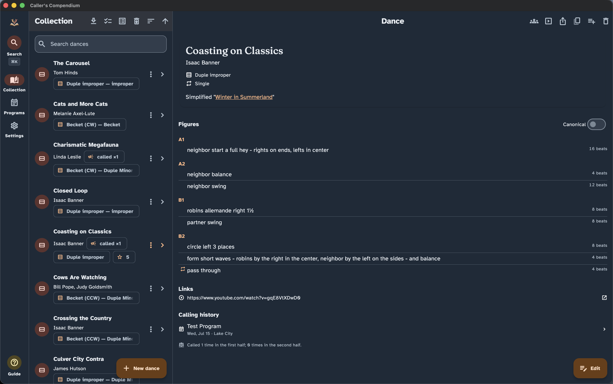

# Landing page (`site/`)

Source for the public site at
<https://ibanner56.github.io/CallersCompendium/>.

It's a dependency-free static site — plain HTML, CSS, and a little vanilla JS.
The landing page itself has **no build step**: what's in this folder is what
gets served. The **user guides** at `/guide/` are generated (see below).

```
site/
├── index.html      # the page
├── styles.css      # styling (dark-mode aware, responsive, a11y-minded)
├── app.js          # fetches beta.json and renders the download cards
└── assets/         # logo, favicon, social card, (future) screenshots
```

## The user guides are generated

`/guide/` is **not** in this folder — it is rendered from
[`docs/user/*.md`](../docs/user/) by
[`tools/site/render_user_docs.py`](../tools/site/render_user_docs.py) at publish
time, and never committed. The same Markdown feeds three consumers: GitHub,
the offline in-app reader, and this site.

Why pre-rendered? `gh-pages` carries a `.nojekyll` marker so the update
manifests serve verbatim — which also means Jekyll won't render Markdown for us.
The renderer is stdlib-only (no `pip install` in the Pages job, no third-party
JS or CSS on the site), escapes everything, and allow-lists link targets.

The build stages a **complete site** — the contents of `site/` plus the rendered
`guide/` tree — into `build/site`, and that directory is what gets published:

```sh
python3 tools/site/render_user_docs.py --out build/site
```

A broken cross-link, an `#anchor` with no matching heading, two headings that
collide on one anchor, a stale `guide/…` link on the landing page, or any GitHub
repo URL in the built site whose path is missing or has the wrong `blob`/`tree`
form all **fail the build**; the same check runs on every PR that touches
`docs/user/` via `.github/workflows/docs-bundle-check.yml`.

The guide pages reuse `styles.css` (see the *Guide pages* block) and the same
header/footer chrome as `privacy/index.html`, so they read as part of the site.

## How it's deployed

The site is published to the **`gh-pages` branch** (the same branch that hosts
the in-app update manifests `beta.json` / `stable.json`). Two things write to
that branch, and they are designed to coexist without clobbering each other:

| Writer | Trigger | Publishes | Preserves |
| --- | --- | --- | --- |
| `.github/workflows/pages-site.yml` → `tools/site/render_user_docs.py` → `tools/release/publish_pages_site.sh` | push to `main` touching `site/**`, `docs/user/**` or `tools/site/**`, or manual dispatch | everything in `site/` **plus** the rendered `guide/` | the `*.json` manifests + `.nojekyll` |
| `release.yml` `pages` job → `tools/release/publish_pages_manifest.sh` | tagged release | the current channel's `*.json` | the landing page, the guides + the other channel |

Both scripts start from the existing `gh-pages` content and rewrite only their
own files, so a site deploy never erases a manifest and a release never erases
the site. GitHub Pages stays on **Deploy from a branch → `gh-pages` → `/ (root)`**
— do **not** switch the Pages source to "GitHub Actions".

## Why the downloads never go stale

The download cards are populated **at page load** by `app.js`, which fetches
`beta.json` from this same origin — the very manifest the release pipeline
refreshes on every tagged release. So version, links, sizes, and checksums track
each release automatically, with no edits to this page. If the fetch fails, the
section falls back to a link to the Releases page.

What is **not** automatic is the editorial copy (status blurb, roadmap phase,
feature list, screenshots). Keep that aligned each release — see the
[release runbook](../docs/dev/releasing.md#keeping-the-landing-page-aligned)
and the [release checklist](../docs/dev/release-checklist.md).

## Updating screenshots

The Screenshots section uses real captures stored in `assets/`. The current
assets are:

| File | Surface |
|------|---------|
| `assets/laptop-collection-view.png` | Desktop – collection browser |
| `assets/ipad-performance-view.jpeg` | Tablet – performance mode |
| `assets/phone-program-editor.png` | Phone – program editor |

To replace or add a screenshot:

1. **Capture** on the target surface (source of truth — a real build of the
   tagged commit):
   - **Desktop (Linux/macOS/Windows):** use the OS screenshot tool
     (macOS `⇧⌘4`, Windows `Win+Shift+S`, GNOME `PrtSc`). Aim for a clean window
     at a generous size.
   - **Android:** device/emulator power+volume-down, or `adb exec-out screencap -p > shot.png`.
   - **iOS/iPadOS:** simulator `⌘S` (saves to Desktop) or device side+volume-up.
2. **Optimize & normalize:** export/downscale to a sensible width (≈1600px max),
   compress (PNG or WebP), and drop the file in `assets/`.
3. **Wire it in:** in `index.html`, each screenshot is a `<figure class="shot">`
   containing a `<div class="shot-frame">` (add `contain` for portrait/phone
   shots) with a badge and the ``:

   ```html
   <figure class="shot">
     <div class="shot-frame">
       <span class="shot-badge">Desktop</span>
       
     </div>
     <figcaption>Browse and search your collection</figcaption>
   </figure>
   ```

   Write a **descriptive `alt`** for each (accessibility matters — it's a value of
   the app itself).

## Local preview

```sh
python3 tools/site/render_user_docs.py --out build/site
cd build/site
python3 -m http.server 8000
# open http://localhost:8000  (guides at http://localhost:8000/guide/)
```

Serving `build/site` rather than `site/` is what makes `/guide/` resolve — it is
the same tree the publisher pushes. The `beta.json` fetch is same-origin, so the
live download cards only render when the page is served from the deployed site
(or if you drop a `beta.json` next to `index.html` locally). Everything else
previews fine offline.
