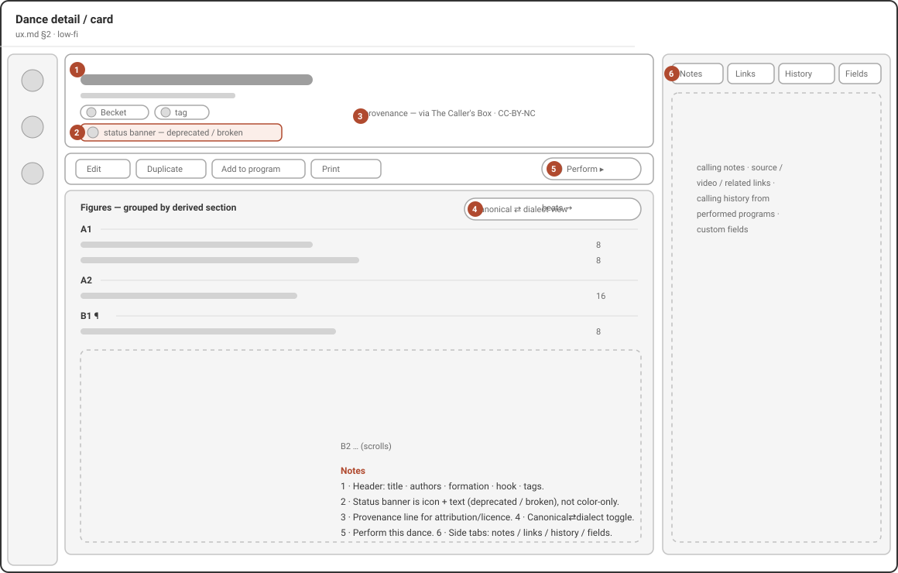
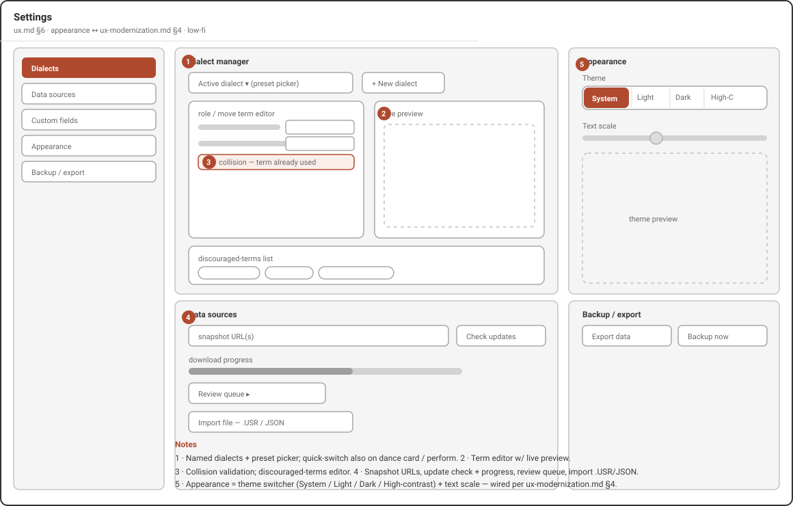

# Dialect: put the app in your own words

Every caller has their own words. This guide shows you how to make Caller's
Compendium speak yours — choosing the role names and phrasing you use, switching
them in a moment, and doing it all without ever changing the dances you have
saved.

A [dialect](./README.md#glossary) is your personal choice of role names and
wording — for example **Larks/Robins** or **Leads/Follows** — applied everywhere
the app shows text. It is *your words, your way*. Dialects are the heart of
Caller's Compendium, so it is worth a few minutes to set yours up the way you
like it.

If you are brand new here, start with the [getting-started guide](./getting-started.md)
first, then come back to make the app sound like you.

## Why callers need dialects

Contra has no single vocabulary. One community calls the roles **Larks** and
**Robins**; another says **Leads** and **Follows**; older cards and some regions
use other words again. The same is true of moves — one caller's "shoulder round"
is another's older term for the very same figure.

That variety is wonderful, but it makes a shared library of dances awkward: if a
[dance](./README.md#glossary) is written down in one caller's words, everyone
else has to translate it in their head. Dialects solve this. You keep every dance
once, and the app shows it to *you* in *your* words — and to the next caller in
theirs — without anyone rewriting anything.

## The big idea: one library underneath, your words on top

This is the single most important thing to understand, and it makes everything
else safe to experiment with.

Under the hood, every dance in your [collection](./README.md#glossary) is stored
in one shared, neutral form. Your dialect is a layer of wording laid *on top* of
that stored dance when the app draws it on screen. Choosing or switching a
dialect changes only what you see — it never rewrites the dance itself.

That leads to a distinction worth keeping clear:

- **Changing your dialect changes your *view*.** The role names and wording you
  read on the dance card, in a program, and while calling all update to match. No
  saved dance is touched.
- **Editing a dance changes the *dance*.** That happens only in the dance editor,
  when you deliberately change a [figure](./README.md#glossary), the notes, or the
  title.

Because the stored form never changes when you switch dialects, three good things
follow on their own:

- **Search always works**, whatever words you prefer. If you search using your
  own role names or an older term, the app matches it against the shared form for
  you, so you find the dance either way.
- **Your data stays portable.** A dance you saved in one dialect opens correctly
  for someone using another, and your [backups](./README.md#backup--portability) never bake in one set
  of words.
- **Nothing is ever lost in translation.** Switching between dialects — even
  repeatedly, even mid-evening — can't corrupt or reword your saved dances.

*Wireframe of the dance card. The figure list at the centre is drawn in your
active dialect; the toggle above it flips the same card to the shared canonical
wording without changing the saved dance.*

## The dialects that come built in

Caller's Compendium ships with three ready-to-use dialects. You choose one as
your active dialect, and you can add as many of your own as you like.

- **Larks/Robins** — the modern, role-neutral names, and the app's default. If
  you do nothing, this is what you see.
- **Leads/Follows** — another role-neutral choice, ready to pick.
- **Canonical** — the plain, shared wording the app stores underneath. Handy when
  you want to see a dance in its neutral form (more on this below).

The built-in dialects are deliberately role-neutral. If your community uses other
role names — including traditional gendered ones — you are not stuck: you enter
whatever wording you want yourself, in a custom dialect. The next sections show
how.

## Choose your dialect

1. Open **Settings** and choose the **Dialect** section.
2. In the **Dialects** list, select the one you want to use. The app switches to
   it right away, everywhere.

The built-in dialects carry a **Preset** badge and are read-only, so you can't
change their wording by accident. Your own dialects sit below them and can be
edited freely.

*Wireframe of Settings. The Dialect section is a manager for your whole library
of dialects: pick which one is active, create new ones, and edit the wording of
your own.*

## Make your own dialect

When none of the built-in dialects match your community, make your own. From
**Settings › Dialect**:

- Choose **New dialect** to start from a clean slate, or
- Choose **Duplicate from…** to copy an existing dialect (a preset or one of your
  own) and adjust it. To tweak a built-in dialect, use **Duplicate to customize**
  from its menu — this makes an editable copy and leaves the original preset
  untouched.

Give the dialect a name, then open its term editor to set any of the following.
A **live preview** shows a sample figure re-worded as you type, so you can see the
effect immediately.

### Role names

Set the words for the two roles — for example **Larks** and **Robins**, or your
community's own terms. You can enter both the singular and plural forms (the app
fills in a sensible plural if you leave it blank). This is also where you would
enter traditional or gendered role names if that is what your dancers use.

### Reworded moves

Give individual moves the wording you say out loud. If you always call a move by a
particular name, set it here and the app will use your wording on every dance that
contains that move. For moves that come in left- and right-handed versions, you
can include a placeholder so the app fills in "left" or "right" for you rather
than making you write two versions.

### Dancer wording

Reword the way the app refers to *who* is dancing — for example the words for
"neighbors" or "the next couple" — to match how you phrase things from the stage.

### Discouraged terms

Each dialect keeps a list of words you would rather not use. When you type one of
these while writing a dance, the editor gently flags it (it shows the word struck
through) so you can reconsider — but it never blocks you or changes your text. The
list ships with some common examples and is yours to edit, add to, or clear.

> **The app watches for clashes.** If two different things would end up with the
> exact same wording, the editor warns you right away, because that would make it
> impossible to tell them apart later. Adjust one of the words and the warning
> clears. You can't save a dialect with an unresolved clash.

## Switch dialect on the fly

You don't have to visit Settings every time. On the dance card and in
[Perform mode](./README.md#glossary) there is a quick-switch control — the
people icon — that changes your active dialect instantly.

Choose it, pick a dialect from the list, and the whole app re-reads in those
words at once. This is built for real evenings: guest-calling for a community that
uses different role names, or switching wording between gigs, takes a moment and
leaves every saved dance exactly as it was.

Remember the distinction: the quick-switch changes *how dances read for you*, not
the dances themselves. Switch as often as you like.

## Peek at the canonical wording

Sometimes you want to see a dance in the plain, shared wording — to compare notes
with another caller, or to double-check what a figure really is underneath your
own phrasing.

On the dance card and in Perform mode, the **Show canonical terms** control (shown
as a **Canonical** switch on the dance card) flips the current view between your
dialect and the shared canonical wording. It changes only what is on screen right
then — it doesn't change your active dialect or touch the saved dance. When your
active dialect is already **Canonical**, the toggle isn't shown, because there
would be nothing to switch between.

This pairs naturally with Perform mode: you can call from your own words and, if a
dancer or another caller asks, flip to the canonical wording for a moment without
losing your place. See the [Perform mode guide](./perform.md) for the full calling
view.

## Set your defaults

Two settings decide what you see before you touch anything:

- **Your active dialect** (in **Settings › Dialect**) is the wording every screen
  uses by default.
- **Open dance details in canonical terms** (in **Settings › Defaults**, under
  *Display defaults*) decides whether a dance opens showing your dialect or the
  shared canonical wording. Leave it off to always open in your own words; turn it
  on if you prefer to start from the neutral wording. Either way, the on-screen
  toggle still lets you switch a dance while it is open.

For a full tour of everything under Settings, see the
[Settings guide](./README.md#settings).

## Practical scenarios

**Guest-calling for another community.** You usually call Larks/Robins, but
tonight's crowd says Leads/Follows. Before you start, open the quick-switch on the
dance card or in Perform and choose **Leads/Follows**. Every dance now reads in
that community's words. Afterwards, switch back — none of your dances changed.

**Your community's own words.** Your dancers use role names that aren't built in.
Make a custom dialect once (**Settings › Dialect › New dialect**), enter your role
names and any moves you say differently, and set it active. From then on the whole
app speaks your language.

**Bringing in dances written in older words.** When you [import](./imports.md)
dances, or open older cards, they may use terms that have since fallen out of use.
The app quietly understands the common older words and matches them to the shared
form, so those dances still appear in your dialect and still turn up in search —
no clean-up required.

**Comparing a figure with another caller.** Mid-conversation, flip **Show
canonical terms** on the dance card to read the dance in neutral wording you both
recognise, then flip back to your own.

## Good to know

- **Printing and sharing.** When you print or export a dance or program, you can
  choose whether to use your dialect or the canonical wording, so what you hand
  someone matches how *they* speak.
- **Screen readers.** The app reads dances aloud in your dialect too — your own
  words are the clearest ones for you — so the spoken view and the visible view
  stay in step. See the [accessibility guide](./README.md#accessibility) for more.
- **It's all on your device.** Dialects, like everything in Caller's Compendium,
  live only on your device. There is no account and nothing to sync.

## Related guides

- [Getting started](./getting-started.md) — find your way around the app.
- [Perform mode](./perform.md) — call live, with the dialect and canonical
  controls close at hand.
- [Settings](./README.md#settings) — where the dialect manager and display defaults live.
- [Collection & search](./collection.md) — searching works whatever dialect you
  use.
- [Imports & migration](./imports.md) — bring in dances written in other words.
- [Glossary](./README.md#glossary) — plain definitions of the terms used here.
