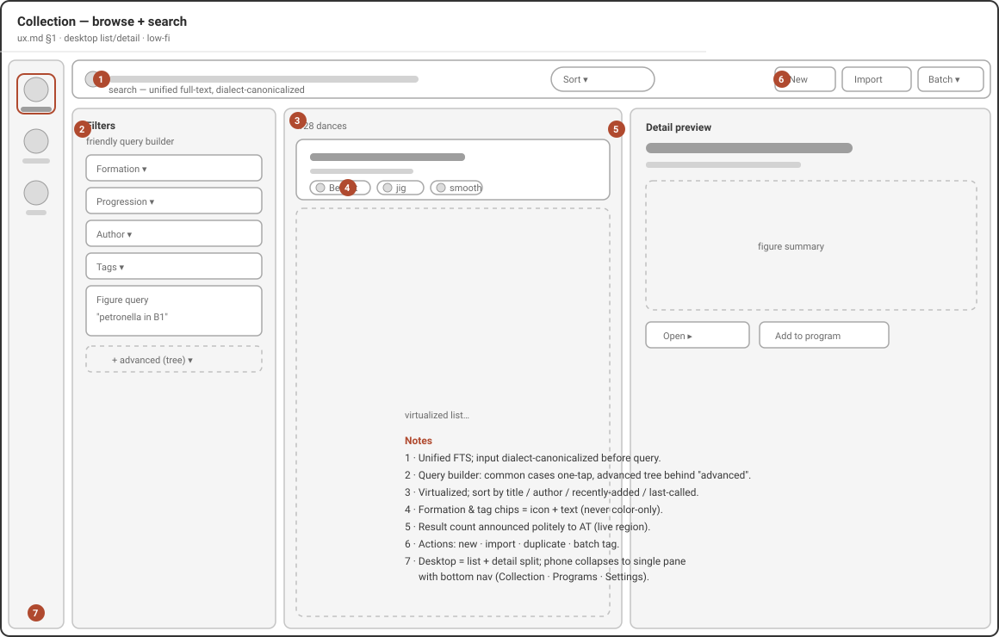
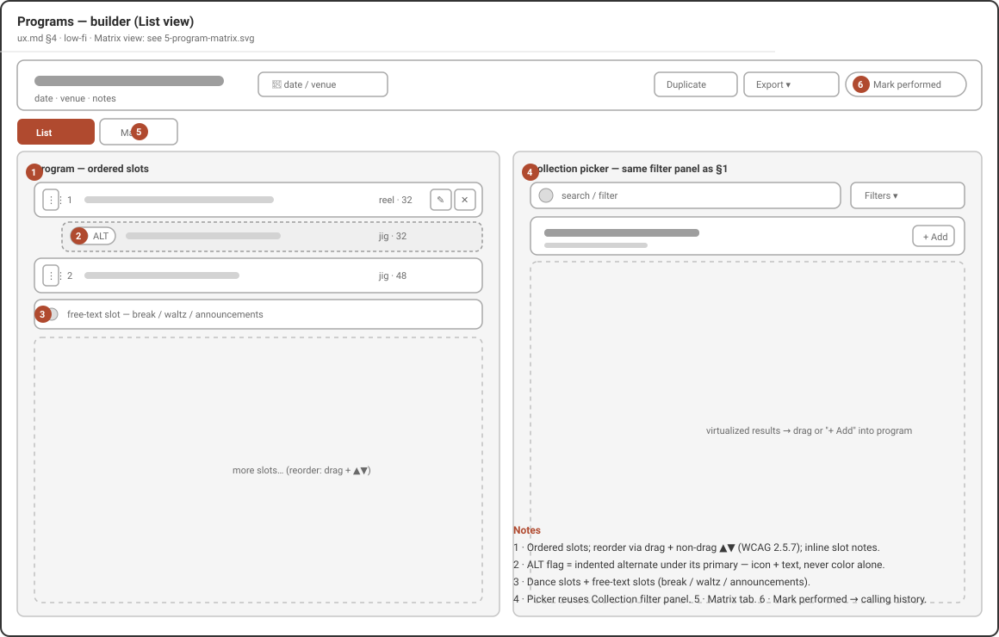
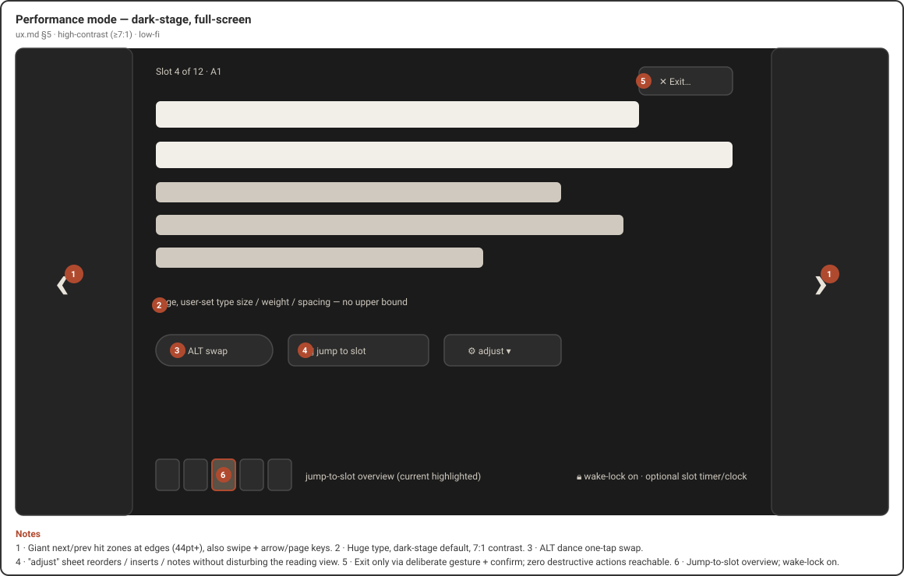

# Getting started

New to Caller's Compendium? This guide walks you through what the app is, what
you see the first time you open it, and how to find your way around — so you can
add your first dance and, when a gig comes around, call from the stage with
confidence.

> **Finding your way around these words.** On-screen buttons and screens are
> written in **bold** — like **Collection** and **New dance**. The first time a
> dance term appears it links to the [Glossary](./glossary.md), so you
> can get a plain-language definition without losing your place.

## What Caller's Compendium is

Caller's Compendium is a free, open-source organizer for contra-dance callers.
It keeps your [collection](./glossary.md#collection) of
[dances](./glossary.md#dance), helps you build [programs](./glossary.md#program)
(set lists) for events, and gives you a large-print, high-contrast calling view
for the stage.

It is **local-first**, and that shapes everything else:

- **Your data stays on your device.** Dances, programs, custom fields, and your
  wording all live in local storage on the machine you are using — not on
  someone else's server.
- **There is no account.** Nothing to sign up for, nothing to sign in to. You
  open the app and start working.
- **No telemetry.** The app does not track you, phone home, or collect usage
  data. What you do in Caller's Compendium is your business alone.
- **It works offline.** You can catalogue dances, build programs, and call a
  whole evening with no internet connection. The only time the app reaches the
  network is when *you* choose to bring in dances from an online source, and
  even then it only reads — it never publishes your work back out.
- **It runs everywhere you call.** The same app, adapted to each screen size,
  runs on Linux, macOS, Windows, Android, and iOS/iPadOS. On a phone you get a
  single-column layout with a bottom navigation bar; on a tablet or desktop you
  get side-by-side list and detail panes and a left navigation rail.

Because your whole library lives in one place on your device, you can move it to
a new machine any time with a single backup file — see the
[Backup & portability guide](./backup-portability.md).

## Installing the app

Downloadable builds are ready for **Linux**, **macOS**, **Windows**, and
**Android**, and **iPhone/iPad** builds go out through **TestFlight** to invited
testers. The [Installation guide](./installation.md) walks you through
downloading the right file (or joining the TestFlight beta), getting past the
first-time security prompt you'll see on the unsigned Windows and Linux builds,
and keeping the app up to date.

## Your first launch

When you open Caller's Compendium for the first time, it takes you straight to
your **Collection**. There is no sign-in screen and no setup wizard to get
through first.

Your collection starts empty, so you will see a friendly prompt inviting you to
add or import a dance to get started, alongside a **New dance** button. This is
your starting point: from here you can build your library by hand, bring in
dances you already have, or pull dances from an online source.

*Wireframe sketch of the Collection screen: a search bar across the top with
Sort, New, Import, and Batch actions; a Filters panel and a virtualized list of
dances on the left; and a dance detail preview on the right. This is a low-fidelity
layout sketch, not the finished app.*

Two small things worth knowing on day one:

- **Your wording is already set.** Out of the box, the app speaks in
  **Larks/Robins** role names. You can change this at any time — see
  [Calling in your own words](#calling-in-your-own-words) below.
- **Nothing is permanent by accident.** If you delete a dance or program, you
  can undo it, and deleted items can be restored later — so you can explore
  without worrying about losing work.

## A tour of the four main areas

Caller's Compendium is organized around four areas. Three of them —
**Collection**, **Programs**, and **Settings** — are always one step away in the
navigation (a bottom bar on a phone, a left rail on a tablet or desktop). The
fourth, **Perform**, is a *mode* you step into from a dance or a program when it
is time to call, and step back out of when you are done.

### Collection — your dance library

**Collection** is your whole library of dances, and it is where the app opens.
Each dance is one transcription: its title, author,
[formation](./glossary.md#formation), and the ordered list of
[figures](./glossary.md#figure) (the moves) that make it up.

From here you can:

- **Browse and sort** your dances by title, author, recently added, or last
  called.
- **Search** with the bar at the top — type any words and it searches across
  your dances.
- **Filter** with the structured panel — narrow by formation,
  [progression](./glossary.md#progression), author, tags, custom fields, or even by
  the figures a dance contains (for example, dances with a petronella, or a
  chain *then* a swing).
- **Add a dance** with **New dance**, or **Import** dances from other sources.

Selecting a dance opens its detail view, with the full figure-by-figure
breakdown, notes, and links. Learn more in the
[Collection & search guide](./collection.md).

### Programs — set lists for your events

A **program** is an ordered set list for a single event — Saturday's dance, a
weekend, a one-off gig. Open **Programs** to see the programs you have built;
it starts with a short prompt and a **New program** button until you make your
first one.

Inside a program you arrange [slots](./glossary.md#slot): dance slots pulled
from your collection, an alternate dance (an [alt](./glossary.md#alt)) tucked
under its primary, and free-text slots for the things between dances — a break,
a waltz, announcements. A program also carries its event date, venue, and notes.

*Wireframe sketch of the Programs builder: a two-pane layout with the ordered
program slots on the left and a searchable collection picker on the right. This
is a low-fidelity layout sketch, not the finished app.*

Each program also has a **[matrix](./glossary.md#matrix)** — a figures-by-dances
grid worked out from the choreography — so you can see the shape and variety of
your evening at a glance and avoid calling three swings-into-a-hey in a row. The
[Programs & matrix guide](./programs.md) covers building programs
and reading the matrix in full.

### Perform — the calling view

**[Perform mode](./glossary.md#perform-mode)** is the app's stage-ready calling view.
It is not a navigation tab; you enter it when you are ready to call and it fills
the whole screen.

- To call a **single dance**, open it from your collection and choose
  **Perform this dance**.
- To call a **whole evening**, open a program and choose **Perform this
  program**, then step through your slots in order.

Perform mode is built for the realities of the stage: huge, adjustable type on a
high-contrast dark background, next and previous controls big enough to hit
without looking, and the screen kept awake so it never dims mid-dance. If you
need to make a change on the fly — reorder what is left, swap in an alt, or add a
quick note — an **adjust** panel lets you do it without disturbing the card you
are reading.

*Wireframe sketch of Perform mode: a full-screen, dark, high-contrast dance card
with very large text, large previous/next arrows at the screen edges, a slot
indicator, and controls to swap an alternate, jump to a slot, adjust, or exit.
This is a low-fidelity layout sketch, not the finished app.*

A full walkthrough — from getting set up before the music starts to making
changes mid-gig — is in the [Perform mode guide](./perform.md).

### Settings — make the app yours

**Settings** is where you shape the app around how you work. It is organized into
sections:

- **General** — where you run [imports](./glossary.md#import) and manage your
  data, including [backup and restore](./backup-portability.md).
- **Appearance** — themes (including light, dark, and high-contrast) and text
  size.
- **[Dialect](./glossary.md#dialect)** — your role names and wording (more on
  this next).
- **Language & region** — regional preferences.
- **Defaults** — sensible starting values, such as a default caller or band, to
  save typing.
- **About** — version and license information.

The [Settings guide](./settings.md) covers each section in detail.

## Add your first dance

Ready to put a dance in? From **Collection**, choose **New dance**. This opens
the dance editor, where you:

1. Give the dance a **title** (this is the only required field), and add the
   author, formation, and any notes you like.
2. Build the choreography by adding figures in order. Start typing a move — for
   example, "sw" — and the editor offers matches like *swing*; accept it and fill
   in who does it and for how many beats. A running beat count keeps you honest
   as you go.
3. If a move is unusual and nothing matches, type it in as free text — the editor
   still records it as a figure in your dance.
4. Save when you are happy. Your dance now lives in your collection, ready to
   search, add to a program, or call.

You do not have to build every dance by hand, though — most callers start by
bringing in dances they already have.

## Bring in dances you already have

If you already keep dances in another tool or have them from a community source,
you can **Import** them instead of retyping. From **Collection**, choose
**Import** (or run an import from **Settings → General**).

Caller's Compendium can bring in dances from community sources such as **The
Caller's Box** and **ContraDB**, and from a **Caller's Compendium** file that you
or another caller exported. You can also turn on online search right from the
collection to find and pull in individual dances from The Caller's Box.

Whatever the source, every import lands in a **review queue** first. You get a
side-by-side look at the original and how the app understood it, and nothing
touches your collection until you approve it — so an import can never quietly
overwrite your work. The [Imports & migration guide](./imports.md) walks through
each source step by step.

## Calling in your own words

Contra callers do not all use the same words, and Caller's Compendium does not
make you. Your **dialect** is your personal choice of role names and phrasing,
applied everywhere the app shows text.

The app ships speaking **Larks/Robins**, with **Leads/Follows** ready to pick,
and you can enter any wording you prefer. Underneath, your dances are stored in a
shared vocabulary, so switching your dialect never changes the dances themselves
— search keeps working and your data stays portable no matter which words you
use. You can even switch dialects between gigs, or right from a dance card.

Manage your dialects in **Settings → Dialect**. For the full picture — presets,
editing individual moves, and live previews — see the
[Dialect guide](./dialects.md).

## Where to go next

- **Fill out your library:** [Imports & migration](./imports.md) ·
  [Collection & search](./collection.md)
- **Build an evening:** [Programs & matrix](./programs.md)
- **Call it:** [Perform mode](./perform.md)
- **Make it yours:** [Dialect](./dialects.md) ·
  [Settings](./settings.md) ·
  [Backup & portability](./backup-portability.md)
- **Using assistive technology or large text?** The
  [Accessibility guide](./accessibility.md) covers screen readers, text
  size, high contrast, and keyboard use.

Not sure what a word means? The [Glossary](./glossary.md) has plain
definitions for every term used across these guides.
