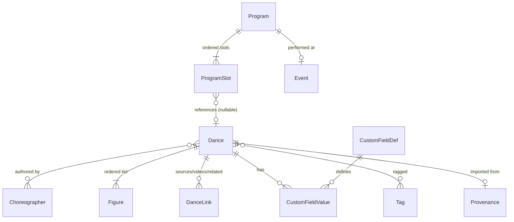

# Design: Domain model

*Roadmap item 1.7 · v0.1 (2026-07-10). Draws on docs/research/. Implemented as a
pure-Dart core package (no Flutter imports) per ADR-001.*

## Principles

1. **Canonical in storage, dialect at display.** All figure/role/move terms are
   stored canonically; user dialect is presentation (see design/dialect.md).
2. **Structured figures with named parameters.** No positional parameter arrays
   (ContraDB pitfall). Every persisted structure carries a schema version.
3. **Contra first, forms extensible.** `DanceForm` discriminates now; figure
   taxonomies are per-form so ECD/Squares can add their own later without
   schema surgery.
4. **Provenance everywhere.** Imported data keeps its raw source payload,
   external ID, permission/license, and import time.
5. **Soft delete over hard delete** for user-visible entities.

## Entity overview



## Entities

### Dance
| Field | Type | Notes |
|---|---|---|
| id | UUID | |
| title | string, required | |
| authors | ordered refs → Choreographer | multiple; "Traditional"/"Unknown" are real Choreographer rows |
| form | enum `DanceForm` | `contra` (v1); `ecd`, `square` reserved |
| formation | `Formation` value | see below |
| progression | enum | none/single/double/triple/quadruple/other |
| phraseStructure | string, default `""` | empty = standard 4×16-beat (A1 A2 B1 B2); else e.g. `6*8*2` (TCB convention) |
| figures | ordered `Figure[]` | the transcription; see design/figure-taxonomy.md |
| hook | string | one-line "why call this" description |
| callingNotes | text | teaching/history notes, dialect-aware free text |
| status | enum | `active` / `deprecated` / `broken` (mirrors TCB) |
| tunes | string[] | suggested music |
| customFields, tags, links, provenance | | see below |
| createdAt / updatedAt / deletedAt | timestamps | deletedAt = soft delete |

**Calling history** is derived (query over performed ProgramSlots), not stored
on the dance.

### Figure (value object, not a table-per-move)
```
{
  schemaVersion: 1,
  move: "swing",              // canonical move id from the form's taxonomy
  params: {who: "partners", prefix: "balance", beats: 16},  // NAMED params
  note: "scoop them up",       // optional, dialect-aware free text
  progression: true?           // marks progression point(s)
}
```
- `custom` move: `{move: "custom", params: {text: "...", beats: n}}` — the
  searchable free-text fallback; text is canonicalized on input.
- Section labels (A1/B2…) are **derived** from cumulative beats +
  phraseStructure, not stored — keeps reordering/beat edits consistent.

### Formation
Canonical enum seeded from the TCB vocabulary (duple improper/becket(cw|ccw)/
proper/indecent…, triple minor, 3-face-3, 4-face-4, circle mixer, Sicilian
circle, scatter mixer, longways, triplet, grid, other) **plus** an optional
free-text `detail`. Enum-with-detail avoids ContraDB's regex-over-free-text
weakness while never losing information.

### Choreographer
`id, name (unique), website?, notes?`. Merge tool needed eventually (imports
create near-duplicates: "Gene Hubert" vs "Hubert, Gene").

### Program & ProgramSlot
| Program | ProgramSlot |
|---|---|
| id, title | id, programId, position |
| eventDate?, venue?, notes | danceId? (nullable → free-text slot: break, waltz, announcement) |
| status: draft/final/performed | text? (used when danceId null, or per-slot caller note) |
| createdAt/updatedAt/deletedAt | isAlt: bool (alternate dance, decided at event time) |
| | performedAt? (set when actually called → feeds dance calling history) |

Duplicate-program = deep copy of slots. The programming matrix is a **view**
computed from structured figures (no manual "elements" checklist — the fix for
CC's biggest weakness).

### CustomFieldDef / CustomFieldValue
User-defined: `key, label, type (text|number|boolean|choice), choices?,
showInList, searchable`. Values attach to dances. Typed to keep search sane.

### Tag / DanceTag
Flat user tags with optional color. (System tags like "verified" not needed
locally — single-user app.)

### DanceLink
`danceId, kind (source|video|relatedDance|other), url? | targetDanceId?,
label?`. Covers CC's source area + related dances and TCB's video lists.

### Provenance
`danceId, source (callersbox|contradb|callers_companion|manual|json),
externalId?, importedAt, permission?, license?, rawPayload (as imported),
sourceVersion?` — enables re-import/diff, attribution display, and honoring
permission tiers.

### Settings (not per-dance)
Dialect config (see design/dialect.md), performance-mode prefs, snapshot
source URLs.

## Invariants (enforced in the core package, fully unit-tested)

- Dance title non-empty; figures list may be empty (stub/metadata-only import).
- Figure `move` must exist in the taxonomy for `dance.form` (or be `custom`);
  `params` must validate against the move's parameter schema.
- Beats ≥ 0; per-phrase overflow is a **warning**, not an error (real dances
  bend phrasing; choreography validation is a later milestone).
- ProgramSlot requires at least one of `danceId` or `text` to be non-null;
  both may be set simultaneously (`text` is a per-slot caller note when a
  dance is attached, or the full slot content for free-text slots like breaks).
- Deleting a dance (soft) keeps program slots valid; UI shows tombstone.

## Explicitly out of v1

Multi-user/sync, choreography validation (external project), ECD/square
taxonomies (schema-ready, not populated), authoring back to online sources.

## CC parity backfill (2026-07-12 schema audit → ROADMAP Phase 4b+)

A direct parse of the shipped Caller's Companion `.USR`
(research/callers-companion.md "Schema-level addendum") surfaced native CC
fields/entities this model does not yet carry. They are **not** in the v0.1
model above; they are planned additive work (Phases 0–3 stay complete). Listed
here so the model contract stays honest about the intended end-state.

**Dance** — to add:
- `level` (enum or ordered scale) + a "mixed level" marker. **High priority**:
  primary filter/programming axis for callers. Feeds a `Level` search leaf
  (design/search.md) and the Collection facet panel.
- `composedOn` / `revisedOn` (optional, partial-precision) — distinct from
  `createdAt`/`updatedAt` record stamps.
- `rating` (optional) — sortable curation signal. May ship as a default custom
  field instead of a core column; decision tracked in ROADMAP 4b.3.
- structured `reference` (title + page/number), beyond a URL `DanceLink`.

**Choreographer** — optional contact fields (email, location, deceased flag)
toward CC `Author`; privacy-aware, all optional.

**Program / ProgramSlot** — to add (before/with Phase 4):
- `Program`: `band`, `caller`, `dancerLevel` alongside `eventDate`/`venue`/
  `notes`; optional `timeStart` / running length.
- `ProgramSlot`: structured `caller` (guest) and planned `time`/`length`,
  rather than folding them into the free-text `text` note.

**New entities (Later milestones)** — `Venue` (reusable, addressed) instead of
the current free-text `Program.venue` string; `GlossaryTerm`
(term/definition/source). A decision is still open on user-defined quick-entry
**snippets** (CC "Insert Call" buttons) given our taxonomy type-ahead already
covers entry speed.
