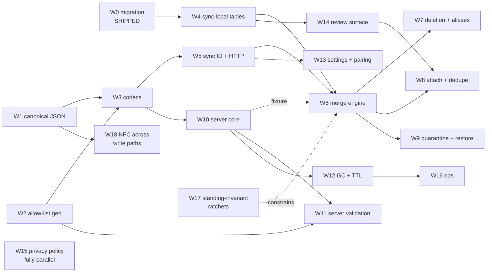

# Implementation plan: Device Sync and the Athenaeum

*Execution companion to [ADR-004](../adr/004-device-sync-and-athenaeum.md),
[sync-spec.md](sync-spec.md) (normative behaviour) and [sync.md](sync.md)
(rationale). This document carries neither behaviour nor rationale: it says
**what to build, in what order, and what must not overlap**.*

## 1. Status

**ADR-004 is `Proposed`. Nothing in this plan may start until it is Accepted**,
and that ruling is the maintainer's. The plan is written now so the shape of
the programme is visible *before* the decision, not to presume it.

One unit has already shipped: the §3.1 schema migration, merged as
[#898](https://github.com/ibanner56/CallersCompendium/issues/898), ahead of the
ADR and deliberately — see *What must be serialised*, **S6**. Everything else is
unstarted. That unit shipped its *migration* cleanly but not its *invariant*:
§3.1's soft-delete join rule was violated in `main` when **W17** was written,
which is why W17 exists.

Three live defects found while reviewing this plan were filed rather than folded
in, and all three have since been fixed on `main`: **#1016** (an archive
re-import resolving onto a tombstoned venue) by #1018, **#1020** (numeric custom
fields accepting `NaN` and `±Infinity`) by #1022, and **#1021** (import dedupe
missing NFD titles) by #1024. Each was a prerequisite for a §9 bucket here, so
each is now inherited rather than owed — but **only the instance is fixed, not
the class**, which is the whole argument for W17's ratchets: #1016 was a new
read that no list would have covered, and it was closed by adding one filter.

Where this document and the spec disagree, the spec governs. Where this document
and reality disagree, this document is wrong: it is a plan, and plans are the
first thing a programme falsifies.

## 2. How the work is described

Each unit below states five things, and the middle three are the point:

| Field | Meaning |
| --- | --- |
| **Serves** | The spec sections this unit is responsible for. Every implementable section is owned by exactly one unit; the *Coverage* table below is the check on that. |
| **Inherits** | What must already exist, and *what specifically* is consumed — not merely "comes after". |
| **Produces** | The artefact other units consume. If nothing consumes it, it is a leaf and can move freely. |
| **Unblocks** | The units that cannot start without this one's artefact. |
| **Done when** | The conformance bucket in [§9 of the spec](sync-spec.md) that must be green, plus any unit-specific gate. |

"Inherits" and "Unblocks" are the dependency graph. Read them, not the unit
numbers — the numbering is roughly execution order but two units with adjacent
numbers are often parallel, and one late unit (**W10**) is needed unusually
early.

## 3. The six contracts

Parallelism in this programme is gated by **contracts, not files**. Two units
can touch entirely disjoint paths and still collide, because both encode an
assumption about one of these six:

1. **Canonical JSON and the content hash** (§4.1, §4.2). Every hash-derived
   behaviour — the baseline, the manifest, delta sync, the merge
   discriminator — is wrong together if this is wrong. Frozen at **C1**.
2. **The generated allow-list** (§3.3, §7.2). One mapping, imported by the
   client serialiser *and* the server validator. This is the reason the server
   is Dart at all (ADR, *Why Dart for the server*): a second language means a
   second hand-maintained list, which is the drift the registry exists to end.
3. **The blob and manifest schemas** (§4.3, §4.4, §4.5).
4. **The two non-content-addressed JSON shapes** — `GET /v1/store` and
   `POST /v1/blobs/missing` (§5.2). These are the endpoints nothing *forced*
   into a schema, which is exactly why they were the last to get one.
5. **Sync-ID normalisation** (§5.1, §8). Trim → NFC → locale-independent
   lowercase, applied identically by client and server before the HMAC. The
   plan schedules **W5 and W10 in parallel from C1**, which is two units
   independently implementing one algorithm with no file overlap — the exact
   configuration contracts exist to catch. The spec calls the divergence the
   nastiest failure in the HTTP contract *because it produces no error*: one ID
   the user typed resolves to two storage keys, and the second device sees a
   working sync of an empty store. This is the same argument that produced the
   generated allow-list, and it applies here for the same reason.
6. **`normalizeTitle`** (§6.10). Normative by reference since round 30,
   consumed by W8. A second implementation that agrees on lowercase ASCII and
   disagrees on a leading article merges records **silently**.

A unit that changes any of the six is **never** parallel with a unit that
consumes it, regardless of file overlap. A unit that merely consumes them is
parallel with anything else that only consumes them.

Contracts 5 and 6 were missing from this list until round 31, and both were
missing for the same reason: they are *shipped or specified elsewhere*, so they
did not look like something this programme decides. That is what makes them
dangerous. A contract does not stop being a contract because it was written
down in another document.

## 4. Work units

### Phase 0 — shipped

#### W0 · Schema migration

- **Serves** §3.1.
- **Inherits** nothing.
- **Produces** `updated_at`, `deleted_at` and `existence_at` across eight tables
  — twenty columns — and six entity-level hard deletes converted to tombstones.
- **Unblocks** everything. Nothing else in the programme changes the schema of
  an existing table.
- **Done when** merged — it is, as #898.

Its early landing is load-bearing rather than incidental, and the reasoning
matters for anyone tempted to treat the gap as wasted time: each device stamps
`updated_at` at *its own* migration time, so while those stamps survive, the
device that upgrades last wins every settings conflict on first sync. Real edits
overwrite migration stamps with meaningful ones. **The delay between W0 and
first sync is what repairs the ordering wart**, so it is a feature of the
schedule, not slack in it.

### Phase 1 — the shared contract (serial with respect to everything after it)

#### W1 · Canonical JSON and the content hash

- **Serves** §4.1, §4.2.
- **Inherits** nothing. This is the root of the graph.
- **Produces** an RFC 8785 (JCS) canonicaliser; SHA-256 content hashing;
  **adoption of `unorm_dart`** as the NFC primitive, promoted to a dependency of
  `app` and re-exported so write paths outside `compendium_core` can reach it;
  rejection of NaN and ±Infinity; rejection of unpaired surrogates **checked on
  the string before encoding**; and the **golden vector corpus** that every
  later unit tests against.
- **Unblocks** W3, and transitively everything.
- **Done when** the §9 *Wire format* bucket is green **except** the
  normalisation clauses W18 owns, including the imported RFC 8785 conformance
  vectors, a fractional
  `custom_field_values.value_num` agreeing across two independently written
  encoders, and the surrogate rejection firing before `utf8.encode` rather than
  after it.

W1 exposes the normalisation primitive; it does **not** normalise. The
serialiser emits the string **as stored**, and that is a decision rather than an
omission. A serialiser that normalised defensively on the way out would make the
wire bytes converge while the local database stayed NFD — so the locally-created
NFD test would pass, the write-path ratchet would have nothing to catch, and
§6.10's dedupe, which reads *stored* values, would keep failing. The defect
would survive in the one place it is most expensive to find. Emitting stored
bytes is
what makes §4.1's one-time pass necessary, and necessary is what makes it get
written.

Applying normalisation across the app's write paths, and repairing rows already
stored, is therefore W18 — kept separate so that W1, the root of the serial
phase, does not grow a data migration.

The primitive itself is now mostly a packaging job rather than an
implementation: `unorm_dart` is already a dependency of `compendium_core`, and
`nfc()` already has two call sites. Both are **comparison-only** — inside
`_foldDiacritics` in `dedupe.dart` and `_normalizeName` in
`import_pipeline.dart` — and neither is reachable from `app`, which does not
depend on the package and cannot see `nfc` through the barrel. Nothing
normalises a value that gets **stored**.

The golden corpus is the real deliverable. Code can be rewritten; the corpus is
what makes a rewrite safe, and what lets the server be built by someone who
never reads the client.

#### W2 · The generated allow-list

- **Serves** §3.3, §7.2 (the generation half; enforcement is W11).
- **Inherits** the existing privacy registry — `field_registry.dart`,
  `settings_registry.dart`. It adds no classifications and invents no list.
- **Produces** a generated `snake_case table.column` → bare camelCase mapping
  keyed by record kind; settings resolution routed through `classifySettingsKey`
  so prefix-declared keys resolve; and **fail-closed** behaviour — an
  unclassified key is treated as `deviceLocal` and never serialised.
- **Unblocks** W3 (client serialiser), W11 (server validator).
- **Done when** the bijection ratchet passes over real `encodeArchive`-shaped
  output, never a hand-written key string, **and the registry half of the §9
  *Classification* bucket is green** — `deviceLocal` is never serialised, as a
  property test over the registry that **must not be allowed to become
  vacuous**. A property test that silently enumerates nothing passes forever;
  assert the population it covered.

Expressed as an allow-list, never a denylist. A denylist admits every key the
lookup fails to resolve, and an unresolved settings key can hold unsaved dance
and program content — which is precisely what the editor-draft keys held until
#973.

#### W3 · Blob, settings-record and manifest codecs

- **Serves** §4.3, §4.4, §4.5.
- **Inherits** W1 (canonicalisation and hashing), W2 (which keys may appear).
- **Produces** encode/decode for the blob envelope and the manifest; `v`
  handling on read; hydration of the fields a record publishes but does not own
  (authorship and tags come from join rows, so the record's own row is not the
  whole of its serialised content).
- **Unblocks** W5, W6, W10.
- **Done when** a blob and a manifest round-trip byte-identically and the
  envelope's absent-versus-null rule is pinned by golden.

> **Checkpoint C1 — the wire format is frozen.** See *Checkpoints* below.

#### W18 · Unicode normalisation across write paths

- **Serves** §4.1 (the every-write-path rule and its one-time pass), and the
  NFC precondition §6.10 depends on.
- **Inherits** W1's normalisation primitive. Nothing else — it touches no sync
  machinery, and can otherwise start the moment the ADR is accepted.
- **Produces** NFC normalisation applied at every path that populates a
  `shareable` string, implemented at the **repository write choke point** each
  kind already funnels through rather than per-writer; a **one-time backfill
  migration** over existing rows that leaves `updated_at`, `existence_at` and
  `deleted_at` untouched, excludes record-identity columns (`settings.key`),
  detects collisions by **grouping on `(table, column, target)` before writing**
  rather than by catching the `UNIQUE` violation, **skips and reports** whole
  colliding groups without aborting, and **rebuilds derived indexes if it wrote
  anything**; the `normalisation_skips` table (§3.2) with its **retry on each
  open judged by both halves of the grouping test** — recorded-row grouping by
  `(table, column, target)` *and* live occupancy — its **retirement of entries
  whose row was hard-deleted**, its restore-clears rule, and its second writer
  on the ordinary-edit carve-out; and a **structural** ratchet
  asserting that write paths route through the choke point.
- **Unblocks** nothing directly, but it **gates C1**: the *Wire format* bucket's
  locally-created-NFD vector, pre-existing-row vector, collision, idempotence
  and derived-rebuild clauses are all its, as is the write-path clause in
  *Write-path invariants*.
- **Done when** those clauses are green: a locally-created NFD title uploads as
  NFC, a row written before the normalising build is NFC after upgrade, the
  backfill is proved not to move any of the three stamps, a colliding local pair
  leaves both rows untouched and is reported while the pass completes, a tag and
  a choreographer sharing a name are both normalised, a recorded
  mutually-colliding pair survives re-open **still whole** rather than having
  one member written along iteration order, a retry does not raise against a row
  created after the skip was recorded, an entry whose row was hard-deleted is
  retired while one whose row was soft-deleted is not, a restore re-runs the
  pass, `normalisation_skips` survives an epoch reset and
  a detach, an ordinary edit to a blocked row succeeds, `settings.key` is
  untouched, a second run of the pass changes nothing, a row whose text the pass
  changed is still found by search, and the write-path ratchet catches a
  **newly added** writer that bypasses the choke point rather than a writer
  removed from a list.

**This unit exists because the round-31 fix to §4.1 corrected the rule without
assigning the work it created.** Correcting a rule and leaving its
implementation unowned is a quieter version of not correcting it, because the
plan is what gets built from.

It is deliberately separate from W17 rather than folded in, though both own
standing properties. W17 ratchets invariants over code that already exists and
ships no migration; W18 touches every write surface in the app and carries a
**data** migration over user rows. Those are different risk classes, and a
checkpoint that gates them together tells you less than one that gates them
apart.

The backfill is the part worth not deferring. "Normalise on write" repairs a row
the next time it is written, and a library imported years ago and never edited
is never written again — so the population the rule was written for is precisely
the population it misses. §6.2 step 4 uploads exactly that library verbatim.

**The backfill is the first work in this programme that rewrites stored user
rows, and it should be planned as a migration rather than as a loop.** Three
constraints on it are non-obvious and each has a matching test above.

*It runs under an exception to invariant I1, and the exception is conditional.*
§6.5 permits a content change without a stamp bump only for an operation that is
content-derived — no clock, device identity or randomness — **and** whose every
cross-row dependency is enumerated in the spec and produces divergence that is
reported rather than silently resolved. This pass has exactly one such
dependency, the collision skip below. That is not a courtesy extended to the
pass; it is the reason it may leave stamps alone, and every other constraint
here exists to keep the condition true. The §6.5 proof obligation has two
halves, and the second is the one worth reading before writing the test:
running the pass twice over the same database proves nothing about a cross-row
read, because such a read is perfectly deterministic. The pass must also be run
over two databases containing the same row — one where the collision fires, one
where it does not.

*Normalising can collide, and the collision must be found before writing.*
`choreographers.name`, `tags.name` and `custom_field_defs.key` are `UNIQUE`, so
two rows differing only in Unicode form collapse onto one string. §6.6 already
specifies this collision class for these exact columns — but only for the
**inbound apply** path, so an implementer building W18 in isolation will not
meet it. Compute every target value first, group by it, and skip whole groups
of more than one; do **not** implement this by catching the `UNIQUE` violation.
With try-and-catch the first row of a colliding pair writes successfully —
nothing holds the target yet — so one member is normalised and which one depends
on row order. The spec requires both to be left alone. Grouping must include
soft-deleted rows: soft delete is an `UPDATE` and none of the three `UNIQUE`
indexes is filtered on `deleted_at`, so a tombstone occupies its natural key and
can block a live row.

The pass does not merge. Merging would be a judgement about whether two
similar names are one entity, and a user making that judgement differently on
two devices produces exactly the divergence I1 orders — which would disqualify
the pass from the exemption it depends on.

*Group on `(table, column, target)`, never on the target alone.* The in-scope
rows span three tables with three independent `UNIQUE` indexes, so a tag and a
choreographer named `José` do not collide. Grouping on the value alone skips
both of them **permanently**, because unlike a genuine collision a cross-table
one never stops colliding and retry can never clear it.

*Skips are recorded and retried; they are not final.* This adds a table —
`normalisation_skips (table, column, record_id)` — which is classified in §3.2
and must be created with its classification in the same PR, or the coverage
ratchet fails. Re-attempt the recorded rows on each open. This is the whole of
the tombstone answer: a blocked row unblocks when the row occupying its target
is renamed or deleted, when a blocking tombstone is purged, or when
reconciliation renames one side, and the next open finishes the job. Without
retry a live row can be left un-normalised forever by a tombstone the user
cannot see or list. A later ordinary edit to a blocked row must **not** fail —
store the value un-normalised and record the skip; that carve-out is the
table's second writer.

*Retry runs the same grouping test as the initial pass, re-derived from live
state — both halves of it.* Write a recorded row only when no other recorded row
in the same `(table, column)` currently derives the same target **and** the live
`UNIQUE` column holds no occupant other than the row itself. Implementing either
half alone is a defect, and they fail in opposite directions.

Live occupancy alone splits a mutually-colliding pair: if `A` and `C` are
recorded together, both NFD and both deriving `T`, then neither occupies `T`, so
whichever row the retry loop reaches first is written and the second is then
blocked by it. The pair the initial pass deliberately left whole comes apart
along an iteration order nothing specifies, and two devices can normalise
opposite members. Recorded grouping alone raises: if an unrelated `D` later
takes `T` in NFC — which succeeds, since `A` and `C` still hold un-normalised
bytes — then renaming `C` leaves `A` a singleton by grouping, and the retry
writes `A` straight into `D`. This is why an entry stores only the row's
address: the target and the group are both snapshots, and each must be
re-derived on every attempt.

*Retire an entry whose row was hard-deleted — in the retry loop, not in the
delete paths.* `ImportPipeline.undo` already hard-deletes choreographers
(`delete(id, permanent: true)`), so an entry can outlive its row, at which point
it can never be written, never clears, and gives retry nothing to recompute
from. The table is polymorphic, so `ON DELETE CASCADE` is unavailable; putting
the retirement in retry makes it self-healing rather than an obligation on every
present and future delete path. Do **not** retire on soft delete: a tombstone
still occupies the key, so the repair is still owed and still blocked.

*`normalisation_skips` does not clear with the baseline.* Its neighbours
`id_aliases` and `review_queue` do, and copying them is the expected mistake: a
`UNIQUE` collision between two Unicode forms is a fact about this library, not
about a store, so it survives an epoch reset and a detach. Clearing it on a
`409` drops every owed repair while the completion marker still says the scan
finished. Restore is the one event that clears it — along with the marker,
because a restore brings in rows the scan never saw and no per-entry
revalidation can discover them.

*The pass must be total, not all-or-nothing.* The existing one-time sweeps in
`repositories.dart` write their completion marker only after the whole pass
succeeds, so a throwing row is retried from scratch on every launch and the
sweep never completes. Skip-on-collision is what makes that idiom safe here:
nothing raises, so there is nothing to retry into. Re-running is a no-op. Note
the marker records that a *scan* completed; the recorded skip groups are a
separate, retried set, so the two coexist rather than conflicting.

*`settings.key` is in scope by classification and must be excluded by hand.* It
is a `shareable` string column, so "every `shareable` string column" reaches it,
but §4.4 makes it the settings record's id — normalising it would rename the
record. Harmless today, since settings keys are ASCII app constants, and that is
exactly why it will not be noticed.

*Derived indexes are maintained by the repository layer, not by SQLite.*
`dance_fts` and `dance_substring_fts` hold literal text written on each
repository write; a bulk `UPDATE` that bypasses that layer leaves them holding
pre-normalisation text and search silently stops matching. Call
`runDerivedRebuild()` when the pass wrote something. The nearby precedent is
`_normaliseInversePairMoveIdsIfNeeded`, which gates its rebuild on
`!alreadyRebuilt || rewroteAny` rather than calling it unconditionally, and a
second call site in the same file gates on a rewrite count alone; follow the
rewrite-gated shape. A retry pass in which every recorded group still collides
writes nothing and must not rebuild. `runDerivedRebuild()` rebuilds derived
tables only, so it touches none of the three stamps and composes with the rule
above.

**Sizing note for the first sync after this unit ships.** The pass changes
content without moving `updated_at`, so on the first device to upgrade *every*
never-edited non-ASCII record becomes an equal-`updatedAt` difference against a
peer that has not upgraded yet. §10 treats ties as an occasional edge case; here
they arrive in a batch whose size is the user's non-ASCII library. They resolve
correctly and are reported, so this is a UX volume question — the report must
not be a per-record prompt — rather than a correctness one.

**#1021 is no longer this unit's first act.** It was fixed on `main` by #1024
while this plan was being written, so the red-run instruction that stood here
does not apply. What remains is unaffected: #1024 repaired *comparison* in the
import dedupe path, and nothing yet normalises a value that gets **stored**.

### Phase 2 — client foundation and server core, in parallel

#### W4 · Sync-local tables

- **Serves** §3.2.
- **Inherits** W0 (the migration is the only change to *existing* tables; these
  are new ones).
- **Produces** `baseline`, `id_aliases`, `pending_deletions`, `review_queue`,
  `published_records` — **with their classifications in the same PR**, or the
  coverage ratchet fails the build. Note the split classification:
  `pending_deletions.tombstone_blob` is `shareable` while the rest of that table
  is `deviceScoped`, because it is retransmitted record content rather than
  device bookkeeping.
- **Unblocks** W6, W7, W8, W9, W14.
- **Done when** the ratchet is green and each table's lifecycle is tested,
  including the three that differ: `pending_deletions` survives an epoch reset,
  clears on detach, and is revalidated against restored data after a restore;
  `published_records` clears on *nothing*; the rest clear with the baseline.
  `normalisation_skips` is **not** W4's — it is created and lifecycle-tested by
  W18, which is why "the rest clear with the baseline" is true here. Read
  without that carve-out the sentence is exactly the mistake §3.2's lifecycle
  paragraph warns against, so do not extend this unit to the new table by
  analogy.

`published_records` is the one to get right, because its whole purpose is to
resist the intuitive rule. It records that bytes physically left this device,
which no local action can retract — so detach, epoch reset and restore all leave
it alone. Clearing it on detach converts "the deletion sticks" into "the
deletion silently reverts".

#### W5 · Sync ID, authentication and the HTTP client

- **Serves** §5.1, §5.2, §5.3 (client half), §8.
- **Inherits** W3 (what it sends and receives).
- **Produces** diceware generation over the EFF long wordlist; the client-side
  strength floor; the structural rule and the **normalisation applied before
  the HMAC** (trim → NFC → locale-independent lowercase); bearer auth that never
  puts the ID in a URL; and status handling — `409` forces fresh attach, `422`
  is surfaced and **never retried**, `429` honours `Retry-After`.
- **Unblocks** W6, W8, W13.
- **Done when** the ID bound cases pass (one code point over rejected, at the
  bound accepted), a client/server `id_key` agreement test passes under
  differing whitespace and Unicode form, **and a `302` to a foreign https host
  is refused with no credentialed request issued** (§9 *Client isolate and
  robustness*).

The strength floor is enforced here and **only** here. A server that re-runs it
and is marginally stricter locks a user out of their own store, because the ID
*is* the address.

#### W10 · Athenaeum core — storage, endpoints, limits

- **Serves** §7.1, §5.1–§5.4 (server half), §8 (server half — the structural
  sync-ID rule and its `403`, and the prohibition on the server running its own
  strength estimator).
- **Inherits** W3 (schemas). W2 arrives later, via W11.
- **Produces** the Dart + `shelf` service; `HMAC-SHA256(pepper, syncID)` storage
  keying with versioned peppers; the store, manifest and blob endpoints; strong
  quoted `ETag` equal to the manifest content hash, with `If-None-Match`;
  permissive `Content-Type` handling; and **every limit enforced before
  allocation**, streaming-abort style.
- **Unblocks** W11, W12, W16 — and, critically, **W6**.
- **Done when** the loopback round trip at **C2** passes, and the
  store-lifecycle half of §9 *Client isolate and robustness* is green: every
  store creation mints
  an epoch no peer has seen (mutation: derive it from the `id_key`, so a
  `DELETE` and recreate reproduces it and nobody fresh-attaches); concurrent
  creators observe one epoch; a stale-epoch manifest `PUT` is `409` and does not
  land; a blob `PUT` not hashing to its path segment is rejected, and a `PUT` to
  an existing hash neither replaces the bytes nor refreshes `uploaded_at`. Plus
  the §8 server case: a structurally valid but *weak* user-chosen ID is
  **accepted** (mutation: re-run the client's estimator server-side, which is
  the lockout).

**This unit is numbered late and must be scheduled early.** It is the cheaper
half of the programme and it is the *test fixture* for the expensive half: a
merge engine developed against a mock server is a merge engine whose first
contact with the real contract happens at the end. My recommendation is to start
W10 at C1, concurrently with W4 and W5, and to treat "the client team has a real
server to run against" as the point of it rather than a side effect.

#### W13 · Settings blade, enablement, pairing and triggers

- **Serves** §6.1, §6.12.
- **Inherits** W5 for the ID and endpoint types. Everything else can be built
  against a fake engine from C1 onward.
- **Produces** the top-level Settings blade; **off on every installation until
  the user turns it on, with no sync-related network call while off**; the
  pairing flow, which must work for a user reading an ID aloud over the phone;
  *Sync only on WiFi* defaulting to on, with a manual attempt on a metered
  connection routing to the setting; and the status surface.
- **Unblocks** nothing. It is a leaf, which is what makes it safely parallel.
- **Done when** the enablement test proves the no-network-call property, not
  merely that the toggle renders.

Its settings keys are themselves `deviceScoped` and MUST NOT sync — a sync
feature whose configuration syncs is a loop.

#### W14 · A kind-agnostic review surface

- **Serves** the review-queue surface required by §3.2.
- **Inherits** W4 (`review_queue` is the storage this reviews).
- **Produces** a generic keep-both-or-merge list. **No per-kind editors are
  required**, which is the scope control on this unit.
- **Unblocks** W8.
- **Done when** a queued pair survives an app restart and can be resolved.

The existing `import_review_screen.dart` reviews **dances only**, and is driven
by `ImportSession`, whose own doc comment says it is deliberately not persisted.
Sync runs non-interactively with nobody watching, so there is no in-progress
import to attach a decision to. This is new storage plus a new surface, not a
reuse of proven machinery — the ADR corrects an earlier draft that implied
otherwise.

#### W17 · Standing-invariant ratchets

- **Serves** the enforcement of §3.1's join rule and §6.5's **I1**/**I2** — the
  two properties that are not behaviours of any one unit.
- **Inherits** W0 (the soft-delete columns exist). Independent of everything
  else, and can start the moment the ADR is accepted.
- **Produces** a CI ratchet enumerating every read that joins through to a
  soft-deletable parent and asserting the `deleted_at IS NULL` filter; a ratchet
  for I1/I2 over write paths. **The fix for #1016 is inherited, not owed** —
  #1018 closed the instance on `main`, leaving W17 the class.
- **Unblocks** nothing, in the sense that no unit must wait for it — but its
  I1/I2 ratchet **constrains** W6 and every write path built after it, and it
  gates **C0's honesty** (see below). A constraint is not a dependency: W6 can
  start without W17, it just cannot be trusted to have held I1/I2 without it.
- **Done when** the §9 *Soft-delete join coverage* **and** *Write-path
  invariants* buckets are both green — the first proved by dropping the
  `deleted_at` predicate from one existing read and watching CI go red, the
  second by a write that changes a record's serialised content through a
  join-hydrated field without advancing `updatedAt`. Neither is proved by
  adding a test beside the current code and observing it pass.

Both ratchets MUST be **structural** — a scan that flags any new read joining
through a soft-deletable parent, and any new write path that can change
serialised content — rather than a maintained enumeration of the ones known
today. An enumeration relocates the forgetting instead of removing it: it turns
"someone forgot the filter" into "someone forgot to add their read to the list",
which fails the same way and is harder to notice. #1016 arrived as a *new* read,
which is exactly the case a list does not cover.

**This unit exists because "exactly one owning unit" is the wrong tool for a
standing property.** It is the right tool for a behaviour: a behaviour is built,
tested and finished, and the unit closes with it. §3.1's join rule and I1/I2 are
not built — they are *maintained*, against every future PR, for as long as the
app has these columns. Assigning them to W0 and W6 means they are unowned the
moment those units close, which is not hypothetical: the join rule decayed
exactly that way. #1016 is an ordinary feature PR (#986) breaking a sync
invariant months after v25 landed, found by review rather than by CI. That is
the steady state for the duration of this programme, and prose in a spec has no
failure signal.

Nothing about this unit is sync-specific enough to wait for sync. It should be
among the first things built, because every unit after it is a chance to decay
what it protects.

#### W15 · Privacy-policy amendment

- **Serves** the ADR's *Blocking prerequisite*; §10.
- **Inherits** nothing whatsoever.
- **Produces** amended `docs/dev/store-submission/privacy-policy.md` **and** its
  mirror `site/privacy/index.html`, changed together, with the effective date
  bumped.
- **Unblocks** nothing directly — but **C6 and C7 both depend on it** (S7).
- **Done when** neither file claims "there is no cloud sync" or "we have no
  servers that receive or hold your content", both of which they say today, and
  both of which both app-store listings link to.

Fully parallel with all code, and best done early: it is the cheapest unit in
the programme and the only one that can block a release on its own.

### Phase 3 — the engine

#### W6 · Steady-state merge

- **Serves** §6.3, §6.4, §6.5, §6.7.
- **Inherits** W3, W4 (the baseline), W5 (transport), **W10 as a live fixture**.
- **Produces** the baseline diff; the merge table including the both-present row
  that resolves as `changed`/`changed`; existence decided by `existenceAt`
  *before* the table is consulted and separately from content; the apply path;
  the isolate boundary; and enforcement of **I1** and **I2**.
- **Unblocks** W7, W8, W9.
- **Done when** the §9 *Merge* and *Existence* buckets are green, including
  ≥3-device
  convergence with interleaved edits, the equal-`updatedAt` tie being **reported
  rather than resolved**, and a bystander failing to resurrect a tombstone. The
  inbound-apply half of *Classification* is also W6's: apply preserves
  `deviceLocal` columns, rejects present non-shareable keys by their **wire**
  spelling, and refuses a peer's `deviceScoped` setting. The isolate half of
  *Client isolate and robustness* lands here too — a malformed date rejects one
  record without aborting the batch or escaping the isolate; **an interrupted
  sync is a no-op**, which is §6.7's single apply transaction observed from
  outside; and **a blob `GET` returning `404` skips and reports the record and
  leaves the baseline unadvanced** rather than deleting it (§6.3 step 6).

I1 and I2 are normative constraints on *every* new write path in the app, not
just sync's. I1 is easy to violate innocently, because a record's serialised
form includes join-hydrated fields, so a write that never touches the record's
own row can still change what it publishes.

#### W7 · Deletion, tombstones and collision reconciliation

- **Serves** §6.6, §6.8.
- **Inherits** W4, W6.
- **Produces** the `pending_deletions` lifecycle and tombstone blobs;
  natural-key collision reconciliation for the `UNIQUE` kinds; `id_aliases` with
  reference rewriting that **bumps the referring record's `updated_at`**; and
  the forfeiture check against `published_records`.
- **Unblocks** nothing directly; W8 assumes its rules exist.
- **Done when** the §9 *Reconciliation* and *Deletion* buckets are both green,
  including the rewrite-in-place mutation — where content changes but no row
  does, so peers never learn of it and the reference stays broken everywhere
  else. *Deletion* is the bucket that matters most here and was gated by nothing
  until round 31: absence never deletes, an epoch reset preserves pending
  deletions, a published record tombstones rather than vanishing, and
  detach-then-reattach does not reverse a deletion. This unit builds the whole
  tombstone machinery, so a *Reconciliation*-only gate let it be "done" with
  every one of those unwritten.

Settings are deliberately **not** a collision kind: their id *is* their natural
key, so two devices setting one key hold one id with two bodies, which is a
content conflict for W6's table rather than a reconciliation for this unit.

#### W8 · Attach and fresh-attach dedupe

- **Serves** §6.2, §6.10.
- **Inherits** W5, W6, W4, and **W14** (dedupe has nowhere to defer to without
  a review surface).
- **Produces** the union — **no deletion occurs during a fresh attach**; dedupe
  on `normalizeTitle` plus `_choreographyEquals`, with tombstones excluded from
  candidacy entirely; `program_slots.dance_id` rewiring to the survivor; epoch
  and baseline persistence; and the after-the-fact count ("merged 412
  duplicates"), which is the mitigation rather than a prompt.
- **Unblocks** nothing.
- **Done when** the §9 *Dedupe* bucket is green, and so is the attach half of
  *Attach and restore* — epoch mismatch produces a fresh attach and never a
  deletion;
  union and silent merge; an equal-`updatedAt` fresh-attach tie reported rather
  than swallowed *and* reported again on the next steady pass; referential
  closure across a pending hold; the three-peer case of deleter, pending holder
  and stale peer.

Dedupe compares by reference to the shipped `normalizeTitle`, never a
reimplementation. A second definition that agrees on lowercase ASCII and
disagrees on a leading article is the failure this unit is most likely to ship,
and it merges records **silently**.

#### W9 · Quarantine, repair and restore

- **Serves** §6.9, §6.11.
- **Inherits** W4, W6.
- **Produces** clock-skew quarantine on the `localNow + 24h` bound; the repair
  classifier, which compares body hashes and therefore depends on I2 holding;
  and restore, which **drops the baseline to force a fresh attach**, clearing
  `id_aliases` and `review_queue` with it while `pending_deletions` survives and
  is revalidated. Restore MUST additionally clear the §4.1 normalisation
  completion marker and `normalisation_skips` (§6.11). Neither rides on the
  baseline — the marker is not sync state at all, and `normalisation_skips`
  deliberately survives baseline drops — so an implementer clearing "what goes
  with the baseline" clears neither, and the pass never re-runs over restored
  rows. The rule is over the **event**, not the mode: `RestoreMode.merge` writes
  unjudged rows exactly as `replace` does.
- **Unblocks** nothing.
- **Done when** the §9 *Quarantine and repair* bucket is green, and so is the
  restore half of *Attach and restore* — a restore converges rather than
  diverging — and a restore is proved to re-run the normalisation pass: a
  restored un-normalised row is NFC afterwards, with the mutation that keeps the
  completion marker across restore shown to leave it un-normalised.

### Phase 4 — server hardening and operations

#### W11 · Server-side allow-list validation

- **Serves** §7.2 (enforcement).
- **Inherits** W2 (the same generated mapping the client uses), W10.
- **Produces** `422` for any blob carrying a key not classified `shareable` for
  its kind; and the unknown-`v` rule — the key check applies regardless of `v`,
  and a blob is **not** rejected merely for carrying a `v` the server does not
  know.
- **Unblocks** nothing.
- **Done when** the generated mapping is proven by test and the unknown-`v`
  case is pinned.

This is a second line of defence. The client serialiser is the control; neither
is sufficient alone, because server rejection happens *after* the bytes crossed
the wire.

#### W12 · TTL, garbage collection and the break-glass log

- **Serves** §7.3, §7.4.
- **Inherits** W10.
- **Produces** reachability GC; the 24-hour upload grace window that makes a
  recent upload a temporary GC root; **`DELETE /v1/store` deleting
  unconditionally**, grace window or not; quota accounting and `507`; and the
  break-glass access log.
- **Unblocks** W16.
- **Done when** the §9 *Server* bucket is green, including the mutation that
  applies the age bound to `DELETE` — under which the user's only immediate
  remedy for a full store silently does nothing.

#### W16 · Operational readiness

- **Serves** §7.5; the operational half of §7.4; §10.
- **Inherits** W10, W12.
- **Produces** the container and deployment documentation; the **four proxy
  conformance requirements**, each of which some common proxy violates by
  default; alerting; retention proof; the break-glass authorisation process; and
  lost-ID support.
- **Unblocks** nothing — but **C7 cannot pass without it**.
- **Done when** a from-scratch self-host reaches a working sync using only the
  published documentation.

Requirements (3) and (4) — no proxy-side decompression, and the sync ID never
written to a log — are invisible in behaviour, which is why they are stated
rather than left to deployment taste. They cannot be caught by testing that the
thing works.

## 5. Order of execution

**The graph is a reading aid, not the authoritative edge list.** It is drawn as
a transitive reduction, so edges implied by a path are omitted — W3→W6, W4→W7,
W4→W8, W4→W9, W5→W8 and W10→W16 are all real dependencies that do not appear as
arrows. The **Inherits** and **Unblocks** fields on each unit are authoritative;
where they and this picture disagree, they win.

**The critical path is W1 → W3 → W5 → W6 → W8**, with the caveat that it is a
judgement rather than a derivation: W2 also gates W3, and no unit here carries a
duration estimate, so nothing in this document *proves* the W1 leg is the long
one. It is my expectation, from W1 carrying the golden corpus and W2 being a
generator over a registry that already exists. If W2 turns out to be the longer
leg, the path runs through it instead and nothing else about the plan changes.

Everything else has slack, and the slack is worth spending deliberately:

- **W2 runs beside W1.** It reads the privacy registry and touches none of W1's
  code. Both must land before W3.
- **W10 runs beside W4 and W5**, from C1. It is off the *nominal* critical path
  and on the *practical* one, because W6 is far cheaper to build and far safer
  to trust against a real server than a mock.
- **W13 and W14 run from C1** against fakes. They are leaves; W14 rejoins at W8.
- **W15 runs whenever.** It should be done first, being the cheapest thing that
  can block a release — and under S7 it blocks the beta, not just the release.
- **W17 runs first, or as near to first as anything does.** It is independent of
  every other unit and protects an invariant that decays under ordinary feature
  work. Building it late means building it after the decay it exists to catch.
- **W18 runs from W1 and must finish before C1.** It inherits only the
  normalisation primitive, then works entirely in app code the rest of the
  programme does not touch, so it parallelises cleanly against W2 and W3. It is
  easy to mistake for deferrable because nothing *inherits* from it — but C1
  freezes the wire format, and most of the *Wire format* clauses are its. Treat
  the backfill as a **migration**: it is the first work in the programme to
  rewrite stored user rows, and it should be reviewed by whoever reviews schema
  changes rather than by whoever reviews sync.
- **W11, W12 and W16 follow W10** and are independent of the entire client
  engine — but **C5 must precede C6**, so they are not deferrable past beta.

## 6. What must be serialised

These are not scheduling preferences. Each has a failure mode that scheduling
cannot recover from.

- **S1 · Nothing starts before ADR-004 is Accepted.** The maintainer's ruling.
- **S2 · The §4 contract freezes before parallel work begins.** Not the files —
  the contract. Two units that each assume a different manifest shape conflict
  with zero textual overlap.
- **S3 · The server deploys before any client that emits a new `shareable`
  field or record kind** (§7.2). Adding either does **not** bump `v`, so nothing
  on the wire signals the difference: the client simply gets `422` on every
  affected blob, visibly, with no retry. This binds v1's rollout *and every
  future vocabulary change*, and it binds self-hosters too — their upgrade must
  lead the app's. It is the one part of the design a client-side revision cannot
  absorb.
- **S4 · Every new table or settings key is classified in the PR that creates
  it** (§3.2). The ratchet enforces it; scheduling it as follow-up work means a
  red build, not a late doc.
- **S5 · W15 lands before release, and is independent of code.** Superseded in
  scope by **S7** below: "before release" was too late, and W15 gates C6 as well
  as C7.
- **S6 · W0 stays early.** Already satisfied, and the gap it opened is doing
  work — see W0.
- **S7 · W15 lands before *any real user's content leaves a device*, which is
  C6, not C7.** Both published policy documents —
  `docs/dev/store-submission/privacy-policy.md` and its mirror
  `site/privacy/index.html` — currently say "We have no servers that receive or
  hold your content, and there is no cloud sync." Both app-store listings link
  to them. A beta running against that text means real dances, programs and
  venue notes on project infrastructure while a store-linked statement says it
  cannot happen. S5 was written as though C7 were the first moment content
  moves; C6 is. This is the cheapest item in the whole plan and the only one
  whose blast radius is outside the repository, which is a bad combination to
  get wrong.
- **S8 · The C1 contract freeze needs an amendment path, not just a freeze.**
  Frozen does not mean immutable — a defect found at C4 in the manifest schema
  has to be fixable. What it means is that a change after C1 is an *event*: it
  reopens every unit that consumed the contract, and the units currently in
  flight have to be told. Naming that here is what stops the freeze from being
  quietly ignored the first time it is inconvenient.

**Rollback posture**, which was missing and is reassuring once stated. W0 stands
on its own terms — deletions became observable, defensible with or without sync
— so abandoning the programme after C0 costs nothing already spent. The client
is off by default until the user enables it, so abandoning after C6 strands no
one who did not opt in. The server holds no unique data by construction, so
decommissioning it loses nothing. **The one gap is a user who has attached and
then wants out**, and the honest answer is that the shipped JSON export is the
only rollback they will ever have. Taking an automatic export immediately before
a first attach is the cheapest insurance in the programme and I would do it.

## 7. Checkpoints

Each checkpoint is a falsifiable gate, not a status report. A checkpoint that
cannot fail is not a checkpoint.

| ID | Lands after | Gate |
| --- | --- | --- |
| **C0** | W0 | **Shipped, with a caveat.** Migration merged as #898 (schema v25, via #901 and #903); eight tables, twenty columns, six entity-level hard deletes converted to tombstones. But §3.1 carries a §9 bucket — *Soft-delete join coverage* — that nothing enforces. The one known violation (#1016) was fixed by #1018; the *rule* still decays silently, since a new unfiltered read compiles and passes. C0 is green on the migration and not on the invariant; **W17 is what closes it**. |
| **C1** | W1, W2, W3, W18 | **Wire format frozen.** RFC 8785 vectors pass; two independently written encoders agree on a corpus including a fractional `value_num`, an NFC/NFD title pair, a locally-created never-synced NFD title, and a row normalised by W18's backfill; the surrogate rejection fires before encoding; allow-list bijection green over real codec output, and non-vacuous. *Parallel work begins here.* |
| **C2** | W10, W5 | **Loopback round trip.** One client against a local server: blob and manifest survive `PUT`/`GET` byte-identically; `413`, `415` and `422` paths exercised; `ETag`/`304` honoured; client and server agree on `id_key` for the same typed ID under differing whitespace and Unicode form (contract 5). |
| **C3** | W6 | **Two devices converge.** §9 *Merge* and *Existence* green, including the both-present row, ≥3-device interleaved edits, a stale peer failing to roll back newer data, and an equal-`updatedAt` tie being reported rather than broken. |
| **C4** | W7, W8, W14 | **Attach and dedupe on a real library.** §9 *Dedupe*, *Reconciliation*, *Deletion* and the attach half of *Attach and restore* green; the review queue survives a restart; the merge count is reported after the fact. |
| **C5** | W11, W12 | **Server hardened.** §9 *Server* green; limits rejected before allocation; grace window honoured and `DELETE` exempt from it. |
| **C6** | W9, W13, **and C5** | **Beta.** Exit criteria below. Off by default with the no-network-call property proven; quarantine, repair and restore working; WiFi-only default honoured. **W15 must have landed** if any real user's content moves (S7). |
| **C7** | W15, W16 | **Ship gate.** Privacy policy amended in both files with the date bumped; ops prerequisites met; **server deployed ahead of the client release** (S3). |

C2 is the checkpoint most likely to be skipped and least advisable to skip. It
is the first moment the two halves of the programme touch, and every defect it
catches is a contract defect — the class that is cheapest now and most expensive
at C3.

**C5 is a prerequisite of C6, and nothing in the dependency graph made it one.**
W11 and W12 (server hardening) and W9 and W13 (quarantine, settings) have
disjoint dependencies, so C6 was reachable with neither the server-side
allow-list check nor GC, TTL and quota enforcement in place. That would have put
beta users on a server missing half of the "enforced at both ends" property the
whole design is sold on — and the client-side half is the half that runs on a
device an attacker's peer can write to. I added the ordering; it is my call, not
a ruling, and I would not run a beta without it.

**C6 needs exit criteria, because a beta with none cannot fail.** The ADR
defines revisit triggers, and not one of them can fire against a checkpoint that
observes nothing. What is missing, and is the maintainer's to set: how many
devices, over how long, what is watched, and which observation sends the
programme back to the ADR rather than forward to C7. My suggestion is that the
watched signals be the ones the design already predicts and cannot rule out —
the rate of review-queue entries per sync, the rate of skipped-record reports,
and any equal-`updatedAt` tie reported twice — because each maps to a named
limitation in §10 and a trigger in the ADR.

## 8. Parallelism hazards

Units that look independent and are not. Each is a real collision, not a
theoretical one.

- **W6 and W8** both write the apply path. W8 inherits W6's rules; running them
  concurrently means two authors deciding independently what "apply" means.
- **W7 and W8** both act on dedupe outcomes — W7 owns alias rewriting, W8 owns
  survivor selection, and the survivor's references are rewritten by W7's rules.
- **W8 and W13** share a contract that lives in neither: **what the user is
  told.** The merge count, the reported ties and the skipped-record reports are
  produced by W8 and rendered by W13. Different files, one contract.
- **W5 and W10 both implement sync-ID normalisation** (contract 5), in different
  units, in different languages' worth of code, scheduled in parallel from C1.
  They share no file. A disagreement produces no error at all: the same typed ID
  becomes two `id_key`s, and the second device sees a working sync of an empty
  store. Write it once and have both sides import it, or pin both against one
  shared vector set at C2.
- **W8 and any future reimplementation of `normalizeTitle`** (contract 6). It is
  normative by reference precisely so there is one of it; a copy that agrees on
  lowercase ASCII and disagrees on a leading article merges records silently.
- **W18 and W8** both depend on `normalizeTitle`'s behaviour, from opposite
  sides. W18 changes what reaches it — every title becomes NFC, including the
  ones the fold table currently mangles — while W8 builds fresh-attach dedupe on
  top of its output. If W18 lands after W8's dedupe fixtures are written, those
  fixtures encode the pre-normalisation behaviour and will need rewriting; if it
  lands before, they encode the intended one. This is a **sequencing** hazard
  rather than a merge conflict, and it is the reason W18 sits in Phase 1 rather
  than being deferred as an app-code cleanup.
- **W18 and every unit that writes a `shareable` string.** W18's ratchet asserts
  new write paths normalise. Any unit that adds a write path after W18 lands
  inherits that obligation, and any that lands *first* will need revisiting —
  the same standing-property problem W17 exists for.
- **Any unit adding a `shareable` field while the server is unreleased** trips
  S3 and produces `422` for real users.
- **`app/CHANGELOG.md`.** Two individually mergeable PRs editing the same
  `## [Unreleased]` section conflict. Expect it and sequence the entries.

**None of these is detectable by CI today**, and S3 is the one worth building a
detector for: a PR adding a `shareable` field or a new record kind is
mechanically recognisable from the registry diff, and recent history shows
ordinary feature PRs adding classified fields routinely. Everything else on this
list is caught by review or not at all.

## 9. Coverage

Every implementable section of the spec is owned. This table is the check on the
plan, and a section appearing twice or not at all is a defect in this document.
§1 (status) and §2 (terminology) carry no behaviour and are not listed.

Several sections name two units, and the pairing is not sloppiness. §3.1 and
§6.5 split into one unit that *builds* the behaviour and one that *keeps it
true* — see W17 for why those are different jobs. §4.1 and §6.10 split into the
unit that defines the rule (W1) and the unit that makes it hold across the app's
existing write paths and stored rows (W18). §3.2 splits into the storage (W4)
and the surface that reviews it (W14). In each case the second unit is the one
that is easy to forget, because the first one is where the interesting code is.

| Spec | Unit | Spec | Unit |
| --- | --- | --- | --- |
| §3.1 | W0 + W17 | §6.4 | W6 |
| §3.2 | W4 + W14 + W18 | §6.5 | W6 + W17 |
| §3.3 | W2 | §6.6 | W7 |
| §4.1 | W1 + W18 | §6.7 | W6 |
| §4.2 | W1 | §6.8 | W7 |
| §4.3 | W3 | §6.9 | W9 |
| §4.4 | W3 | §6.10 | W8 + W18 |
| §4.5 | W3 | §6.11 | W9 |
| §5.1 | W5 + W10 | §6.12 | W13 |
| §5.2 | W5 + W10 | §7.1 | W10 |
| §5.3 | W5 + W10 | §7.2 | W2 + W11 |
| §5.4 | W10 | §7.3 | W12 |
| §6.1 | W13 | §7.4 | W12 + W16 |
| §6.2 | W8 | §7.5 | W16 |
| §6.3 | W6 | §8 | W5 + W10 |

§9 is **not** distributed by prose. An earlier draft claimed it was, while only
six of its buckets were named by any unit — leaving *Existence*,
*Soft-delete join coverage*, *Classification*, *Deletion*, *Attach and restore*
and *Client isolate and robustness* gated by nothing, two of them the data-loss
buckets. Ownership is now explicit:

| §9 bucket | Owning unit(s) |
| --- | --- |
| Wire format | W1 + **W18** (every normalisation clause: both form vectors, the collision, idempotence and derived-rebuild clauses) |
| Merge | W6 |
| Existence | W6 |
| Soft-delete join coverage | **W17** |
| Write-path invariants | **W17** (I1, I2 and I1's exception) + **W18** (the write-path normalisation clause) |
| Classification | W2 (registry property test) + W6 (inbound apply) |
| Reconciliation | W7 |
| Dedupe | W8 |
| Quarantine and repair | W9 |
| Deletion | W7 |
| Attach and restore | W8 (attach) + W9 (restore) |
| Server | W12 |
| Client isolate and robustness | W6 (isolate) + W5 (redirect) + W10 (store lifecycle) |

A bucket split across units is split by clause, not left jointly owned: each
unit's **Done when** names the clauses it carries. §10 (deferred) is owned by
nobody by definition — but its last two entries are shipping prerequisites
rather than deferrals, and are carried by W15 and W16.

## 10. Relationship to a coarser issue breakdown

The grouping below is **mine, not the ADR's.** An earlier draft of this document
said "the ADR anticipated seven issues"; it does not, and the word "seven"
appears nowhere in it. I carried the list forward from my own planning notes and
attributed it upward, which is the failure this repository's own guidance names
— grep for the property, not the citation — committed in the same document that
records two other instances of it. The grouping is still useful, and it is worth
having because filing an issue per unit has real costs, but it carries no
authority beyond my judgement.

This plan is finer-grained on purpose — an issue that spans W1 through W3 cannot
say which half of it is blocking:

| Track | Units |
| --- | --- |
| *(shipped — #898)* | W0 |
| Protocol + client engine | W1, W2, W3, W6 |
| Identity + pairing | W5, and W13's pairing flow |
| Fresh attach + dedupe | W4, W7, W8, W9, W14 |
| Athenaeum server | W10, W11 |
| Server ops | W12, W16 |
| Settings & status UI | W13's blade, enablement and status surface |
| Privacy policy amendment | W15 |
| Standing invariants | W17, W18 |

W13 spans two tracks, because pairing *is* a screen in the settings blade and
splitting it puts one flow under two owners. W17 and W18 share a track and do
not fit the others at all, which is the point of them: W17 is the only work here
that never finishes, and W18 is the only work here that changes stored user rows
outside a sync path. Both are separable into their own issues, and W18's should
be filed as a migration rather than as a feature.

Filing granularity is a separate decision from execution granularity, and it is
the maintainer's. My recommendation is one issue per unit for W1–W3, because
they are the units where "blocked on the other half" needs to be sayable, and
one issue per track thereafter.

## 11. Decisions still open

Named here rather than assumed, because each changes the plan rather than its
details:

1. **ADR-004 acceptance** (S1). Gates everything.
2. **Whether W10 is scheduled early**, as recommended under W10 and in *Order of
   execution*. The alternative is a mocked server and a later, riskier first
   contact.
3. **C6's exit criteria** — how many devices, over how long, what is watched,
   and which observation sends the programme back to the ADR. C6 currently
   observes nothing, so none of the ADR's revisit triggers can fire against it.
   *Whether* there is a beta is settled: C6 exists, it is off by default, and
   under S7 it cannot run before W15. What is open is what would end it.
4. **Issue-filing granularity**, as raised under *Relationship to a coarser
   issue breakdown*.
5. **Whether a pre-attach automatic export ships with W8.** The shipped JSON
   export is the only rollback a user who attaches and regrets it will ever
   have. I would do it; it is a scope addition to a unit already on the critical
   path, so it is worth deciding deliberately rather than by default.
