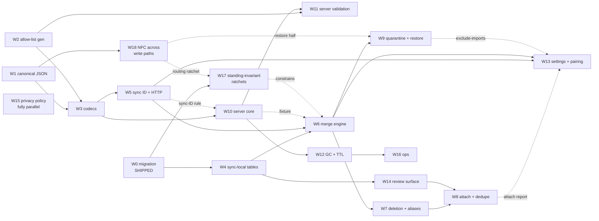

# Implementation plan: Device Sync and the Athenaeum

*Execution companion to [ADR-004](../adr/004-device-sync-and-athenaeum.md),
[sync-spec.md](sync-spec.md) (normative behaviour) and [sync.md](sync.md)
(rationale). This document carries neither behaviour nor rationale: it says
**what to build, in what order, and what must not overlap**.*

## 1. Status

**ADR-004 is `Accepted`; S1's prerequisite is satisfied.** The maintainer's
ruling is recorded in the ADR. **No sync client, server or network code
exists**, but the statement "everything apart from the schema migration is
unstarted" is no longer true, and treating it as true would schedule the
creation of artefacts that are already on `main`.

The §3.1 schema migration shipped first, tracked as
[#898](https://github.com/ibanner56/CallersCompendium/issues/898) and delivered
by PRs #901 and #903, ahead of the ADR and deliberately — see *What must be
serialised*, **S6**. That unit shipped its *migration* cleanly but not its
*invariant*: §3.1's soft-delete join rule was violated in `main` when **W17**
was written, which is why W17 exists.

Three further pieces landed while this document was in review, each closing a
repair issue raised by the review of this design:

| Landed | Closes | Unit | State |
| --- | --- | --- | --- |
| #1115 | #1109 | **W15** | Substantially done. Both policy files carry the operator-visibility and logged break-glass disclosures §8 requires. |
| #1118 | #1110 | **W17** | Partly done: the soft-delete join rule, I1/I2 over raw and typed writes, and the certificate-hatch scan. The write-path routing ratchet is still owed, and could not have landed — it asserts a choke point W18 builds. |
| #1119 | #1111 | **W18** | Partly done, **and drifted**. See the card. |

**W18's delta is corrective, not additive**, and that is the entry most likely
to be misread. Its card below is written around what remains, which is a
reconciliation of shipped code against a contract accepted after the code was
merged — not the from-scratch build the earlier draft described.

Three live defects found while reviewing this plan were filed rather than folded
in, and all three have since been fixed on `main`: **#1016** (an archive
re-import resolving onto a tombstoned venue) by #1018, **#1020** (numeric custom
fields accepting `NaN` and `±Infinity`) by #1022, and **#1021** (import dedupe
missing NFD titles) by #1024. Each was a prerequisite for a §9 bucket here, so
each is now inherited rather than owed — but **only the instance is fixed, not
the class**, which is the whole argument for W17's ratchets: #1016 was a new
read that no list would have covered, and it was closed by adding one filter.

Where this document and the spec disagree, the spec governs. Where this document
and reality disagree, this document is wrong: it is a plan, and plans are the
first thing a programme falsifies.

## 2. How the work is described

Each unit below states five things, and the middle three are the point:

| Field | Meaning |
| --- | --- |
| **Serves** | The spec sections this unit is responsible for. Every implementable section is owned by exactly one unit; the *Coverage* table below is the check on that. |
| **Inherits** | What must already exist, and *what specifically* is consumed — not merely "comes after". |
| **Produces** | The artefact other units consume. If nothing consumes it, it is a leaf and can move freely. |
| **Unblocks** | The units that cannot start without this one's artefact. |
| **Done when** | The conformance bucket in [§9 of the spec](sync-spec.md) that must be green, plus any unit-specific gate. |

"Inherits" and "Unblocks" are the dependency graph. Read them, not the unit
numbers — the numbering is roughly execution order but two units with adjacent
numbers are often parallel, and one late unit (**W10**) is needed unusually
early.

## 3. The six contracts

Parallelism in this programme is gated by **contracts, not files**. Two units
can touch entirely disjoint paths and still collide, because both encode an
assumption about one of these six:

1. **Canonical JSON and the content hash** (§4.1, §4.2). Every hash-derived
   behaviour — the baseline, the manifest, delta sync, the merge
   discriminator — is wrong together if this is wrong. Frozen at **C1**.
2. **The generated allow-list** (§3.3, §7.2). One mapping, imported by the
   client serialiser *and* the server validator. This is the reason the server
   is Dart at all (ADR, *Why Dart for the server*): a second language means a
   second hand-maintained list, which is the drift the registry exists to end.
3. **The blob and manifest schemas** (§4.3, §4.4, §4.5).
4. **The two non-content-addressed JSON shapes** — `GET /v1/store` and
   `POST /v1/blobs/missing` (§5.2). These are the endpoints nothing *forced*
   into a schema, which is exactly why they were the last to get one.
5. **Sync-ID normalisation and credential encoding** (§5.1, §8). Trim → NFC →
   locale-independent
   lowercase, applied identically by client and server before the HMAC — and
   then, on the wire, **base64url of the normalised UTF-8 bytes, unconditionally
   and with padding omitted**, because §8 permits code points RFC 6750's
   `b64token` grammar forbids and `dart:io` throws rather than sending them.
   Encoder and decoder are two halves of one contract for the same reason the
   normalisation is: they are split across W5 and W10, and a disagreement
   resolves one typed ID to two storage keys with no error on either side. The
   plan schedules **W5 and W10 in parallel from C1**, which absent a contract
   is two units independently implementing one algorithm with no file overlap
   — the exact configuration contracts exist to catch. The spec calls the
   divergence the
   nastiest failure in the HTTP contract *because it produces no error*: one ID
   the user typed resolves to two storage keys, and the second device sees a
   working sync of an empty store. This is the same argument that produced the
   generated allow-list, and it applies here for the same reason. The
   resolution is a **single shared definition, written by W5 and imported by
   W10**, carried by a narrow W5 → W10 edge covering the `id_key` derivation
   alone, so everything else in the two units still runs in parallel.
6. **`normalizeTitle`** (§6.10). Normative by reference since round 30,
   consumed by W8. A second implementation that agrees on lowercase ASCII and
   disagrees on a leading article merges records **silently**.

A unit that changes any of the six is **never** parallel with a unit that
consumes it, regardless of file overlap. A unit that merely consumes them is
parallel with anything else that only consumes them.

Contracts 5 and 6 were missing from this list until round 31, and both were
missing for the same reason: they are *shipped or specified elsewhere*, so they
did not look like something this programme decides. That is what makes them
dangerous. A contract does not stop being a contract because it was written
down in another document.

## 4. Work units

### Phase 0 — shipped

#### W0 · Schema migration

- **Serves** §3.1.
- **Inherits** nothing.
- **Produces** `updated_at`, `deleted_at` and `existence_at` across eight tables
  — twenty columns — and six entity-level hard deletes converted to tombstones.
- **Unblocks** everything. Nothing else in the programme changes the schema of
  an existing table.
- **Done when** merged — it is. #898 is the issue; PRs #901 and #903 closed it.

Its early landing is load-bearing rather than incidental, and the reasoning
matters for anyone tempted to treat the gap as wasted time: each device stamps
`updated_at` at *its own* migration time, so while those stamps survive, the
device that upgrades last wins every settings conflict on first sync. Real edits
overwrite migration stamps with meaningful ones. **The delay between W0 and
first sync is what repairs the ordering wart**, so it is a feature of the
schedule, not slack in it.

### Phase 1 — the shared contract (serial with respect to everything after it)

#### W1 · Canonical JSON and the content hash

- **Serves** §4.1, §4.2.
- **Inherits** nothing. This is the root of the graph.
- **Produces** an RFC 8785 (JCS) canonicaliser; SHA-256 content hashing;
  **adoption of `unorm_dart`** as the NFC primitive, promoted to a dependency of
  `app` and re-exported so write paths outside `compendium_core` can reach it;
  rejection of NaN and ±Infinity; rejection of unpaired surrogates **checked on
  the string before encoding**; and the **golden vector corpus** that every
  later unit tests against.
- **Unblocks** W3 and W18, and transitively everything below them.
- **Done when** the §9 *Wire format* bucket is green **except** the
  normalisation clauses W18 owns, including the imported RFC 8785 conformance
  vectors, a fractional `custom_field_values.value_num` agreeing across two
  independently written encoders, and the surrogate rejection firing before
  `utf8.encode` rather than after it. W1 also carries the **manifest nesting**
  clause of *Cross-kind identity*: the manifest is keyed kind-then-id, and a
  fixture holding a dance and a program with the same id round-trips both.

W1 exposes the normalisation primitive; it does **not** normalise. The
serialiser emits the string **as stored**, and that is a decision rather than an
omission. A serialiser that normalised defensively on the way out would make the
wire bytes converge while the local database stayed NFD — so the locally-created
NFD test would pass, the write-path ratchet would have nothing to catch, and
§6.10's dedupe, which reads *stored* values, would keep failing. The defect
would survive in the one place it is most expensive to find. Emitting stored
bytes is
what makes §4.1's one-time pass necessary, and necessary is what makes it get
written.

Applying normalisation across the app's write paths, and repairing rows already
stored, is therefore W18 — kept separate so that W1, the root of the serial
phase, does not grow a data migration. W18 is named on W1's **Unblocks** field
rather than left to "transitively everything", because it takes the primitive
from W1 and nothing else: it hangs directly off the root and is not reachable
through W3, so a reader tracing the chain forward from W3 never arrives at it.

The primitive itself is now mostly a packaging job rather than an
implementation, and the storage half of it has already shipped — wrongly.
`unorm_dart` is a dependency of `compendium_core`, and `nfc()` now has **three**
call sites. Two are comparison-only: `_foldDiacritics` in `dedupe.dart` and
`_normalizeName` in `import_pipeline.dart`, neither reachable from `app`, which
does not depend on the package and cannot see `nfc` through the barrel.

The third is `normalizeShareableText` in `storage/shareable_text.dart`, which
#1119 put on every repository write path. So the claim this card was written
against — that nothing normalises a value that gets **stored** — is no longer
true. What W18 owes is therefore a correction, not a first implementation: that
call composes the two transforms in the order §4.6 rules out. See W18.

The golden corpus is the real deliverable. Code can be rewritten; the corpus is
what makes a rewrite safe, and what lets the server be built by someone who
never reads the client.

#### W2 · The generated allow-list

- **Serves** §3.3, §7.2 (the generation half; enforcement is W11).
- **Inherits** the existing privacy registry — `field_registry.dart`,
  `settings_registry.dart`. It adds no classifications and invents no list.
- **Produces** a generated `snake_case table.column` → bare camelCase mapping
  keyed by record kind; settings resolution routed through `classifySettingsKey`
  so prefix-declared keys resolve; and **fail-closed** behaviour — an
  unclassified key is treated as `deviceLocal` and never serialised.
- **Unblocks** W3 (client serialiser), W11 (server validator).
- **Done when** the bijection ratchet passes over real `encodeArchive`-shaped
  output, never a hand-written key string, **and the registry half of the §9
  *Classification* bucket is green** — `deviceLocal` is never serialised, as a
  property test over the registry that **must not be allowed to become
  vacuous**. A property test that silently enumerates nothing passes forever;
  assert the population it covered.

Expressed as an allow-list, never a denylist. A denylist admits every key the
lookup fails to resolve, and an unresolved settings key can hold unsaved dance
and program content — which is precisely what the editor-draft keys held until
#973.

#### W3 · Blob, settings-record and manifest codecs

- **Serves** §4.3, §4.4, §4.5.
- **Inherits** W1 (canonicalisation and hashing), W2 (which keys may appear).
- **Produces** encode/decode for the blob envelope and the manifest; `v`
  handling on read; hydration of the fields a record publishes but does not own
  (authorship and tags come from join rows, so the record's own row is not the
  whole of its serialised content).
- **Unblocks** W5, W6, W10.
- **Done when** a blob and a manifest round-trip byte-identically and the
  envelope's absent-versus-null rule is pinned by golden.

> **Checkpoint C1 — the wire format is frozen.** See *Checkpoints* below.

#### W18 · Text normalisation and sanitisation across write paths

- **Serves** §4.1 and §4.6 (each transform's every-write-path rule, and the
  one-time pass they share), and the NFC precondition §6.10 depends on.
- **Inherits** W1's normalisation primitive. Nothing else — it touches no sync
  machinery, so W1 is its only gate and it runs beside the sync programme
  rather than after it.
- **Produces** NFC normalisation **and `sanitizeImportedText` with
  `allowLineBreaks: true`** applied at every path that populates a `shareable`
  string, composed in the order §4.6 fixes — **sanitise, then NFC**, since the
  two do not commute and NFC-first leaves text decomposed — implemented at the
  **repository write choke point** each kind already
  funnels through rather than per-writer; a **one-time backfill migration**
  applying both transforms over existing rows that leaves `updated_at`,
  `existence_at` and `deleted_at` untouched, excludes record-identity columns
  (`settings.key`), detects collisions by **grouping on `(table, column,
  target)` before writing** rather than by catching the `UNIQUE` violation,
  **skips and reports** whole colliding groups without aborting, applies the
  same grouping to the **object keys inside a `shareable` settings value** and
  skips that settings key whole when two of its keys share a normalised target,
  and **rebuilds derived indexes if it wrote anything**; the
  `normalisation_skips` table (§3.2) — which **exists on `main` in schema v29
  and carries a fourth column, `target_value`, that §3.2 forbids**, so this is
  a migration that drops a column, not a `createTable` — with its **retry on
  each open judged by
  both halves of the grouping test** — recorded-row grouping by
  `(table, column, target)` *and* live occupancy — its **retirement of entries
  whose row was hard-deleted**, which requires a **new lookup unfiltered by
  `deleted_at`** in all three in-scope repositories, since every existing
  `getById` there filters and would make a tombstone indistinguishable from a
  deleted row; a **primary key on `(table, column, record_id)`** with recording
  as an upsert; its restore-clears rule; and its second writer on the
  ordinary-edit carve-out. The completion marker MUST **record a
  fingerprint of the whole in-scope set — the columns *and* the settings-key
  classifications, exact keys and prefixes alike** — with the pass re-running
  whenever the live in-scope set **differs** from it. Recording columns alone
  fails in both directions: `settings.value_json` is `deviceLocal` at the
  column level, so reclassifying a key to `shareable` changes no column and the
  comparison never differs, leaving that key's existing values unbackfilled
  forever; and the live set already includes those decoded values, so comparing
  it against a column-only marker differs on every open and re-runs the pass
  every launch. The two sides of the comparison must be built from the same
  criteria — a comparison at open, **not** a migration
  hook, since reclassifying a column runs no migration, and inequality rather
  than containment, so a reclassify-out does not make the recorded set a
  high-water mark. That live set MUST be **derived by reflecting over the
  schema's column types intersected with `fieldClassifications`, with identity
  columns excluded via `Table.primaryKey`** and backed by its own ratchet,
  **plus the decoded values of every `shareable` settings key, walked
  recursively** — `settings.value_json` is `deviceLocal` at the column level, so
  a reflection over column classifications alone silently omits every settings
  value the allow-list does let travel, and the omission is invisible to a
  column-level coverage test because the column is correctly classified, since
  `DataClassification` carries no column type and a hand-list would disable the
  comparison at its input. All **three** scope criteria are mechanised, identity
  included: `_key` is classified `shareable`, so a literal string ∩ `shareable`
  set pulls in every id column and renames `settings.key` rather than repairing
  it, and the existing coverage test — which compares only `table.column` names
  — cannot catch that. **Every pass that rewrites a row** — the one-time pass
  *and retry* — MUST commit in **three steps**: rewrites, skips and the durable
  rebuild-owed flag in one transaction; the rebuild outside it, **followed by
  clearing the flag**; the completion marker last, for the one-time pass only.
  The clear belongs to the rebuild step and not to the marker, since retry
  writes no marker and would otherwise leave a rebuild owed that it had already
  performed. The flag's set and its clear MUST share one condition. A pass MAY
  narrow that condition — setting **no flag and running no rebuild** — only
  where a test shows no rewritten column feeds a derived index (`tags.name` and
  `custom_field_defs.key` feed neither FTS table), and MUST do both otherwise;
  skipping the rebuild while still setting the flag defers the same
  whole-library rebuild to the next app open. That flag MUST be the existing
  `derivedRebuildRequiredKey`, since the repair is performed by the generic
  pre-check that reads it and not by the sweep. Both writers of
  `normalisation_skips` MUST take their `(table, column)` spelling from
  **constants declared once and imported at all four sites**, which must be
  created — the registry's identifiers are inline map keys today; and a
  **structural** ratchet asserting that write paths route through the choke
  point — **written here and owned by W17 thereafter** (see the parallelism
  hazards): it asserts a standing property over every write path built after
  this unit, and W18 closes once its backfill has run, so leaving the ratchet
  with W18 parks a perpetual obligation on a unit that ends. The two transforms
  share the choke point, the backfill, the collision
  grouping and `normalisation_skips`, so they are one unit: splitting them makes
  two passes over the same rows and gives one table two owning units, which is
  the ambiguity W4's card exists to avoid.

**Most of this shipped in #1119 (closing #1111), and two parts of it shipped
wrong.** The write-path choke point, the backfill, the collision grouping, the
`normalisation_skips` table and the structural guards are on `main` at schema
v29. What is left is corrective, and both items are contract violations rather
than gaps:

1. **The composition order is reversed.** `normalizeShareableText` is
   `sanitizeImportedText(nfc(value), allowLineBreaks: true)` — NFC first —
   which §4.6 records as the order that does not work. Verified by running the
   shipped function rather than by reading its doc comment: on
   `e` + `U+200B` + `U+0301` it returns `U+0065 U+0301`, so the canonicaliser
   emits text that is not NFC. Its guard cannot catch this, because the test
   input places the zero-width space *after* the combining mark
   (`'Cafe\u0301\u200B\nnext'`), where NFC composes before the strip and the
   order cannot matter. Fixing the order also requires **re-running the
   backfill**, since rows repaired by the reversed composition may be stored
   decomposed — so the completion marker must be invalidated, not just the
   function corrected.
2. **`target_value` must go, and its classification is wrong today.** §3.2
   holds that the table stores "no name, only the address of a row", and
   requires retry to re-derive the target from the live column. The shipped
   column stores the normalised value itself: `choreographer_repository.dart`
   passes `targetValue: name`, and `choreographers.name` is classified
   `DpvTerm.name` / `DataSubject.thirdParty` / `shareable`. The same value is
   classified in `normalisation_skips` as `DpvTerm.nonPersonal` /
   `DataSubject.none`, with the note "Local collision-repair bookkeeping". A
   third party's name does not stop being a third party's name because it was
   copied into a bookkeeping table. Dropping the column resolves both the
   contract violation and the misclassification at once, which is why it is
   preferred to reclassifying in place.

**The classification ratchet did not catch (2), and could not.** It asserts
that every persisted field *has* an entry, not that the entry is *right* —
`normalisation_skips.target_value` is present and green. Presence is
mechanisable; correctness of the subject axis is a judgement, which is why
this repo's guidance asks for a stated reason in the `note` and why a note
naming the table rather than the value is the tell.
- **Unblocks** W9's restore half (which must clear the state this unit owns),
  and **W17's write-path routing ratchet**, which asserts a property of the
  choke point this unit builds and therefore cannot be written first; otherwise
  nothing directly, but it **gates C1**: the *Wire format*
  bucket's locally-created-NFD vector, pre-existing-row vector, collision,
  idempotence and derived-rebuild clauses are all its, as is the write-path
  clause in *Write-path invariants*.
- **Done when** those clauses are green: a locally-created NFD title uploads as
  NFC, a row written before the normalising build is NFC after upgrade, the
  backfill is proved not to move any of the three stamps, a colliding local
  pair leaves both rows untouched and is reported while the pass completes, a
  tag and a choreographer sharing a name are both normalised, a recorded
  mutually-colliding pair survives re-open **still whole** rather than having
  one member written along iteration order, a retry does not raise against a
  row created after the skip was recorded, an entry whose row was hard-deleted
  is retired while one whose row was soft-deleted is not — proved through the
  unfiltered lookup, with the filtered accessor shown to retire both — a row
  recorded twice across an interrupted pass is still repairable, a
  *reclassified* column re-runs the pass with no migration involved, a column
  reclassified out and back in re-runs it too, a newly `shareable` column
  enters the live set with no list edited, a crash between the commit and the
  derived rebuild still leaves search matching the repaired rows **on the retry
  path as well as the one-time pass**, no primary key enters the live in-scope
  set, a retry that rebuilds leaves no rebuild owed, both writers spell
  `(table, column)` identically, a restore re-runs the pass,
  `normalisation_skips` survives an epoch reset and a detach, an ordinary edit
  to a blocked row succeeds, `settings.key` is untouched, a second run of the
  pass changes nothing, a row whose text the pass changed is still found by
  search, and the write-path ratchet catches a **newly added** writer that
  bypasses the choke point rather than a writer removed from a list; and, for
  the sanitiser specifically, a title containing `U+200B` typed into the editor
  is stored clean, a paragraph break in a notes field **survives** the pass, the
  inbound apply path is proved to leave a conforming peer's bytes
  byte-identical, and a row needing only sanitisation, a row needing only
  normalisation and a row needing both are each repaired by the one pass.

**This unit exists because the round-31 fix to §4.1 corrected the rule without
assigning the work it created.** Correcting a rule and leaving its
implementation unowned is a quieter version of not correcting it, because the
plan is what gets built from.

It is deliberately separate from W17 rather than folded in, though both own
standing properties. W17 ratchets invariants over code that already exists and
ships no migration; W18 touches every write surface in the app and carries a
**data** migration over user rows. Those are different risk classes, and a
checkpoint that gates them together tells you less than one that gates them
apart.

The backfill is the part worth not deferring. "Normalise on write" repairs a row
the next time it is written, and a library imported years ago and never edited
is never written again — so the population the rule was written for is precisely
the population it misses. §6.2 step 4 uploads exactly that library verbatim.

**The backfill is the first work in this programme that rewrites stored user
rows, and it should be planned as a migration rather than as a loop.** Three
constraints on it are non-obvious and each has a matching test above.

*It runs under an exception to invariant I1, and the exception is conditional.*
§6.5 permits a content change without a stamp bump only for an operation that is
content-derived — no clock, device identity or randomness — **and** whose every
cross-row dependency is enumerated in the spec and produces divergence that is
reported rather than silently resolved. This pass has exactly one such
dependency, the collision skip below. That is not a courtesy extended to the
pass; it is the reason it may leave stamps alone, and every other constraint
here exists to keep the condition true. The §6.5 proof obligation has two
halves, and the second is the one worth reading before writing the test:
running the pass twice over the same database proves nothing about a cross-row
read, because such a read is perfectly deterministic. The pass must also be run
over two databases containing the same row — one where the collision fires, one
where it does not.

*Normalising can collide, and the collision must be found before writing.*
`choreographers.name`, `tags.name` and `custom_field_defs.key` are `UNIQUE`, so
two rows differing only in Unicode form collapse onto one string. §6.6 already
specifies this collision class for these exact columns — but only for the
**inbound apply** path, so an implementer building W18 in isolation will not
meet it. Compute every target value first, group by it, and skip whole groups
of more than one; do **not** implement this by catching the `UNIQUE` violation.
With try-and-catch the first row of a colliding pair writes successfully —
nothing holds the target yet — so one member is normalised and which one depends
on row order. The spec requires both to be left alone. Grouping must include
soft-deleted rows: soft delete is an `UPDATE` and none of the three `UNIQUE`
indexes is filtered on `deleted_at`, so a tombstone occupies its natural key and
can block a live row.

The pass does not merge. Merging would be a judgement about whether two
similar names are one entity, and a user making that judgement differently on
two devices produces exactly the divergence I1 orders — which would disqualify
the pass from the exemption it depends on.

*Group on `(table, column, target)`, never on the target alone.* The in-scope
rows span three tables with three independent `UNIQUE` indexes, so a tag and a
choreographer named `José` do not collide. Grouping on the value alone skips
both of them **permanently**, because unlike a genuine collision a cross-table
one never stops colliding and retry can never clear it.

*Skips are recorded and retried; they are not final.* This adds a table —
`normalisation_skips (table, column, record_id)` — which is classified in §3.2
and must be created with its classification in the same PR, or the coverage
ratchet fails. Re-attempt the recorded rows on each open. This is the whole of
the tombstone answer: a blocked row unblocks when the row occupying its target
is renamed or deleted, when a blocking tombstone is purged, or when
reconciliation renames one side, and the next open finishes the job. Without
retry a live row can be left un-normalised forever by a tombstone the user
cannot see or list. A later ordinary edit to a blocked row must **not** fail —
store the value un-normalised and record the skip; that carve-out is the
table's second writer.

*Retry runs the same grouping test as the initial pass, re-derived from live
state — both halves of it.* Write a recorded row only when no other recorded row
in the same `(table, column)` currently derives the same target **and** the live
`UNIQUE` column holds no occupant other than the row itself. Implementing either
half alone is a defect, and they fail in opposite directions.

Live occupancy alone splits a mutually-colliding pair: if `A` and `C` are
recorded together, both NFD and both deriving `T`, then neither occupies `T`, so
whichever row the retry loop reaches first is written and the second is then
blocked by it. The pair the initial pass deliberately left whole comes apart
along an iteration order nothing specifies, and two devices can normalise
opposite members. Recorded grouping alone raises: if an unrelated `D` later
takes `T` in NFC — which succeeds, since `A` and `C` still hold un-normalised
bytes — then renaming `C` leaves `A` a singleton by grouping, and the retry
writes `A` straight into `D`. This is why an entry stores only the row's
address: the target and the group are both snapshots, and each must be
re-derived on every attempt.

*Retire an entry whose row was hard-deleted — in the retry loop, not in the
delete paths.* `ImportPipeline.undo` already hard-deletes choreographers
(`delete(id, permanent: true)`), so an entry can outlive its row, at which point
it can never be written, never clears, and gives retry nothing to recompute
from. The table is polymorphic, so `ON DELETE CASCADE` is unavailable; putting
the retirement in retry makes it self-healing rather than an obligation on every
present and future delete path. Do **not** retire on soft delete: a tombstone
still occupies the key, so the repair is still owed and still blocked.

*Write the unfiltered lookup first — it does not exist, and the accessor you
will reach for is wrong.* Telling a tombstone from a hard-deleted row needs a
read that ignores `deleted_at`, and all three in-scope repositories filter:
`choreographer_repository.dart:67`, `tag_repository.dart:82` and
`custom_field_repository.dart:74` each `where` on `deletedAt.isNull()`, and none
takes an `includeDeleted` parameter. Both states come back `null`, so the
natural implementation retires the entries the spec forbids retiring and drops
owed repairs with no error anywhere. `DanceRepository.getById` *does* take
`includeDeleted` (`dance_repository.dart:685`), which makes the pattern look
uniform when it is not. The same lookup serves retry's value read, since a
recorded row may legitimately be a tombstone. Three outcomes, not two: live,
tombstoned, absent.

*Make recording an upsert and give the table a primary key on
`(table, column, record_id)`.* The pass writes skips and marker in one
transaction, so an interruption re-runs it from the start rather than resuming;
without a key that re-run inserts a second entry for the same row, and a
duplicate is self-blocking — condition (a) sees "another recorded row deriving
this target" and the row is blocked forever against its own twin.

*Commit in three steps, and copy `_backfillChainHandIfNeeded` rather than the
simpler sweeps.* Rewrites, skips and a durable rebuild-owed flag go in one
transaction; `runDerivedRebuild` runs outside it, and the flag is cleared once
that returns; the completion marker is written last, for the one-time pass
only. The clear belongs with the rebuild and not with the marker, because retry
writes no marker. The shape matters
because a crash in the gap is otherwise permanent rather than transient: the
marker would assert the scan is done, every later pass writes nothing, and "a
pass that wrote nothing MUST NOT rebuild" then forbids the repair — leaving
full-text and substring search silently not matching the rows the pass just
fixed. `repositories.dart` already does exactly this (`:991`, `:1006`, `:1021`,
with the owed-rebuild check at `:467`–`:491`); the two-step sweeps in the same
file (`:557`, `:569`) are the ones with no derived data to rebuild, and copying
those here is the mistake.

Two details of that shape are easy to drop and carry the whole guarantee. The
flag must be **the existing `derivedRebuildRequiredKey`**, not one private to
this unit, because the repair is not performed by the sweep that sets it — it is
performed by an unconditional check at the top of the migration path that runs
before any sweep, and a private flag nobody else reads is inert. And the
obligation is on **any pass that writes a row, retry included**, not on the
one-time pass: retry never writes the completion marker, so a rule shaped around
step 3 would skip it, while retry is the path that runs forever and is therefore
the likelier one to be interrupted. The reference implementation keys the flag
off `rewroteAny` (`:985`) rather than off a lifecycle for exactly this reason,
and says so at `:986`–`:990`. The same applies to the *clear*: it goes with the
rebuild (`:1011`–`:1016`), not with the marker, or retry rebuilds and then
leaves the flag standing for the next open to honour with a second
whole-library recomputation.

*Compare in-scope sets at open; do not hang the re-run off a migration.* The
marker records a fingerprint of what the scan covered — the columns **and** the
`shareable` settings classifications — and the pass re-runs when the live
in-scope set **differs** from it. Both halves are needed because the write
path's obligation follows the value, not the column: `settings.value_json` is
`deviceLocal`, so a column-only marker never covers a settings value and
reclassifying a key to `shareable` trips no re-run at all. A migration hook
looks equivalent and is not: reclassifying a column to `shareable` is an edit
to a map entry in `field_registry.dart`, with no schema change, no version bump
and no migration step, so a migration-gated guard is vacuously satisfied for
one of the two triggers it exists to catch. Compare with **inequality**, not
containment: a removal shrinks the live set, containment would pass it
silently, and the recorded set would become a high-water mark that never
notices the same column coming back — after an interval in which its rows
accrued NFD unnormalised and unrecorded. And derive the live set by reflecting
over the schema's column types intersected with `fieldClassifications`:
`DataClassification` has no column-type field, so "string" is a schema fact,
and hand-enumerating it means a newly `shareable` column never enters the live
set and the comparison never fires — disabling this safety net through its own
input. Exclude identity by reflection as well, through `Table.primaryKey`: the
scope is *string, `shareable`, and not identity*, and mechanising two of the
three is worse than mechanising none, because `_key` is itself classified
`shareable`. A literal string ∩ `shareable` set therefore contains every id
column in the schema, and normalising `settings.key` renames records rather
than repairing them. Budget a ratchet that asserts the derived set, not one
shaped like the coverage test: that test compares `table.column` names for
presence and staleness and would pass unchanged with every primary key leaked
into the scan.

*Generate the `(table, column)` spelling; do not write it twice.* The pass and
the write-path carve-out are separate writers, and retry correlates their
entries by grouping on those two strings. Two spellings of the same column —
the registry's `'choreographers.name'` against a Dart accessor name — never
group, so condition (a) stops correlating and collision detection degrades with
nothing raised. §3.3 already demands a generated, test-proven mapping for the
identical registry-versus-code mismatch. Note that the source does not exist
yet: the registry's identifiers are inline string literals used as map keys, and
the carve-out has a call site in each of the three repositories, so this unit
declares the constants once and imports them at all four sites rather than
typing two literals and reconciling them afterwards.

*Expect the rebuild to be blunter than the repair.* `runDerivedRebuild` is the
only rebuild routine there is, and it clears and repopulates the dance FTS and
figure tables for the whole library. Its indexed columns reach `choreographers`
through resolved author names, but neither `tags.name` nor `custom_field_defs`
keys appear in either FTS schema — so a tag-only repair, the likeliest kind,
pays a full recomputation for indexes that did not change. The spec permits
skipping the flag and the rebuild together where a test proves no rewritten
column feeds an index, and requires both otherwise. If that permission is taken,
do not try to reflect the mapping out of the schema — no schema records that
`authors` comes from `choreographers.name`, and the indexed row is assembled by
hand across joins. Declare the mapping once and check it by observing a rebuild:
seed a marker per in-scope column and assert which markers reach indexed
columns. The drift that matters needs no schema change at all.

*`normalisation_skips` does not clear with the baseline.* Its neighbours
`id_aliases` and `review_queue` do, and copying them is the expected mistake: a
`UNIQUE` collision between two Unicode forms is a fact about this library, not
about a store, so it survives an epoch reset and a detach. Clearing it on a
`409` drops every owed repair while the completion marker still says the scan
finished. Restore is the one event that clears it — along with the marker,
because a restore brings in rows the scan never saw and no per-entry
revalidation can discover them.

*The pass must be total, not all-or-nothing.* The existing one-time sweeps in
`repositories.dart` write their completion marker only after the whole pass
succeeds, so a throwing row is retried from scratch on every launch and the
sweep never completes. Skip-on-collision is what makes that idiom safe here:
nothing raises, so there is nothing to retry into. Re-running is a no-op. Note
the marker records that a *scan* completed; the recorded skip groups are a
separate, retried set, so the two coexist rather than conflicting.

*`settings.key` is in scope by classification and must be excluded by hand.* It
is a `shareable` string column, so "every `shareable` string column" reaches it,
but §4.4 makes it the settings record's id — normalising it would rename the
record. Harmless today, since settings keys are ASCII app constants, and that is
exactly why it will not be noticed.

*Derived indexes are maintained by the repository layer, not by SQLite.*
`dance_fts` and `dance_substring_fts` hold literal text written on each
repository write; a bulk `UPDATE` that bypasses that layer leaves them holding
pre-normalisation text and search silently stops matching. Call
`runDerivedRebuild()` when the pass wrote something. The nearby precedent is
`_normaliseInversePairMoveIdsIfNeeded`, which gates its rebuild on
`!alreadyRebuilt || rewroteAny` rather than calling it unconditionally, and a
second call site in the same file gates on a rewrite count alone; follow the
rewrite-gated shape. A retry pass in which every recorded row is still blocked
writes nothing and must not rebuild. `runDerivedRebuild()` rebuilds derived
tables only, so it touches none of the three stamps and composes with the rule
above.

**Sizing note for the first sync after this unit ships.** The pass changes
content without moving `updated_at`, so on the first device to upgrade *every*
never-edited non-ASCII record becomes an equal-`updatedAt` difference against a
peer that has not upgraded yet. §10 treats ties as an occasional edge case; here
they arrive in a batch whose size is the user's non-ASCII library. They resolve
correctly and are reported, so this is a UX volume question — the report must
not be a per-record prompt — rather than a correctness one.

**#1021 is no longer this unit's first act.** It was fixed on `main` by #1024
while this plan was being written, so the red-run instruction that stood here
does not apply. What remains is unaffected: #1024 repaired *comparison* in the
import dedupe path, and nothing yet normalises a value that gets **stored**.

### Phase 2 — client foundation and server core, in parallel

#### W4 · Sync-local tables

- **Serves** §3.2.
- **Inherits** W0 (the migration is the only change to *existing* tables; these
  are new ones).
- **Produces** `baseline`, `id_aliases`, `pending_deletions`, `review_queue`,
  `published_records` — **with their classifications in the same PR**, or the
  coverage ratchet fails the build. Note the split classification:
  `pending_deletions.tombstone_blob` is `shareable` while the rest of that table
  is `deviceScoped`, because it is retransmitted record content rather than
  device bookkeeping.
- **Unblocks** W6, W7, W8, W9, W14.
- **Done when** the ratchet is green and each table's lifecycle is tested,
  including the three that differ: `pending_deletions` survives an epoch reset,
  clears on detach, and is revalidated against restored data after a restore;
  `published_records` clears on *nothing*; the rest clear with the baseline. W4
  also carries the **baseline** clause of *Cross-kind identity*: an entry is
  addressed by `(kind, record_id)`, so the same fixture keeps two entries rather
  than one. `normalisation_skips` is **not** W4's — it is created and
  lifecycle-tested by W18, which is why "the rest clear with the baseline" is
  true here. Read without that carve-out the sentence is exactly the mistake
  §3.2's lifecycle paragraph warns against, so do not extend this unit to the
  new table by analogy.

`published_records` is the one to get right, because its whole purpose is to
resist the intuitive rule. It records that bytes physically left this device,
which no local action can retract — so detach, epoch reset and restore all leave
it alone. Clearing it on detach converts "the deletion sticks" into "the
deletion silently reverts".

#### W5 · Sync ID, authentication and the HTTP client

- **Serves** §5.1, §5.2, §5.3 (client half), §8.
- **Inherits** W3 (what it sends and receives).
- **Produces** diceware generation over the EFF long wordlist; the client-side
  strength **warning**; the structural rule and the **normalisation applied
  before the HMAC** (trim → NFC → locale-independent lowercase), written
  **once** as the shared definition W10 imports rather than reimplements, per
  contract 5; the
  **base64url credential encoding** applied unconditionally to every sync ID,
  which is what makes a non-English ID transmissible at all — `dart:io` throws
  `FormatException` on a raw non-Latin-1 header value, so the failure is a local
  exception rather than a rejected request; bearer
  auth that never puts the ID in a URL; and status handling — `409` forces fresh
  attach, `422` is surfaced and **never retried**, `429` honours `Retry-After`.

  W5 also owns **`sync_id` and `sync_device_id` as persisted settings keys, with
  their classifications** — `accessControlData` and `protocolIdentifier` — and
  therefore owns **adding those two members to `EgressClass`**. ADR-004 and spec
  §3.3 specify both classes; neither is in the Dart enum, deliberately, because
  a member with no registry entry is a member no ratchet exercises. Assigning
  them here lands each member in the same change as its first entry, and keeps
  both in one unit rather than splitting an enum edit across two.

  That this needed saying at all is the point: those two keys are the only
  persisted values in the feature whose classification is neither `shareable`
  nor `deviceScoped`, and no unit's card named them, so the coverage ratchet's
  "classified in the PR that adds it" rule had nothing to bind to. This is my
  assignment, not a ruling.
- **Unblocks** W6, W8, W13, and **W10 for the sync-ID normalisation definition
  only** (contract 5).
- **Done when** the ID bound cases pass (one code point over rejected, at the
  bound accepted), a client/server `id_key` agreement test passes under
  differing whitespace and Unicode form, **a non-ASCII sync ID produces a
  request that is actually issued** — asserted on the request, not on sync
  succeeding, since the naive implementation throws before the socket is touched
  — **and an all-ASCII ID and the base64url of that same ID resolve to two
  different stores**, which is what pins the encoding as unconditional, **and a
  `302` to a foreign https host is refused with no credentialed request
  issued**, as are a server presenting an untrusted certificate, a
  `localhost`-prefixed public host such as `localhost.example.com`, **and the
  loopback addresses `http://[::1]` and `http://127.0.0.2`** (§9 *Client isolate
  and robustness*). Those last two are separate cases on purpose: a prefix test
  and a loopback-*range* test are different wrong implementations, and each
  passes the other's test. Certificate verification MUST have no disable switch,
  and the loopback exemption MUST be an exact host match — both are rules about
  who is on the other end of the connection, which the scheme string does not
  constrain. The *standing* half of the certificate rule — that no escape hatch
  is ever added — belongs to W17, not here; this unit owns only the behaviour,
  which a debug flag defaulting to off would satisfy.

The strength score **warns and never blocks**, here or anywhere else, and is
computed over the **normalised** ID rather than the string as typed — an
estimator run on the raw form credits case and Unicode differences that
normalisation collapses, and so reports a strength the credential does not
have. Blocking has no safe home: the ID *is* the store address, joining means
typing an existing one, and a newer client with a stricter estimator locks a
user out of an ID an older client accepted, exactly as a stricter server would.
This unit inherits the rule and not its original third leg: spec §5.2 now splits
creation onto `POST /v1/store`, so the server *can* tell creating from joining
and a server-side floor is buildable. It is still not built. Maintainer's
ruling, re-affirmed after the split; spec §8 carries the re-derivation.

#### W10 · Athenaeum core — storage, endpoints, limits

- **Serves** §7.1, §5.1–§5.4 (server half), §8 (server half — the structural
  sync-ID rule and its `403`, and the prohibition on the server running its own
  strength estimator, which now follows from the score blocking nowhere at
  all).
- **Inherits** W3 (schemas), and **W5 for the sync-ID normalisation and
  credential-encoding definitions only** (contract 5).

  That second edge is narrow by design — it gates the `id_key` derivation and
  nothing else, so the rest of this unit still runs beside W5 from C1, exactly
  as the schedule intends. It is declared because the rule above forbids a
  consumer running parallel with the producer of a contract, and contract 5's
  resolution makes W5 that producer; left undeclared, the two units sit in
  precisely the configuration that contract exists to prevent while reading as
  though nothing connected them. W2 is deliberately not an edge here: it
  arrives later, via W11, so it constrains that unit and not this one.
- **Produces** the Dart + `shelf` service; `HMAC-SHA256(pepper, syncID)` storage
  keying, with the pepper in configuration and **no version scheme** — the spec
  specifies none, and §10 records pepper rotation as an unresolved limitation
  whose proposed answer is versioned lazy re-keying, so building versioning here
  would implement a resolution the design has not adopted, with no schema column
  and no conformance case behind it; the store, manifest and blob endpoints,
  **including `POST /v1/store` as a separate creation call that `GET` never
  performs**; strong quoted `ETag` equal to the manifest content hash, with
  `If-None-Match`; permissive `Content-Type` handling; **base64url credential
  decoding that rejects malformed input with `401` rather than repairing it —
  never `U+FFFD` substitution, which maps distinct IDs onto one store**; **the
  failed store-resolution limits, per-IP and server-wide**, counting all four of
  §5.4's outcomes rather than `401` alone — the server-wide one is what §8's
  enumeration bound actually rests on, and counting only `401` leaves a
  structurally valid guess costing nothing — scoped so that a request resolving
  an existing store still succeeds while the budget is saturated; the **separate
  server-wide cap on store creations**, which bounds stored rows rather than
  guessing and must not share the failure budget; and **every limit enforced
  before allocation**, streaming-abort style.
- **Unblocks** W11, W12, W16 — and, critically, **W6**.
- **Done when** the loopback round trip at **C2** passes, and the
  store-lifecycle half of §9 *Client isolate and robustness* is green, together
  with §9's *Server* cases for the endpoint split: `GET /v1/store` for an
  unknown store is `404` and creates nothing; every `POST /v1/store` returning
  `201` mints an epoch no peer has seen (mutation: derive it from the `id_key`,
  so a `DELETE` and recreate reproduces it and nobody fresh-attaches); a `POST`
  against a store that already exists is `409` and mints nothing; concurrent
  creators observe one epoch; a stale-epoch manifest `PUT` is `409` and does not
  land; a blob `PUT` not hashing to its path segment is rejected, and a `PUT` to
  an existing hash neither replaces the bytes nor refreshes `uploaded_at`. The
  budget cases are part of this gate rather than W12's, because the counter is
  what §8's bound rests on: all four failure outcomes increment it, successes do
  not, and creation is capped separately. Plus the §8 server case: a
  structurally valid but *weak* user-chosen ID is **accepted** (mutation: re-run
  the client's estimator server-side, which is the lockout — and note the split
  makes this mutation *buildable*, where previously it had no endpoint to live
  on). Blob and manifest paths are namespaced by **epoch** as well as `id_key`,
  so a wipe or a sweep still deleting an old incarnation cannot remove content
  uploaded into its successor (mutation: key on `id_key` alone and interleave a
  `DELETE /v1/store` with the recreating `POST`).

**This unit is numbered late and must be scheduled early.** It is the cheaper
half of the programme and it is the *test fixture* for the expensive half: a
merge engine developed against a mock server is a merge engine whose first
contact with the real contract happens at the end. My recommendation is to start
W10 at C1, concurrently with W4 and W5, and to treat "the client team has a real
server to run against" as the point of it rather than a side effect.

#### W13 · Settings blade, pairing, triggers and user-facing obligations

- **Serves** §6.1, §6.12, §6.13, §6.14.
- **Inherits** W5 for the ID and endpoint types, and **W6 + W9 for the
  `sync_exclude_imports` filter alone** — that clause acts on the publish set
  and needs §6.9's citation closure, so it is the one part of this unit that
  cannot be built against a fake engine. The blade, pairing, triggers, status
  surface and the §6.13 hint can, from C1 onward. It also inherits **W8 for the
  attach-completion report alone**.
- **Produces** the top-level Settings blade; **off on every installation until
  the user turns it on, with no sync-related network call while off**; the
  pairing flow, which must work for a user reading an ID aloud over the phone;
  *Sync only on WiFi* defaulting to on, with a manual attempt on a metered
  connection routing to the setting; the status surface;
  **`sync_exclude_imports`** and the publish-set filter it drives, including the
  §6.9 citation closure that keeps a cited imported dance published and the
  upload-only scope that keeps it convergent; and the **partial-venue hint** of
  §6.13, derived on read and naming the local-only fields; and the four
  **§6.14 pairing-time disclosures**, each at the moment it is about — sharing
  is not collaboration where a second person can be added, no-recovery and
  no-revocation in the pairing flow, not-a-backup wherever success is reported,
  and the approaching-expiry warning.
- **Unblocks** nothing. It is a leaf, which is what keeps it parallel with
  everything except the two engine clauses it inherits.

The W8 edge is narrow in the same sense as this document's other narrow edges:
W8 produces the after-the-fact duplicate count and this unit owns the surface
that shows it at the end of pairing, so the edge gates the report and not the
blade. Without it the two halves of one screen are scheduled independently.
- **Done when** the enablement test proves the no-network-call property, not
  merely that the toggle renders, **and** the §9 *User-visible sync obligations*
  bucket is green — both `sync_exclude_imports` clauses (a cited imported dance
  stays published; a second pass makes no further request for a peer's imported
  dance), the hint's field-naming clause, and all four §6.14 disclosure
  clauses — including that not-a-backup appears on the **status surface** and
  not only in the pairing flow.

Its settings keys are themselves `deviceScoped` and MUST NOT sync — a sync
feature whose configuration syncs is a loop. That holds for this unit's keys;
it is **not** true of every key the feature introduces. `sync_device_id` is
`protocolIdentifier` and `sync_id` is `accessControlData` (spec §6.1, §3.3):
both travel on every request, and a card that called them `deviceScoped` would
classify the bearer credential as never-transmittable while the protocol
requires it. Those two belong to W5, not here.

#### W14 · A kind-agnostic review surface

- **Serves** the review-queue surface required by §3.2.
- **Inherits** W4 (`review_queue` is the storage this reviews).
- **Produces** a generic keep-both-or-merge list. **No per-kind editors are
  required**, which is the scope control on this unit.
- **Unblocks** W8.
- **Done when** a queued pair survives an app restart and can be resolved.

The existing `import_review_screen.dart` reviews **dances only**, and is driven
by `ImportSession`, whose own doc comment says it is deliberately not persisted.
Sync runs non-interactively with nobody watching, so there is no in-progress
import to attach a decision to. This is new storage plus a new surface, not a
reuse of proven machinery — the ADR corrects an earlier draft that implied
otherwise.

#### W17 · Standing-invariant ratchets

- **Serves** the enforcement of §3.1's join rule, §6.5's **I1**/**I2**, and §5's
  ban on any certificate-validation escape hatch — the properties that are not
  behaviours of any one unit.
- **Inherits** W0 (the soft-delete columns exist), and — **for the write-path
  routing ratchet only** — W18, which builds the choke point that ratchet
  asserts every write reaches. Independent of everything else, and its other
  ratchets can start the moment the ADR is accepted.

  The scope label is doing real work: without it this card would either
  contradict itself — claiming independence while owning a gate that cannot be
  written before W18 — or overstate the edge, parking W17's certificate and
  single-definition scans behind a data migration they have nothing to do with.
  Same shape as W9's *restore half only* and W10's *sync-ID rule only*.
- **Produces** a CI ratchet enumerating every read that joins through to a
  soft-deletable parent and asserting the `deleted_at IS NULL` filter; a ratchet
  for I1/I2 over write paths; and a source scan asserting that no
  certificate-validation escape hatch exists anywhere in the client —
  `badCertificateCallback`, `SecurityContext` construction,
  `setTrustedCertificates` and equivalents — over the same roots and with the
  same comment-stripping as `app/test/data/settings_classification_test.dart`
  (`:64`–`:73`, `:85`–`:102`); and two **single-definition** source scans, one
  asserting that sync-ID normalisation (contract 5) exists once and is imported
  by both W5 and W10, the other that `normalizeTitle` (contract 6) is the only
  title-normalising definition in the tree **and that every sync call site
  reaches it by import** — counting declarations of the name `normalizeTitle`
  is not sufficient and MUST NOT be what the scan asserts. A second
  implementation is introduced under a *different* name, so a copy called
  `_normalizeTitleForSync` leaves the count at one and the scan green while
  contract 6 is broken; that is the state the scan exists to detect, and the
  name-counting form cannot fail in it. Scan for the behaviour — additional
  definitions performing title normalisation, and call sites reaching one
  without importing the shared definition — on the same footing as the
  contract-5 scan beside it, which already binds the call path rather than the
  name. **W18's write-path routing ratchet is also W17's** once written: it
  asserts that every path populating a `shareable` string routes through the
  normalisation choke point, which is a standing property over write paths that
  do not exist yet, and W18 closes when its backfill completes. W18 writes it;
  W17 owns it and keeps asserting it. **The fix for #1016 is inherited, not
  owed** — #1018 closed
  the instance on `main`, leaving W17 the class.
- **Unblocks** nothing — no unit must wait for it.

  That is a claim about scheduling, not about force. Its I1/I2 ratchet
  **constrains** W6 and every write path built after it, and it gates **C0's
  honesty** (see below). A constraint is not a dependency: W6 can start without
  W17, it just cannot be trusted to have held I1/I2 without it. The graph draws
  the relation as `W17 -.constrains.-> W6`, which is deliberately not a
  dependency arrow.
- **Done when** the §9 *Soft-delete join coverage* **and** *Write-path
  invariants* buckets are both green, **and** the *Client isolate and
  robustness* clause *"No certificate-validation escape hatch exists in the
  client source at all"* is green — this unit carries that one clause of that
  bucket and no other, per the clause-splitting rule below. The first is proved
  by dropping the `deleted_at` predicate from one existing read and watching CI
  go red, the second by a write that changes a record's serialised content
  through a join-hydrated field without advancing `updatedAt`, and the third by
  adding a `badCertificateCallback` behind a debug flag defaulting to off and
  watching CI go red — the arrangement W5's behavioural test passes. None is
  proved by adding a test beside the current code and observing it pass.

  **Three of these landed in #1118 (closing #1110)**, as
  `tools/ci/check_sync_invariants.py`: the soft-delete join rule, I1/I2 over
  both raw-SQL and typed Drift writes, and the certificate-hatch scan. What
  remains is the **write-path routing ratchet**, which is the one that could
  not have landed with them — it asserts that every write reaches a choke point
  W18 builds, which is exactly the narrow W18 edge this card's `Inherits`
  already declares. The scope label earned its keep: without it this unit would
  have been read as blocked in full behind a data migration three of its four
  ratchets have nothing to do with.

  The two single-definition scans are the exception to this unit's pattern: they
  are gated by **no §9 bucket**, and deliberately. §9 is scoped to the rules the
  specification states normatively, and the specification requires the two sides
  to *agree*, not to share source — an implementation that duplicates the
  function correctly conforms. "Exactly one definition" is this plan's chosen
  means of guaranteeing that agreement, so the plan owns it. Their mutation is a
  second copy that currently agrees, which is precisely the state no behavioural
  test can distinguish from the correct one.

Every ratchet and scan in this unit MUST be **structural** — flagging any new
read joining through a soft-deletable parent, any new write path that can change
serialised content, any certificate-validation escape hatch anywhere in the
client, and any second definition of the two shared functions — rather than a
maintained enumeration of the ones known today. An enumeration relocates the
forgetting instead of removing it: it turns "someone forgot the filter" into
"someone forgot to add their read to the list", which fails the same way and is
harder to notice. #1016 arrived as a *new* read, which is exactly the case a
list does not cover.

**This unit exists because "exactly one owning unit" is the wrong tool for a
standing property.** It is the right tool for a behaviour: a behaviour is
built, tested and finished, and the unit closes with it. §3.1's join rule and
I1/I2 are not built — they are *maintained*, against every future PR, for as
long as the app has these columns. The certificate rule is the same kind of
thing said a different way: "no affordance exists anywhere in the client" is
not a behaviour that can be finished. The threat it names is a *future*
addition — a `badCertificateCallback` added to work against a self-signed
server during development, which then ships — and W5's behavioural test cannot
see it, because a debug flag defaulting to off refuses the untrusted
certificate in the test and accepts it in the build that has the flag on. W5
closes early, and from then on the rule would be unowned. Both are kept: one
checks the behaviour, the other checks that the affordance was never written.
Assigning them to W0 and W6 means they are unowned the moment those units
close, which is not hypothetical: the join rule decayed exactly that way. #1016
is an ordinary feature PR (#986) breaking a sync invariant months after v25
landed, found by review rather than by CI. That is the steady state for the
duration of this programme, and prose in a spec has no failure signal.

Nothing about this unit is sync-specific enough to wait for sync. It should be
among the first things built, because every unit after it is a chance to decay
what it protects.

#### W15 · Privacy-policy amendment

- **Serves** the ADR's *Blocking prerequisite*; §10.
- **Inherits** nothing whatsoever.
- **Produces** amended `docs/dev/store-submission/privacy-policy.md` **and** its
  mirror `site/privacy/index.html`, changed together, with the effective date
  bumped; the amendment MUST retire the dated no-cloud-sync claim, correct the
  "before it ships" undertaking to S7's gate, and **add** spec §8's affirmative
  disclosures — that the operator can see all store content except venue
  addresses and contacts, and that break-glass access exists and is logged with
  a stated retention (spec §7.4).
- **Unblocks** nothing directly — but **C6 and C7 both depend on it** (S7).
- **Done when** neither file claims the release "has no cloud sync", **and**
  both state the operator-visibility and break-glass disclosures plainly,
  **and** neither defers the amendment to when the feature "ships". Removing a
  false claim is not the same as making the true one, and §8 requires the
  latter: a policy merely silent about operator visibility still implies the
  store is opaque.

  **Substantially delivered by #1119's sibling, #1115 (closing #1109).** Both
  `docs/dev/store-submission/privacy-policy.md` and `site/privacy/index.html`
  now state that the operator can read the plaintext synchronized store, that a
  logged break-glass path exists with a stated 30-day linkability bound, and
  that structured venue address and contact fields do not travel while freeform
  venue notes do. That is this card's `Done when`, including the part a mere
  retraction would not have satisfied. What remains is the release-time check
  that the effective date is bumped in the release that turns the feature on —
  which is C7's gate, not this unit's.

  **The scope this card was written against no longer exists.** #1086 removed
  the absolute claims ("We have no servers that receive or hold your content,
  and there is no cloud sync"), and #1115 removed what #1086 left: neither file
  now contains the string "cloud sync" at all, and neither defers the amendment
  to "before it ships" — the too-late gate S7 exists to reject. The
  operator-visibility and break-glass half, which #1086 did not touch, is what
  #1115 delivered.

  This card is kept rather than struck because its `Done when` is still the
  thing C7 checks, and because the unit that verifies a disclosure is not the
  unit that wrote it. What is left is one release-time action, not a document
  repair.

Fully parallel with all code, and best done early: it is the cheapest unit in
the programme and the only one that can block a release on its own.

### Phase 3 — the engine

#### W6 · Steady-state merge

- **Serves** §6.3, §6.4, §6.5, §6.7.
- **Inherits** W3, W4 (the baseline), W5 (transport), **W10 as a live fixture**.
- **Produces** the baseline diff; the merge table including the both-present row
  that resolves as `changed`/`changed`; existence decided by `existenceAt`
  *before* the table is consulted and separately from content; the apply path;
  the isolate boundary; and enforcement of **I1** and **I2**.
- **Unblocks** W7, W8, W9, and **W13**'s `sync_exclude_imports` filter.
- **Done when** the §9 *Merge* and *Existence* buckets are green, including
  ≥3-device convergence with interleaved edits, the equal-`updatedAt` tie being
  **reported rather than resolved**, and a bystander failing to resurrect a
  tombstone. Merge coverage is **total** over the baseline: a record present in
  the baseline and missing from a peer's manifest survives, and one missing
  locally with its baseline entry standing is downloaded back. Both mutations —
  reading either absence as authoritative — pass every two-device steady-state
  test, so the fixture must remove a peer's manifest (§5.3) or purge a
  tombstone rather than merely stopping a device from syncing. W6 carries the
  **merge** clause of *Cross-kind identity*: a dance
  and a program sharing an id are merged independently and neither is treated as
  the other's remote side. The inbound-apply half of *Classification* is also
  W6's: apply preserves `deviceLocal` columns, rejects present non-shareable
  keys by their **wire** spelling, and refuses a peer's `deviceScoped` setting.
  **Both spec-only egress classes are covered by that half**: a peer-supplied
  `sync_device_id` (`protocolIdentifier`) and a peer-supplied `sync_id`
  (`accessControlData`) are never applied from a received record or envelope.
  Their non-adoption vectors are **receive-only**, which is why they need naming
  here — the send side never emits either value, so every serialisation test in
  the suite passes against an implementation that adopts both.
  The isolate half of *Client isolate and robustness* lands here too — a
  malformed date rejects one record without aborting the batch or escaping the
  isolate; **an interrupted pass leaves no partial apply**, which is §6.7's
  single apply transaction seen from outside — and, per §6.12, *not* that a
  failed pass leaves local data untouched, since a failure between steps 7 and 8
  keeps the applied content and leaves the baseline unadvanced; and **a blob
  `GET` returning `404` skips and reports the record and leaves the baseline
  unadvanced** rather than deleting it (§6.3 step 6), **and a blob whose
  envelope declares a different `(kind, id)` than the manifest entry it was
  fetched under is skipped and reported rather than applied under either
  identity** — the hash still verifies in that case, so no content-addressing
  test distinguishes it. The *Existence* bucket's **general baseline-absence
  guard** is green here too: a record absent from this device's baseline does
  not have its existence decided by a bare `existenceAt` comparison on any path
  reaching §6.4, settings included. The mutation is to place the guard only on
  §6.6's UUID-collision path, which §6.6 explicitly excludes settings from — so
  every dance, tag and choreographer test passes while a settings existence
  decision is unguarded.

I1 and I2 are normative constraints on *every* new write path in the app, not
just sync's. I1 is easy to violate innocently, because a record's serialised
form includes join-hydrated fields, so a write that never touches the record's
own row can still change what it publishes.

#### W7 · Deletion, tombstones and collision reconciliation

- **Serves** §6.6, §6.8.
- **Inherits** W4, W6.
- **Produces** the `pending_deletions` lifecycle and tombstone blobs;
  natural-key collision reconciliation for the `UNIQUE` kinds; `id_aliases` with
  reference rewriting that **bumps the referring record's `updated_at`**; and
  the forfeiture check against `published_records`.
- **Unblocks** W8, which applies its alias-rewriting rules to the survivor of
  a dedupe it does not itself own. An earlier draft said this unit unblocked
  "nothing directly" in the same sentence that said W8 assumes its rules
  exist — the two halves contradicted each other, and the schedule followed the
  first, permitting the two units to decide independently what a rewritten
  reference means.
- **Done when** the §9 *Reconciliation* and *Deletion* buckets are both green,
  including the rewrite-in-place mutation — where content changes but no row
  does, so peers never learn of it and the reference stays broken everywhere
  else. *Deletion* is the bucket that matters most here and was gated by nothing
  until round 31: absence never deletes, an epoch reset preserves pending
  deletions, a published record tombstones rather than vanishing, and
  detach-then-reattach does not reverse a deletion. This unit builds the whole
  tombstone machinery, so a *Reconciliation*-only gate let it be "done" with
  every one of those unwritten.

Settings are deliberately **not** a collision kind: their id *is* their natural
key, so two devices setting one key hold one id with two bodies, which is a
content conflict for W6's table rather than a reconciliation for this unit.

#### W8 · Attach and fresh-attach dedupe

- **Serves** §6.2, §6.10.
- **Inherits** W5, W6, W4, **W7** (the survivor's references are rewritten by
  its rules), and **W14** (dedupe has nowhere to defer to without a review
  surface).
- **Produces** the union — **absence never deletes at attach, but an explicit
  tombstone with the greater `existenceAt` is applied** (§6.2 step 5, §6.4);
  dedupe on `normalizeTitle` plus `_choreographyEquals`, with tombstones
  excluded from candidacy entirely; `program_slots.dance_id` rewiring to the
  survivor; epoch and baseline persistence; and the after-the-fact count
  ("merged 412 duplicates"), which is the mitigation rather than a prompt.
- **Unblocks** **W13's attach-completion report only**. The count is surfaced
  at the end of pairing, and pairing is W13's. This is the "what the user is
  told" contract the serialisation rules already name between these two units;
  it needed to be an edge, not only a caution, because nothing else sequences
  the producer ahead of the surface that renders it.
- **Done when** the §9 *Dedupe* bucket is green, and so is the attach half of
  *Attach and restore* — an epoch mismatch produces a fresh attach, and the
  mismatch **itself** is never interpreted as a deletion. That is the whole of
  the guarantee, and the narrow wording is the point: an explicit tombstone
  carrying the greater `existenceAt` still applies at attach, exactly as this
  card's `Produces` states and as the fresh-attach exclusion below requires.
  Read as the broader "a fresh attach never deletes", it would license a test
  that fails the correct implementation. Also green on:
  union and silent merge; an equal-`updatedAt` fresh-attach tie reported rather
  than swallowed *and* reported again on the next steady pass; referential
  closure across a pending hold; the three-peer case of deleter, pending holder
  and stale peer. It is also green on the *Existence* bucket's **fresh-attach
  exclusion** — a tombstone reached at attach applies rather than being held
  back by the baseline-absence guard, which at attach has no baseline to
  consult and would otherwise degenerate into *never apply a tombstone*, the
  resurrection defect §6.2 step 5 was rewritten to remove. The mutation is to
  apply the guard uniformly, which passes every steady-state existence test.

Dedupe compares by reference to the shipped `normalizeTitle`, never a
reimplementation. A second definition that agrees on lowercase ASCII and
disagrees on a leading article is the failure this unit is most likely to ship,
and it merges records **silently**.

#### W9 · Quarantine, repair and restore

- **Serves** §6.9, §6.11.
- **Inherits** W4, W6, and — for the restore half only — W18, whose completion
  marker and `normalisation_skips` table restore must clear. No scheduling
  hazard, since W18 gates C1 and this unit is after it, but the edge is real:
  build restore before W18 exists and the clearing rule has nothing to clear.
- **Produces** clock-skew quarantine on the `localNow + 24h` bound; the repair
  classifier, which compares body hashes and therefore depends on I2 holding;
  and restore, which **drops the baseline to force a fresh attach**, clearing
  `id_aliases` and `review_queue` with it while `pending_deletions` survives and
  is revalidated. Restore MUST additionally clear the §4.1 normalisation
  completion marker and `normalisation_skips` (§6.11). Neither rides on the
  baseline — the marker is not sync state at all, and `normalisation_skips`
  deliberately survives baseline drops — so an implementer clearing "what goes
  with the baseline" clears neither, and the pass never re-runs over restored
  rows. The rule is over the **event**, not the mode: `RestoreMode.merge` writes
  unjudged rows exactly as `replace` does.
- **Unblocks** **W13**'s `sync_exclude_imports` filter, which reuses this
  unit's §6.9 citation closure and nothing else here.
- **Done when** the §9 *Quarantine and repair* bucket is green, and so is the
  restore half of *Attach and restore* — a restore converges rather than
  diverging — and a restore is proved to re-run the normalisation pass: a
  restored un-normalised row is NFC afterwards, with the mutation that keeps the
  completion marker across restore shown to leave it un-normalised.

### Phase 4 — server hardening and operations

#### W11 · Server-side allow-list validation

- **Serves** §7.2 (enforcement).
- **Inherits** W2 (the same generated mapping the client uses), W10.
- **Produces** `422` for any blob carrying a key not classified `shareable` for
  its kind; and the unknown-`v` rule — the key check applies regardless of `v`,
  and a blob is **not** rejected merely for carrying a `v` the server does not
  know.
- **Unblocks** nothing.
- **Done when** the generated mapping is proven by test and the unknown-`v`
  case is pinned.

This is a second line of defence. The client serialiser is the control; neither
is sufficient alone, because server rejection happens *after* the bytes crossed
the wire.

#### W12 · TTL, garbage collection and the break-glass log

- **Serves** §7.3, §7.4.
- **Inherits** W10.
- **Produces** reachability GC; the 24-hour upload grace window that makes a
  recent upload a temporary GC root; **`DELETE /v1/store` deleting
  unconditionally**, grace window or not; quota accounting and `507`; and the
  break-glass access log.
- **Unblocks** W16.
- **Done when** the §9 *Server* bucket is green, including the mutation that
  applies the age bound to `DELETE` — under which the user's only immediate
  remedy for a full store silently does nothing — **and the log vectors: no
  line contains a raw `{deviceId}`, and any log recording one carries a stated
  retention bound** (§7.3). That clause is easy to lose because the identifier
  travels in a request *path*, so the body-logging vector passes while it leaks
  by default through ordinary access logging, and §7.3's own reaping never
  reaches a log file. §3.3's `protocolIdentifier` rule 4 states the same
  obligation for the same value.

#### W16 · Operational readiness

- **Serves** §7.5; the operational half of §7.4; §10.
- **Inherits** W10, W12.
- **Produces** the container and deployment documentation; the **six proxy
  conformance requirements**, each of which some common proxy violates by
  default — including that the public listener never serves `/v1` over
  plaintext, and that the per-IP rate limit is enforced against the real client
  address rather than the loopback socket peer the proxy presents; the `https`
  origin's `Strict-Transport-Security` header, which is browser-only defence in
  depth and explicitly **not** part of the guarantee (spec §7.5), since no
  client this app ships honours it; alerting; retention proof; the break-glass
  authorisation process; and lost-ID support.
- **Unblocks** nothing — but **C7 cannot pass without it**.
- **Done when** a from-scratch self-host reaches a working sync using only the
  published documentation; **a plaintext request to `/v1` against the running
  deployment is refused — never redirected, never proxied**; **the per-IP limit
  is shown to separate two clients arriving through the proxy from different
  addresses**, which is the only check that distinguishes a working limiter from
  one counting `127.0.0.1`; **and a run of guesses bearing a different forwarded
  address on each request is still throttled**, which is the half that matters
  for §8 — a deployment trusting the header unconditionally passes the
  two-honest-clients check and buys an attacker unlimited attempts against the
  ID's own strength, so testing only the first mutation gates the capacity
  property and not the security one; and each of the four operational
  prerequisites has been *exercised*, not merely written:
  - **Alerting** — a synthetic quota exhaustion and a synthetic GC failure each
    raise an alert that reaches a human, demonstrated on the running deployment.
  - **Retention proof** — a store left untouched past the disuse TTL is shown to
    be gone, by querying for it rather than by reading the sweep's code, and the
    same check confirms no ordinary log still holds its content (spec §7.3).
  - **Break-glass authorisation** — one access is performed end to end under the
    documented process, and the §7.4 log is then shown to contain exactly the
    row it should.
  - **Lost-ID support** — the documented flow is run once against a real store,
    confirming the answer is that nothing can be recovered and that the response
    says so, since there is no recovery path by design.

Each of the four is a *process*, so none is reachable by a §9 conformance vector
and none was gated by anything. Spec §10 lists them as prerequisites of shipping
rather than of implementation, and C7 inherits that wording — so before this, a
W16 that shipped the container documentation and a correct proxy configuration,
built no alert and wrote no lost-ID process, passed every gate in the plan. That
is the shape this document warns against elsewhere: a checkpoint that cannot
fail is not a checkpoint. Requiring each to have been run once is the cheapest
thing that can fail, and it also catches the case a written procedure hides — an
alert nobody receives, or a retention claim true of the store and false of the
logs.

Requirements (3), (4) and (5) — no proxy-side decompression, the sync ID never
written to a log, and no plaintext `/v1` — are invisible in behaviour, which is
why they are stated rather than left to deployment taste. They cannot be caught
by testing that the thing works.

(5) is also the only transport rule with no client-side counterpart, so it is
checked against the running configuration rather than in a unit test: no test of
the server process can observe which port a proxy accepted a request on. It
matters most for this deployment precisely because of the decision that makes
renewal reliable — the proxy owns `:80` permanently for ACME, so the plaintext
port always has a live listener on it.

## 5. Order of execution

**The graph is a reading aid, not the authoritative edge list.** It omits edges
that a path already implies, where drawing them would only add clutter — W3→W6,
W4→W7, W4→W8, W4→W9, W5→W8, W6→W8 and W10→W16 are all real dependencies that do
not appear as arrows. A dotted arrow carries a label and is narrow: where the
label names a scope, it records a dependency that gates one named thing rather
than a whole unit, so it does not stand in for the solid edge it runs beside.
The arrow labelled `constrains` is not a dependency at all — W17's ratchets
bind what W6 may do without gating when W6 starts. The **Inherits** and
**Unblocks** fields on each unit are authoritative; where they and this picture
disagree, they win.

**The critical path is W1 → W3 → W5 → W6 → W7 → W8**, with the caveat that it
is a judgement rather than a derivation: W2 also gates W3, and no unit here
carries a duration estimate, so nothing in this document *proves* the W1 leg is
the long one. It is my expectation, from W1 carrying the golden corpus and W2
being a generator over a registry that already exists. If W2 turns out to be the
longer leg, the path runs through it instead and nothing else about the plan
changes.

**W18 is the third candidate, and by textual weight the largest single unit
here**: a data migration over user rows, a new persistent table with its own
retry and retirement rules, a choke-point refactor across three repositories, a
new unfiltered lookup in each of them, and several structural ratchets. It gates
C1 exactly as W1 and W2 do. I left it out of the leg above because it inherits
only W1's normalisation primitive and then runs entirely in app code the rest of
the programme does not touch, so it can start almost immediately and absorb
slack the W1 → W3 → W5 → W6 → W8 chain cannot — but that is an argument about
*when it can start*, not about how long it takes, and the two coincide only if
it finishes before W1 does. If it does not, C1 waits on W18 and the leg above is
the wrong one. Naming it here so the judgement is visible rather than absent.

Everything else has slack, and the slack is worth spending deliberately:

- **W2 runs beside W1.** It reads the privacy registry and touches none of W1's
  code. Both must land before W3.
- **W10 runs beside W4 and W5**, from C1. It is off the *nominal* critical path
  and on the *practical* one, because W6 is far cheaper to build and far safer
  to trust against a real server than a mock.
- **W13 and W14 run from C1** against fakes. They are leaves; W14 rejoins at W8,
  and W13 rejoins at W6 + W9 for the `sync_exclude_imports` filter only.
- **W15 runs whenever.** It should be done first, being the cheapest thing that
  can block a release — and under S7 it blocks the beta, not just the release.
- **W17 runs first, or as near to first as anything does.** It is independent of
  every other unit and protects an invariant that decays under ordinary feature
  work. Building it late means building it after the decay it exists to catch.
- **W18 runs from W1 and must finish before C1.** It inherits only the
  normalisation primitive, then works entirely in app code the rest of the
  programme does not touch, so it parallelises cleanly against W2 and W3. It is
  easy to mistake for deferrable because nothing *inherits* from it — but C1
  freezes the wire format, and most of the *Wire format* clauses are its. Treat
  the backfill as a **migration**: it is the first work in the programme to
  rewrite stored user rows, and it should be reviewed by whoever reviews schema
  changes rather than by whoever reviews sync.
- **W11, W12 and W16 follow W10** and are independent of the entire client
  engine — but **C5 must precede C6**, so they are not deferrable past beta.

## 6. What must be serialised

These are not scheduling preferences. Each has a failure mode that scheduling
cannot recover from.

- **S1 · Nothing starts before ADR-004 is Accepted.** The maintainer's ruling.
- **S2 · The §4 contract freezes before parallel work begins.** Not the files —
  the contract. Two units that each assume a different manifest shape conflict
  with zero textual overlap.
- **S3 · The server deploys before any client that emits a new `shareable`
  field or record kind** (§7.2). Adding either does **not** bump `v`, so nothing
  on the wire signals the difference: the client simply gets `422` on every
  affected blob, visibly, with no retry. This binds v1's rollout *and every
  future vocabulary change*, and it binds self-hosters too — their upgrade must
  lead the app's. It is the one part of the design a client-side revision cannot
  absorb.
- **S4 · Every new table or settings key is classified in the PR that creates
  it** (§3.2). The ratchet enforces it; scheduling it as follow-up work means a
  red build, not a late doc.
- **S5 · W15 lands before release, and is independent of code.** Superseded in
  scope by **S7** below: "before release" was too late, and W15 gates C6 as well
  as C7.
- **S6 · W0 stays early.** Already satisfied, and the gap it opened is doing
  work — see W0.
- **S7 · W15 lands before *any real user's content leaves a device*, which is
  C6, not C7.** Both published policy documents —
  `docs/dev/store-submission/privacy-policy.md` and its mirror
  `site/privacy/index.html` — say "The current release has no cloud sync", and
  promise an update "before it ships". Both app-store listings link to them.
  Until #1086 they made the stronger claim that no server receives or holds
  content at all; that is gone, but "before it ships" restates the very gate
  this rule rejects. A beta running against that text means real dances,
  programs and venue notes on project infrastructure while a store-linked
  statement says it cannot happen. S5 was written as though C7 were the first
  moment content moves; C6 is. This is the cheapest item in the whole plan and
  the only one whose blast radius is outside the repository, which is a bad
  combination to get wrong.
- **S8 · The C1 contract freeze needs an amendment path, not just a freeze.**
  Frozen does not mean immutable — a defect found at C4 in the manifest schema
  has to be fixable. What it means is that a change after C1 is an *event*: it
  reopens every unit that consumed the contract, and the units currently in
  flight have to be told. Naming that here is what stops the freeze from being
  quietly ignored the first time it is inconvenient.

**Rollback posture**, which was missing and is reassuring once stated. W0 stands
on its own terms — deletions became observable, defensible with or without sync
— so abandoning the programme after C0 costs nothing already spent. The client
is off by default until the user enables it, so abandoning after C6 strands no
one who did not opt in. The server holds no unique data by construction, so
decommissioning it loses nothing. **The one gap is a user who has attached and
then wants out**, and the honest answer is that the shipped JSON export is the
only rollback they will ever have. Taking an automatic export immediately before
a first attach is the cheapest insurance in the programme and I would do it.

## 7. Checkpoints

Each checkpoint is a falsifiable gate, not a status report. A checkpoint that
cannot fail is not a checkpoint.

| ID | Lands after | Gate |
| --- | --- | --- |
| **C0** | W0 | **Shipped, with a caveat.** Migration merged as #898 (schema v25, via #901 and #903); eight tables, twenty columns, six entity-level hard deletes converted to tombstones. §3.1 also carries a §9 bucket — *Soft-delete join coverage* — which nothing enforced when this row was written; the one known violation (#1016) was fixed by #1018 while the *rule* still decayed silently. **That is now enforced.** #1118 shipped `tools/ci/check_sync_invariants.py`, which fails the build on a Drift or raw-SQL join through a soft-deletable parent with no `deleted_at IS NULL` predicate. C0 is green on both halves. W17's remaining ratchet is a *different* invariant — that every write reaches W18's choke point — and is gated at C1, not here. |
| **C1** | W1, W2, W3, W18 | **Wire format frozen.** RFC 8785 vectors pass; two independently written encoders agree on a corpus including a fractional `value_num`, an NFC/NFD title pair, a locally-created never-synced NFD title, and a row normalised by W18's backfill; the surrogate rejection fires before encoding; allow-list bijection green over real codec output, and non-vacuous. *Parallel work begins here.* |
| **C2** | W10, W5 | **Loopback round trip.** One client against a local server: `POST /v1/store` creates and `GET /v1/store` is `404` until it does, with neither call able to stand in for the other; blob and manifest survive `PUT`/`GET` byte-identically; `413` and `415` paths exercised — **not `422`, which is the allow-list rejection and belongs to W11 at C5**, since W10 inherits W2 only *via* W11 and cannot reject a key it has no mapping for; `ETag`/`304` honoured; client and server agree on `id_key` for the same typed ID under differing whitespace and Unicode form (contract 5). |
| **C3** | W6 | **Two devices converge.** §9 *Merge* and *Existence* green, including the both-present row, ≥3-device interleaved edits, a stale peer failing to roll back newer data, and an equal-`updatedAt` tie being reported rather than broken. |
| **C4** | W7, W8, W14 | **Attach and dedupe on a real library.** §9 *Dedupe*, *Reconciliation*, *Deletion* and the attach half of *Attach and restore* green; the review queue survives a restart; the merge count is reported after the fact. |
| **C5** | W11, W12 | **Server hardened.** §9 *Server* green; **`422` exercised over a blob carrying a non-`shareable` key, and an unknown `v` accepted**; limits rejected before allocation; grace window honoured and `DELETE` exempt from it. |
| **C6** | W9, W13, **C4 and C5** | **Beta.** Exit criteria below. Off by default with the no-network-call property proven; quarantine, repair and restore working; WiFi-only default honoured. **W15 must have landed** if any real user's content moves (S7). |
| **C7** | W15, W16, **C6** | **Ship gate.** Privacy policy amended in both files with the date bumped; ops prerequisites met; **server deployed ahead of the client release** (S3). |

C2 is the checkpoint most likely to be skipped and least advisable to skip. It
is the first moment the two halves of the programme touch, and every defect it
catches is a contract defect — the class that is cheapest now and most expensive
at C3.

**C5 is a prerequisite of C6, and nothing in the dependency graph made it one.**
W11 and W12 (server hardening) and W9 and W13 (quarantine, settings) have
disjoint dependencies, so C6 was reachable with neither the server-side
allow-list check nor GC, TTL and quota enforcement in place. That would have put
beta users on a server missing half of the "enforced at both ends" property the
whole design is sold on — and the client-side half is the half that runs on a
device an attacker's peer can write to. I added the ordering; it is my call, not
a ruling, and I would not run a beta without it.

**C4 is a prerequisite of C6 for the same reason, and was omitted the same
way.** C6 gates the pairing surface, and the attach-completion report shown at
the end of pairing is produced by W8, which C4 gates — so a C6 reached without
C4 gates the surface while the thing it displays is still unbuilt. That C5 had
to be added by hand is the precedent; leaving C4 implicit would have repeated
it in the checkpoint immediately below the paragraph naming the problem. My
call, on the same footing.

**C7 is a prerequisite of nothing, but C6 is a prerequisite of C7, and that was
missing too.** As written, the ship gate landed after W15 and W16 alone, so it
was reachable with the beta gate unpassed and the client engine unproven —
shipping to the public on the strength of a privacy-policy edit and an ops
runbook. Numeric ordering is not authoritative in this table; the two paragraphs
above exist precisely because it is not, and the same omission had already been
made twice. My call, on the same footing as those.

**C6 needs exit criteria, because a beta with none cannot fail.** The ADR
defines revisit triggers, and not one of them can fire against a checkpoint that
observes nothing. What is missing, and is the maintainer's to set: how many
devices, over how long, what is watched, and which observation sends the
programme back to the ADR rather than forward to C7. My suggestion is that the
watched signals be the ones the design already predicts and cannot rule out —
the rate of review-queue entries per sync, the rate of skipped-record reports,
and any equal-`updatedAt` tie reported twice — because each maps to a named
limitation in §10 and a trigger in the ADR.

## 8. Parallelism hazards

Units that look independent and are not. Each is a real collision, not a
theoretical one.

- **W6 and W8** both write the apply path. W8 inherits W6's rules; running them
  concurrently means two authors deciding independently what "apply" means.
- **W7 and W8** both act on dedupe outcomes — W7 owns alias rewriting, W8 owns
  survivor selection, and the survivor's references are rewritten by W7's rules.
- **W8 and W13** share a contract that lives in neither: **what the user is
  told.** The merge count, the reported ties and the skipped-record reports are
  produced by W8 and rendered by W13. Different files, one contract — now also
  a declared edge, for the report specifically.
- **W5 and W10 both implement sync-ID normalisation** (contract 5), in different
  units, in different languages' worth of code, scheduled in parallel from C1.
  They share no file. A disagreement produces no error at all: the same typed ID
  becomes two `id_key`s, and the second device sees a working sync of an empty
  store. **Resolved: write it once and have both sides import it**, rather than
  pinning two implementations against a shared vector set. A vector set fixes
  the cases someone thought of, and this is a Unicode normalisation and
  case-folding rule whose disagreements live in the cases nobody thought of; it
  also has to be re-agreed every time either side is touched. The shared
  definition is owned by **W5** and imported by W10, and **W17** carries a
  standing check that neither side has grown a second implementation — the same
  source-scan shape it already uses for the certificate affordance, and for the
  same reason: the hazard is a copy appearing later, which no behavioural test
  sees while the two copies still agree.
- **W8 and any future reimplementation of `normalizeTitle`** (contract 6). It is
  normative by reference precisely so there is one of it; a copy that agrees on
  lowercase ASCII and disagrees on a leading article merges records silently.
  **W17** carries the standing check here too — that `normalizeTitle` has
  exactly one definition — since "do not reimplement this" is a property of the
  source tree with no behavioural signal until the copy diverges.
- **W18 and W8** both depend on `normalizeTitle`'s behaviour, from opposite
  sides. W18 changes what reaches it — every title becomes NFC, including the
  ones the fold table currently mangles — while W8 builds fresh-attach dedupe on
  top of its output. If W18 lands after W8's dedupe fixtures are written, those
  fixtures encode the pre-normalisation behaviour and will need rewriting; if it
  lands before, they encode the intended one. This is a **sequencing** hazard
  rather than a merge conflict, and it is the reason W18 sits in Phase 1 rather
  than being deferred as an app-code cleanup.
- **W18 and every unit that writes a `shareable` string.** W18's ratchet asserts
  new write paths normalise. Any unit that adds a write path after W18 lands
  inherits that obligation, and any that lands *first* will need revisiting —
  the same standing-property problem W17 exists for. **So the ratchet itself
  belongs to W17, not to W18**, and is assigned there: W18 closes once the
  backfill has run and its rows are normalised, while the obligation it creates
  outlives it and constrains every write path built afterwards. Leaving a
  standing property with a unit that closes is exactly the gap W17 was created
  to remove, and this document had named the hazard here without acting on it.
  W18 still *writes* the scan — it is the unit with the context — but W17 owns
  it thereafter and it is W17's gate that keeps asserting it.
- **Any unit adding a `shareable` field while the server is unreleased** trips
  S3 and produces `422` for real users.
- **`app/CHANGELOG.md`.** Two individually mergeable PRs editing the same
  `## [Unreleased]` section conflict. Expect it and sequence the entries.

**None of these is detectable by CI today**, and S3 is the one worth building a
detector for: a PR adding a `shareable` field or a new record kind is
mechanically recognisable from the registry diff, and recent history shows
ordinary feature PRs adding classified fields routinely. Everything else on this
list is caught by review or not at all.

## 9. Coverage

Every implementable section of the spec is owned. This table is the check on the
plan, and a section appearing twice or not at all is a defect in this document.
§1 (status) and §2 (terminology) carry no behaviour and are not listed.

Several sections name two units, and the pairing is not sloppiness. §3.1 and
§6.5 split into one unit that *builds* the behaviour and one that *keeps it
true* — see W17 for why those are different jobs. §4.1 and §6.10 split into the
unit that defines the rule (W1) and the unit that makes it hold across the
app's existing write paths and stored rows (W18). §3.2 splits into the storage
(W4), the surface that reviews it (W14), and the one table whose storage and
lifecycle belong to the unit that uses it (`normalisation_skips`, W18). In each
case the second unit is the one that is easy to forget, because the first one
is where the interesting code is.

| Spec | Unit | Spec | Unit |
| --- | --- | --- | --- |
| §3.1 | W0 + W17 | §6.4 | W6 |
| §3.2 | W4 + W14 + W18 | §6.5 | W6 + W17 |
| §3.3 | W2 | §6.6 | W7 |
| §4.1 | W1 + W18 | §6.7 | W6 |
| §4.2 | W1 | §6.8 | W7 |
| §4.3 | W3 | §6.9 | W9 |
| §4.4 | W3 | §6.10 | W8 + W18 |
| §4.5 | W3 | §6.11 | W9 |
| §4.6 | W1 + W18 | | |
| §5.1 | W5 + W10 | §6.12 | W13 |
| §5.2 | W5 + W10 | §7.1 | W10 |
| §5.3 | W5 + W10 | §7.2 | W2 + W11 |
| §5.4 | W10 (caps enforced at the boundary) + W12 (store-level quota values) | §7.3 | W12 |
| §6.1 | W13 (including `sync_exclude_imports`: the publish-set filter, its citation closure and its upload-only scope) | §7.4 | W12 + W16 |
| §6.2 | W8 | §7.5 | W16 |
| §6.3 | W6 | §8 | W5 + W10 |
| §6.13 | W13 (the partial-venue hint) | §6.14 | W13 |

§9 is **not** distributed by prose. An earlier draft claimed it was, while only
six of its buckets were named by any unit — leaving *Existence*,
*Soft-delete join coverage*, *Classification*, *Deletion*, *Attach and restore*
and *Client isolate and robustness* gated by nothing, two of them the data-loss
buckets. Ownership is now explicit:

| §9 bucket | Owning unit(s) |
| --- | --- |
| Wire format | W1 + **W18** (every normalisation clause: both form vectors, the collision, idempotence and derived-rebuild clauses) + **W5** (the client half of the base64url credential encoding, including the unconditional-encoding vector) + **W10** (the server half — decode, and `401` on malformed input) |
| Cross-kind identity | **W1** (the manifest's kind nesting) + **W4** (the baseline's `kind` column) + **W6** (the merge keeping two same-id records of different kinds apart) |
| Merge | W6 |
| Existence | W6 (the general baseline-absence guard on §6.4) + **W8** (the fresh-attach exclusion, which is §6.2's clause and cannot be asserted by a unit that never attaches) |
| Soft-delete join coverage | **W17** |
| Write-path invariants | **W17** (I1, I2 and I1's exception) + **W18** (the write-path normalisation and sanitisation clauses, and the inbound no-op vector) |
| Classification | W2 (registry property test, including the allow-list bijection) + W6 (inbound apply) |
| Reconciliation | W7 |
| Dedupe | W8 |
| Quarantine and repair | W9 |
| Deletion | W7 |
| Attach and restore | W8 (attach) + W9 (restore) |
| Server | **W5** (the sync-ID bound and the client half of `id_key` agreement) + **W10** (`ETag`/`If-None-Match`, `Content-Type`, the blob-namespacing and path-safety clauses, the `{deviceId}`/`{hash}` format clauses, the base64url decode and its `401`, the **endpoint-split clauses** — `GET` on an unknown store `404`s and creates nothing, `POST` mints a fresh epoch, `POST` against an existing store is `409` and mints nothing — the **budget-accounting clauses**, that all four failure outcomes increment the server-wide counter and successes do not, and the saturated-limit clause: a request resolving an existing store still succeeds while the counter is shedding) + **W12** (the `DELETE` grace-window clause and the no-logging clauses, including that no log line carries a raw `{deviceId}`) + **W16** (the plaintext-refusal clause, and the rate-limit clauses — the per-IP and server-wide failure limits and the separate store-creation cap — each checked against the running configuration rather than the code, since §8's bound is a property of the deployment) |
| User-visible sync obligations | **W13** (the `sync_exclude_imports` publish-set clauses and the partial-venue hint) |
| Client isolate and robustness | W6 (isolate) + W5 (redirect, certificate and loopback *behaviour*, and the client-side decompression-abort clause) + **W17** (the certificate-affordance source scan) + W10 (store lifecycle) + **W13** (the no-network-call-while-unconfigured clause and the §6.12 trigger clauses) |

A bucket split across units is split by clause, not left jointly owned: each
unit's **Done when** names the clauses it carries. §10 (deferred) is owned by
nobody by definition — but two of its entries are shipping prerequisites rather
than deferrals: the **privacy-policy amendment**, carried by W15, and
**alerting, retention proof, break-glass authorisation and lost-ID support**,
carried by W16. They are named rather than located, because an earlier draft
said "its last two entries" and §10 has since gained the certificate-pinning
deferral at the end — a positional reference into a list that grows silently
stops pointing at what it meant.

## 10. Relationship to a coarser issue breakdown

The grouping below is **mine, not the ADR's.** An earlier draft of this document
said "the ADR anticipated seven issues"; it does not, and the word "seven"
appears nowhere in it. I carried the list forward from my own planning notes and
attributed it upward, which is the failure this repository's own guidance names
— grep for the property, not the citation — committed in the same document that
records two other instances of it. The grouping is still useful, and it is worth
having because filing an issue per unit has real costs, but it carries no
authority beyond my judgement.

This plan is finer-grained on purpose — an issue that spans W1 through W3 cannot
say which half of it is blocking:

| Track | Units |
| --- | --- |
| *(shipped — #898)* | W0 |
| Protocol + client engine | W1, W2, W3, W6 |
| Identity + pairing | W5, and W13's pairing flow |
| Fresh attach + dedupe | W4, W7, W8, W9, W14 |
| Athenaeum server | W10, W11 |
| Server ops | W12, W16 |
| Settings & status UI | W13's blade, enablement and status surface |
| Privacy policy amendment | W15 |
| Standing invariants | W17, W18 |

W13 spans two tracks, because pairing *is* a screen in the settings blade and
splitting it puts one flow under two owners. W17 and W18 share a track and do
not fit the others at all, which is the point of them: W17 is the only work here
that never finishes, and W18 is the only work here that changes stored user rows
outside a sync path. Both are separable into their own issues, and W18's should
be filed as a migration rather than as a feature.

Filing granularity is a separate decision from execution granularity, and it is
the maintainer's. My recommendation is one issue per unit for W1–W3, because
they are the units where "blocked on the other half" needs to be sayable, and
one issue per track thereafter.

## 11. Decisions still open

Named here rather than assumed, because each changes the plan rather than its
details:

1. **Whether W10 is scheduled early**, as recommended under W10 and in *Order of
   execution*. The alternative is a mocked server and a later, riskier first
   contact.
2. **C6's exit criteria** — how many devices, over how long, what is watched,
   and which observation sends the programme back to the ADR. C6 currently
   observes nothing, so none of the ADR's revisit triggers can fire against it.
   *Whether* there is a beta is settled: C6 exists, it is off by default, and
   under S7 it cannot run before W15. What is open is what would end it.
3. **Issue-filing granularity**, as raised under *Relationship to a coarser
   issue breakdown*.
4. **Whether a pre-attach automatic export ships with W8.** The shipped JSON
   export is the only rollback a user who attaches and regrets it will ever
   have. I would do it; it is a scope addition to a unit already on the critical
   path, so it is worth deciding deliberately rather than by default.
