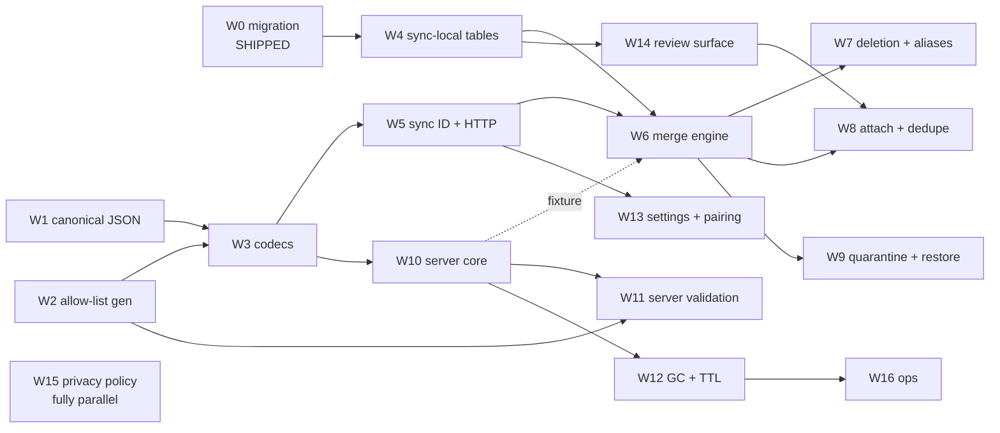

# Implementation plan: Device Sync and the Athenaeum

*Execution companion to [ADR-004](../adr/004-device-sync-and-athenaeum.md),
[sync-spec.md](sync-spec.md) (normative behaviour) and [sync.md](sync.md)
(rationale). This document carries neither behaviour nor rationale: it says
**what to build, in what order, and what must not overlap**.*

## 1. Status

**ADR-004 is `Proposed`. Nothing in this plan may start until it is Accepted**,
and that ruling is the maintainer's. The plan is written now so the shape of
the programme is visible *before* the decision, not to presume it.

One unit has already shipped: the §3.1 schema migration, merged as
[#898](https://github.com/ibanner56/CallersCompendium/issues/898), ahead of the
ADR and deliberately — see *What must be serialised*, **S6**. Everything else is
unstarted.

Where this document and the spec disagree, the spec governs. Where this document
and reality disagree, this document is wrong: it is a plan, and plans are the
first thing a programme falsifies.

## 2. How the work is described

Each unit below states five things, and the middle three are the point:

| Field | Meaning |
| --- | --- |
| **Serves** | The spec sections this unit is responsible for. Every implementable section is owned by exactly one unit; the *Coverage* table below is the check on that. |
| **Inherits** | What must already exist, and *what specifically* is consumed — not merely "comes after". |
| **Produces** | The artefact other units consume. If nothing consumes it, it is a leaf and can move freely. |
| **Unblocks** | The units that cannot start without this one's artefact. |
| **Done when** | The conformance bucket in [§9 of the spec](sync-spec.md) that must be green, plus any unit-specific gate. |

"Inherits" and "Unblocks" are the dependency graph. Read them, not the unit
numbers — the numbering is roughly execution order but two units with adjacent
numbers are often parallel, and one late unit (**W10**) is needed unusually
early.

## 3. The four contracts

Parallelism in this programme is gated by **contracts, not files**. Two units
can touch entirely disjoint paths and still collide, because both encode an
assumption about one of these four:

1. **Canonical JSON and the content hash** (§4.1, §4.2). Every hash-derived
   behaviour — the baseline, the manifest, delta sync, the merge
   discriminator — is wrong together if this is wrong. Frozen at **C1**.
2. **The generated allow-list** (§3.3, §7.2). One mapping, imported by the
   client serialiser *and* the server validator. This is the reason the server
   is Dart at all (ADR, *Why Dart for the server*): a second language means a
   second hand-maintained list, which is the drift the registry exists to end.
3. **The blob and manifest schemas** (§4.3, §4.4, §4.5).
4. **The two non-content-addressed JSON shapes** — `GET /v1/store` and
   `POST /v1/blobs/missing` (§5.2). These are the endpoints nothing *forced*
   into a schema, which is exactly why they were the last to get one.

A unit that changes any of the four is **never** parallel with a unit that
consumes it, regardless of file overlap. A unit that merely consumes them is
parallel with anything else that only consumes them.

## 4. Work units

### Phase 0 — shipped

#### W0 · Schema migration

- **Serves** §3.1.
- **Inherits** nothing.
- **Produces** `updated_at`, `deleted_at` and `existence_at` across eight tables
  — twenty columns — and six entity-level hard deletes converted to tombstones.
- **Unblocks** everything. Nothing else in the programme changes the schema of
  an existing table.
- **Done when** merged — it is, as #898.

Its early landing is load-bearing rather than incidental, and the reasoning
matters for anyone tempted to treat the gap as wasted time: each device stamps
`updated_at` at *its own* migration time, so while those stamps survive, the
device that upgrades last wins every settings conflict on first sync. Real edits
overwrite migration stamps with meaningful ones. **The delay between W0 and
first sync is what repairs the ordering wart**, so it is a feature of the
schedule, not slack in it.

### Phase 1 — the shared contract (strictly serial)

#### W1 · Canonical JSON and the content hash

- **Serves** §4.1, §4.2.
- **Inherits** nothing. This is the root of the graph.
- **Produces** an RFC 8785 (JCS) canonicaliser; SHA-256 content hashing;
  NFC normalisation applied **on ingest**; rejection of NaN and ±Infinity; and
  the **golden vector corpus** that every later unit tests against.
- **Unblocks** W3, and transitively everything.
- **Done when** the §9 *Wire format* bucket is green, including the imported
  RFC 8785 conformance vectors and a fractional `custom_field_values.value_num`
  agreeing across two independently written encoders.

The golden corpus is the real deliverable. Code can be rewritten; the corpus is
what makes a rewrite safe, and what lets the server be built by someone who
never reads the client.

#### W2 · The generated allow-list

- **Serves** §3.3, §7.2 (the generation half; enforcement is W11).
- **Inherits** the existing privacy registry — `field_registry.dart`,
  `settings_registry.dart`. It adds no classifications and invents no list.
- **Produces** a generated `snake_case table.column` → bare camelCase mapping
  keyed by record kind; settings resolution routed through `classifySettingsKey`
  so prefix-declared keys resolve; and **fail-closed** behaviour — an
  unclassified key is treated as `deviceLocal` and never serialised.
- **Unblocks** W3 (client serialiser), W11 (server validator).
- **Done when** the bijection ratchet passes over real `encodeArchive`-shaped
  output, never a hand-written key string.

Expressed as an allow-list, never a denylist. A denylist admits every key the
lookup fails to resolve, and an unresolved settings key can hold unsaved dance
and program content — which is precisely what the editor-draft keys held until
#973.

#### W3 · Blob, settings-record and manifest codecs

- **Serves** §4.3, §4.4, §4.5.
- **Inherits** W1 (canonicalisation and hashing), W2 (which keys may appear).
- **Produces** encode/decode for the blob envelope and the manifest; `v`
  handling on read; hydration of the fields a record publishes but does not own
  (authorship and tags come from join rows, so the record's own row is not the
  whole of its serialised content).
- **Unblocks** W5, W6, W10.
- **Done when** a blob and a manifest round-trip byte-identically and the
  envelope's absent-versus-null rule is pinned by golden.

> **Checkpoint C1 — the wire format is frozen.** See *Checkpoints* below.

### Phase 2 — client foundation and server core, in parallel

#### W4 · Sync-local tables

- **Serves** §3.2.
- **Inherits** W0 (the migration is the only change to *existing* tables; these
  are new ones).
- **Produces** `baseline`, `id_aliases`, `pending_deletions`, `review_queue`,
  `published_records` — **with their classifications in the same PR**, or the
  coverage ratchet fails the build. Note the split classification:
  `pending_deletions.tombstone_blob` is `shareable` while the rest of that table
  is `deviceScoped`, because it is retransmitted record content rather than
  device bookkeeping.
- **Unblocks** W6, W7, W8, W9, W14.
- **Done when** the ratchet is green and each table's lifecycle is tested,
  including the three that differ: `pending_deletions` survives an epoch reset,
  clears on detach, and is revalidated against restored data after a restore;
  `published_records` clears on *nothing*; the rest clear with the baseline.

`published_records` is the one to get right, because its whole purpose is to
resist the intuitive rule. It records that bytes physically left this device,
which no local action can retract — so detach, epoch reset and restore all leave
it alone. Clearing it on detach converts "the deletion sticks" into "the
deletion silently reverts".

#### W5 · Sync ID, authentication and the HTTP client

- **Serves** §5.1, §5.2, §5.3 (client half), §8.
- **Inherits** W3 (what it sends and receives).
- **Produces** diceware generation over the EFF long wordlist; the client-side
  strength floor; the structural rule and the **normalisation applied before
  the HMAC** (trim → NFC → locale-independent lowercase); bearer auth that never
  puts the ID in a URL; and status handling — `409` forces fresh attach, `422`
  is surfaced and **never retried**, `429` honours `Retry-After`.
- **Unblocks** W6, W8, W13.
- **Done when** the ID bound cases pass (one code point over rejected, at the
  bound accepted) and a client/server `id_key` agreement test passes under
  differing whitespace and Unicode form.

The strength floor is enforced here and **only** here. A server that re-runs it
and is marginally stricter locks a user out of their own store, because the ID
*is* the address.

#### W10 · Athenaeum core — storage, endpoints, limits

- **Serves** §7.1, §5.1–§5.4 (server half).
- **Inherits** W3 (schemas). W2 arrives later, via W11.
- **Produces** the Dart + `shelf` service; `HMAC-SHA256(pepper, syncID)` storage
  keying with versioned peppers; the store, manifest and blob endpoints; strong
  quoted `ETag` equal to the manifest content hash, with `If-None-Match`;
  permissive `Content-Type` handling; and **every limit enforced before
  allocation**, streaming-abort style.
- **Unblocks** W11, W12, W16 — and, critically, **W6**.
- **Done when** the loopback round trip at **C2** passes.

**This unit is numbered late and must be scheduled early.** It is the cheaper
half of the programme and it is the *test fixture* for the expensive half: a
merge engine developed against a mock server is a merge engine whose first
contact with the real contract happens at the end. My recommendation is to start
W10 at C1, concurrently with W4 and W5, and to treat "the client team has a real
server to run against" as the point of it rather than a side effect.

#### W13 · Settings blade, enablement, pairing and triggers

- **Serves** §6.1, §6.12.
- **Inherits** W5 for the ID and endpoint types. Everything else can be built
  against a fake engine from C1 onward.
- **Produces** the top-level Settings blade; **off on every installation until
  the user turns it on, with no sync-related network call while off**; the
  pairing flow, which must work for a user reading an ID aloud over the phone;
  *Sync only on WiFi* defaulting to on, with a manual attempt on a metered
  connection routing to the setting; and the status surface.
- **Unblocks** nothing. It is a leaf, which is what makes it safely parallel.
- **Done when** the enablement test proves the no-network-call property, not
  merely that the toggle renders.

Its settings keys are themselves `deviceScoped` and MUST NOT sync — a sync
feature whose configuration syncs is a loop.

#### W14 · A kind-agnostic review surface

- **Serves** the review-queue surface required by §3.2.
- **Inherits** W4 (`review_queue` is the storage this reviews).
- **Produces** a generic keep-both-or-merge list. **No per-kind editors are
  required**, which is the scope control on this unit.
- **Unblocks** W8.
- **Done when** a queued pair survives an app restart and can be resolved.

The existing `import_review_screen.dart` reviews **dances only**, and is driven
by `ImportSession`, whose own doc comment says it is deliberately not persisted.
Sync runs non-interactively with nobody watching, so there is no in-progress
import to attach a decision to. This is new storage plus a new surface, not a
reuse of proven machinery — the ADR corrects an earlier draft that implied
otherwise.

#### W15 · Privacy-policy amendment

- **Serves** the ADR's *Blocking prerequisite*; §10.
- **Inherits** nothing whatsoever.
- **Produces** amended `docs/dev/store-submission/privacy-policy.md` **and** its
  mirror `site/privacy/index.html`, changed together, with the effective date
  bumped.
- **Unblocks** nothing — but **C7 cannot pass without it**.
- **Done when** neither file claims "there is no cloud sync" or "we have no
  servers that receive or hold your content", both of which they say today, and
  both of which both app-store listings link to.

Fully parallel with all code, and best done early: it is the cheapest unit in
the programme and the only one that can block a release on its own.

### Phase 3 — the engine

#### W6 · Steady-state merge

- **Serves** §6.3, §6.4, §6.5, §6.7.
- **Inherits** W3, W4 (the baseline), W5 (transport), **W10 as a live fixture**.
- **Produces** the baseline diff; the merge table including the both-present row
  that resolves as `changed`/`changed`; existence decided by `existenceAt`
  *before* the table is consulted and separately from content; the apply path;
  the isolate boundary; and enforcement of **I1** and **I2**.
- **Unblocks** W7, W8, W9.
- **Done when** the §9 *Merge* bucket is green, including ≥3-device convergence
  with interleaved edits and the equal-`updatedAt` tie being **reported rather
  than resolved**.

I1 and I2 are normative constraints on *every* new write path in the app, not
just sync's. I1 is easy to violate innocently, because a record's serialised
form includes join-hydrated fields, so a write that never touches the record's
own row can still change what it publishes.

#### W7 · Deletion, tombstones and collision reconciliation

- **Serves** §6.6, §6.8.
- **Inherits** W4, W6.
- **Produces** the `pending_deletions` lifecycle and tombstone blobs;
  natural-key collision reconciliation for the `UNIQUE` kinds; `id_aliases` with
  reference rewriting that **bumps the referring record's `updated_at`**; and
  the forfeiture check against `published_records`.
- **Unblocks** nothing directly; W8 assumes its rules exist.
- **Done when** the §9 *Reconciliation* bucket is green, including the
  rewrite-in-place mutation — where content changes but no row does, so peers
  never learn of it and the reference stays broken everywhere else.

Settings are deliberately **not** a collision kind: their id *is* their natural
key, so two devices setting one key hold one id with two bodies, which is a
content conflict for W6's table rather than a reconciliation for this unit.

#### W8 · Attach and fresh-attach dedupe

- **Serves** §6.2, §6.10.
- **Inherits** W5, W6, W4, and **W14** (dedupe has nowhere to defer to without
  a review surface).
- **Produces** the union — **no deletion occurs during a fresh attach**; dedupe
  on `normalizeTitle` plus `_choreographyEquals`, with tombstones excluded from
  candidacy entirely; `program_slots.dance_id` rewiring to the survivor; epoch
  and baseline persistence; and the after-the-fact count ("merged 412
  duplicates"), which is the mitigation rather than a prompt.
- **Unblocks** nothing.
- **Done when** the §9 *Dedupe* bucket is green.

Dedupe compares by reference to the shipped `normalizeTitle`, never a
reimplementation. A second definition that agrees on lowercase ASCII and
disagrees on a leading article is the failure this unit is most likely to ship,
and it merges records **silently**.

#### W9 · Quarantine, repair and restore

- **Serves** §6.9, §6.11.
- **Inherits** W4, W6.
- **Produces** clock-skew quarantine on the `localNow + 24h` bound; the repair
  classifier, which compares body hashes and therefore depends on I2 holding;
  and restore, which **drops the baseline to force a fresh attach**, clearing
  `id_aliases` and `review_queue` with it while `pending_deletions` survives and
  is revalidated.
- **Unblocks** nothing.
- **Done when** the §9 *Quarantine and repair* bucket is green.

### Phase 4 — server hardening and operations

#### W11 · Server-side allow-list validation

- **Serves** §7.2 (enforcement).
- **Inherits** W2 (the same generated mapping the client uses), W10.
- **Produces** `422` for any blob carrying a key not classified `shareable` for
  its kind; and the unknown-`v` rule — the key check applies regardless of `v`,
  and a blob is **not** rejected merely for carrying a `v` the server does not
  know.
- **Unblocks** nothing.
- **Done when** the generated mapping is proven by test and the unknown-`v`
  case is pinned.

This is a second line of defence. The client serialiser is the control; neither
is sufficient alone, because server rejection happens *after* the bytes crossed
the wire.

#### W12 · TTL, garbage collection and the break-glass log

- **Serves** §7.3, §7.4.
- **Inherits** W10.
- **Produces** reachability GC; the 24-hour upload grace window that makes a
  recent upload a temporary GC root; **`DELETE /v1/store` deleting
  unconditionally**, grace window or not; quota accounting and `507`; and the
  break-glass access log.
- **Unblocks** W16.
- **Done when** the §9 *Server* bucket is green, including the mutation that
  applies the age bound to `DELETE` — under which the user's only immediate
  remedy for a full store silently does nothing.

#### W16 · Operational readiness

- **Serves** §7.5; the operational half of §7.4; §10.
- **Inherits** W10, W12.
- **Produces** the container and deployment documentation; the **four proxy
  conformance requirements**, each of which some common proxy violates by
  default; alerting; retention proof; the break-glass authorisation process; and
  lost-ID support.
- **Unblocks** nothing — but **C7 cannot pass without it**.
- **Done when** a from-scratch self-host reaches a working sync using only the
  published documentation.

Requirements (3) and (4) — no proxy-side decompression, and the sync ID never
written to a log — are invisible in behaviour, which is why they are stated
rather than left to deployment taste. They cannot be caught by testing that the
thing works.

## 5. Order of execution

**The critical path is W1 → W3 → W5 → W6 → W8.** Everything else has slack, and
the slack is worth spending deliberately:

- **W2 runs beside W1.** It reads the privacy registry and touches none of W1's
  code. Both must land before W3.
- **W10 runs beside W4 and W5**, from C1. It is off the *nominal* critical path
  and on the *practical* one, because W6 is far cheaper to build and far safer
  to trust against a real server than a mock.
- **W13 and W14 run from C1** against fakes. They are leaves; W14 rejoins at W8.
- **W15 runs whenever.** It should be done first, being the cheapest thing that
  can block a release.
- **W11, W12 and W16 follow W10** and are independent of the entire client
  engine.

## 6. What must be serialised

These are not scheduling preferences. Each has a failure mode that scheduling
cannot recover from.

- **S1 · Nothing starts before ADR-004 is Accepted.** The maintainer's ruling.
- **S2 · The §4 contract freezes before parallel work begins.** Not the files —
  the contract. Two units that each assume a different manifest shape conflict
  with zero textual overlap.
- **S3 · The server deploys before any client that emits a new `shareable`
  field or record kind** (§7.2). Adding either does **not** bump `v`, so nothing
  on the wire signals the difference: the client simply gets `422` on every
  affected blob, visibly, with no retry. This binds v1's rollout *and every
  future vocabulary change*, and it binds self-hosters too — their upgrade must
  lead the app's. It is the one part of the design a client-side revision cannot
  absorb.
- **S4 · Every new table or settings key is classified in the PR that creates
  it** (§3.2). The ratchet enforces it; scheduling it as follow-up work means a
  red build, not a late doc.
- **S5 · W15 lands before release, and is independent of code.** It gates C7
  alone.
- **S6 · W0 stays early.** Already satisfied, and the gap it opened is doing
  work — see W0.

## 7. Checkpoints

Each checkpoint is a falsifiable gate, not a status report. A checkpoint that
cannot fail is not a checkpoint.

| ID | Lands after | Gate |
| --- | --- | --- |
| **C0** | W0 | **Shipped.** Migration merged as #898 (schema v25, via #901 and #903); eight tables, twenty columns, six entity-level hard deletes converted to tombstones. |
| **C1** | W1, W2, W3 | **Wire format frozen.** RFC 8785 vectors pass; two independently written encoders agree on a corpus including a fractional `value_num` and an NFC/NFD title pair; allow-list bijection green over real codec output. *Parallel work begins here.* |
| **C2** | W10, W5 | **Loopback round trip.** One client against a local server: blob and manifest survive `PUT`/`GET` byte-identically; `413`, `415` and `422` paths exercised; `ETag`/`304` honoured. |
| **C3** | W6 | **Two devices converge.** §9 *Merge* green, including the both-present row, ≥3-device interleaved edits, a stale peer failing to roll back newer data, and an equal-`updatedAt` tie being reported rather than broken. |
| **C4** | W7, W8, W14 | **Attach and dedupe on a real library.** §9 *Dedupe* and *Reconciliation* green; the review queue survives a restart; the merge count is reported after the fact. |
| **C5** | W11, W12 | **Server hardened.** §9 *Server* green; limits rejected before allocation; grace window honoured and `DELETE` exempt from it. |
| **C6** | W9, W13 | **Beta, behind the setting.** Off by default with the no-network-call property proven; quarantine, repair and restore working; WiFi-only default honoured. |
| **C7** | W15, W16 | **Ship gate.** Privacy policy amended in both files with the date bumped; ops prerequisites met; **server deployed ahead of the client release** (S3). |

C2 is the checkpoint most likely to be skipped and least advisable to skip. It
is the first moment the two halves of the programme touch, and every defect it
catches is a contract defect — the class that is cheapest now and most expensive
at C3.

## 8. Parallelism hazards

Units that look independent and are not. Each is a real collision, not a
theoretical one.

- **W6 and W8** both write the apply path. W8 inherits W6's rules; running them
  concurrently means two authors deciding independently what "apply" means.
- **W7 and W8** both act on dedupe outcomes — W7 owns alias rewriting, W8 owns
  survivor selection, and the survivor's references are rewritten by W7's rules.
- **W8 and W13** share a contract that lives in neither: **what the user is
  told.** The merge count, the reported ties and the skipped-record reports are
  produced by W8 and rendered by W13. Different files, one contract.
- **Any unit adding a `shareable` field while the server is unreleased** trips
  S3 and produces `422` for real users.
- **`app/CHANGELOG.md`.** Two individually mergeable PRs editing the same
  `## [Unreleased]` section conflict. Expect it and sequence the entries.

## 9. Coverage

Every implementable section of the spec is owned. This table is the check on the
plan, and a section appearing twice or not at all is a defect in this document.
§1 (status) and §2 (terminology) carry no behaviour and are not listed.

| Spec | Unit | Spec | Unit |
| --- | --- | --- | --- |
| §3.1 | W0 | §6.4 | W6 |
| §3.2 | W4 | §6.5 | W6 |
| §3.3 | W2 | §6.6 | W7 |
| §4.1 | W1 | §6.7 | W6 |
| §4.2 | W1 | §6.8 | W7 |
| §4.3 | W3 | §6.9 | W9 |
| §4.4 | W3 | §6.10 | W8 |
| §4.5 | W3 | §6.11 | W9 |
| §5.1 | W5 + W10 | §6.12 | W13 |
| §5.2 | W5 + W10 | §7.1 | W10 |
| §5.3 | W5 + W10 | §7.2 | W2 + W11 |
| §5.4 | W10 | §7.3 | W12 |
| §6.1 | W13 | §7.4 | W12 + W16 |
| §6.2 | W8 | §7.5 | W16 |
| §6.3 | W6 | §8 | W5 + W10 |

§9 (conformance tests) is distributed across every unit by its **Done when**
field. §10 (deferred) is owned by nobody by definition — but its last two
entries are shipping prerequisites rather than deferrals, and are carried by
W15 and W16.

## 10. Relationship to the planned issues

The ADR anticipated seven issues. This plan is finer-grained on purpose — an
issue that spans W1 through W3 cannot say which half of it is blocking — and
maps onto that shape rather than replacing it:

| Planned issue | Units |
| --- | --- |
| Protocol + client engine | W1, W2, W3, W6 |
| Identity + pairing | W5, and W13's pairing flow |
| Fresh attach + dedupe | W4, W7, W8, W9, W14 |
| Athenaeum server | W10, W11 |
| Server ops | W12, W16 |
| Settings & status UI | W13's blade, enablement and status surface |
| Privacy policy amendment | W15 |

W13 is the one place the ADR's split and this one disagree. The ADR separates
pairing from settings; here they are a single unit, because pairing *is* a
screen in the settings blade and splitting them puts one flow under two owners.
Everything else maps cleanly.

Filing granularity is a separate decision from execution granularity, and it is
the maintainer's. My recommendation is one issue per unit for W1–W3, because
they are the units where "blocked on the other half" needs to be sayable, and
one issue per planned track thereafter.

## 11. Decisions still open

Named here rather than assumed, because each changes the plan rather than its
details:

1. **ADR-004 acceptance** (S1). Gates everything.
2. **Whether W10 is scheduled early**, as recommended under W10 and in *Order of
   execution*. The alternative is a mocked server and a later, riskier first
   contact.
3. **Beta scope** — whether C6 ships to real users behind the setting, or
   whether the programme runs to C7 before anyone outside sees it.
4. **Issue-filing granularity**, as raised under *Relationship to the planned
   issues*.
