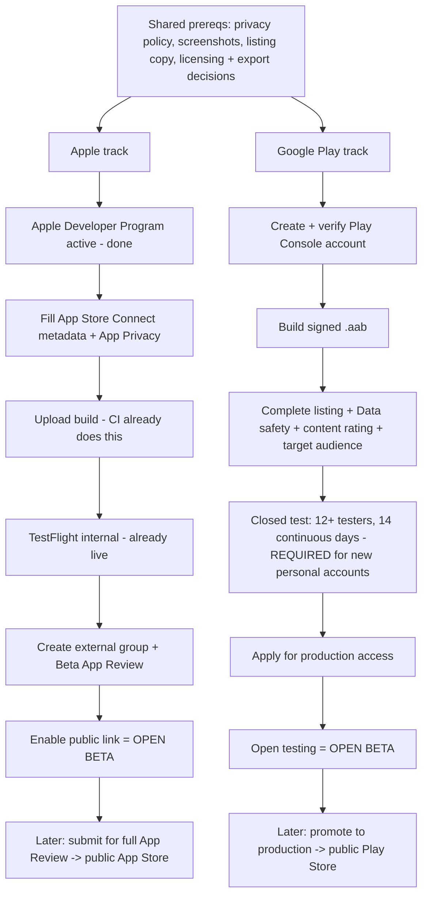

# Getting into the app stores — start here

This folder is the operator guide for putting **Caller's Compendium** on the
**Apple App Store** (via **TestFlight** open beta) and **Google Play** (via its
**testing tracks**, then production). It is written for people who have **never
shipped an app to a store before** — so it defines the jargon, spells out every
account and form, and calls out the surprises that trip up first-time
publishers.

If you just want the release *mechanics* (tagging, CI, signing), that lives in
[`../releasing.md`](../releasing.md) and the per-tag
[`../release-checklist.md`](../release-checklist.md). This folder is about the
**store side**: accounts, listings, review, and the policy forms.

## The documents

| Document | What it's for |
|----------|---------------|
| [`app-store.md`](app-store.md) | Apple: Developer Program, App Store Connect, TestFlight **external (open) beta**, and the path to a public App Store release. |
| [`google-play.md`](google-play.md) | Google Play: Play Console account, identity verification, the **closed → open testing** gate, Data safety, content rating, and production. |
| [`listing-copy.md`](listing-copy.md) | Ready-to-paste **store listing text** for both stores, plus the exact answers to the App Privacy / Data safety / content-rating forms and the reviewer notes. |
| [`privacy-policy.md`](privacy-policy.md) | A drafted **privacy policy** to publish and link — both stores require a working privacy-policy URL. |

Work top-to-bottom: read this page, then do the store-specific checklist, using
`listing-copy.md` and `privacy-policy.md` as the source for anything you have to
paste into a form.

> **Not legal advice.** The licensing, export-compliance, and privacy notes here
> flag things to *decide*, not settled legal conclusions. Where money, data, or
> licensing is involved, confirm against the official docs linked inline and, if
> in doubt, a professional.

## What we're actually shipping to stores

Caller's Compendium already ships **desktop** builds (Linux/macOS/Windows) from
the [GitHub Releases page](https://github.com/ibanner56/CallersCompendium/releases)
— **those are out of scope here**. The stores only concern the two mobile
targets:

- **iOS / iPadOS** — iPhone **and** iPad. Already built, signed, and
  auto-uploaded to **TestFlight internal testing** by CI on every `v*` tag
  (see [`../releasing.md`](../releasing.md#ios-testflight-via-app-store-connect-api)).
  "Open beta" means turning on **TestFlight external testing**, which needs a
  one-time **Beta App Review** and unlocks a **public join link**.
- **Android** — CI already builds a **signed universal APK** for sideloading.
  Google Play wants an **`.aab` (Android App Bundle)**, not an APK, so there is a
  small build change to make (see the Play checklist).

### App facts you'll be asked for repeatedly

Keep this handy — every form asks some slice of it.

| Field | Value |
|-------|-------|
| App name | **Caller's Compendium** |
| Bundle ID / package name | `org.callerscompendium.compendiumApp` (same on both platforms) |
| Release version | Ask beta status and base `X.Y.Z`; use `vX.Y.Z-beta` for beta or `vX.Y.Z` for stable, with Flutter `X.Y.Z` |
| Price | **Free** |
| In-app purchases / subscriptions | **None** |
| Ads | **None** |
| Developer / seller | Isaac Banner (individual) |
| Support email | compendium@contra.dance |
| Support / marketing site | <https://ibanner56.github.io/CallersCompendium/> |
| Source & issues | <https://github.com/ibanner56/CallersCompendium> |
| Privacy policy URL | <https://ibanner56.github.io/CallersCompendium/privacy/> (published — source in [`privacy-policy.md`](privacy-policy.md), page at `site/privacy/index.html`) |
| License | AGPL-3.0 (source-available) |
| Data collected | **None** (local-first, no telemetry, no accounts) |
| Network use | User-initiated imports (Caller's Box, ContraDB, JSON) over HTTPS; opt-in update check (off by default) |
| Age rating | Suitable for everyone (no objectionable content) |
| Primary category | Productivity (secondary: Reference / Tools) |

## Shared prerequisites (do these once, they serve both stores)

These are the things needed **regardless** of store. Knock them out first.

- [x] **A publishable privacy policy at a stable public URL.** Both stores block
  submission without one. **Published** at
  <https://ibanner56.github.io/CallersCompendium/privacy/> (page lives at
  `site/privacy/index.html`; content mirrors [`privacy-policy.md`](privacy-policy.md)).
  Use that URL in both consoles. The `site/` folder publishes to GitHub Pages, so
  the page ships automatically on the next Pages deploy.
- [ ] **Final store listing text**, localized to at least English. Draft is in
  [`listing-copy.md`](listing-copy.md). If the app's new base-language set is
  ready, plan to add matching **localized listings** later (both stores let you
  add locales incrementally — you do **not** need them for the first beta).
- [ ] **Screenshots on real devices, at the sizes each store demands.** We have
  app icons but **no store-sized screenshots yet**. You need them from Perform
  mode, Collection, Programs, and Dialect. Capture on:
  - iPhone (a 6.9"/6.7" class device) and iPad (12.9"/13" class) — Apple requires
    at least one set per device family you support.
  - A phone and a 7"/10" tablet for Play (Play wants phone shots and encourages
    tablet shots since we support tablets).
  Tip: run the app on the OS **Simulator/Emulator** at the exact device size to
  get pixel-perfect frames without owning every device.
- [ ] **A 512×512 (Play) and 1024×1024 (Apple) app icon** with no alpha/rounded
  corners baked in. Confirm the existing `AppIcon.appiconset` / `mipmap` icons
  export cleanly at these sizes.
- [ ] **A feature graphic (1024×500 PNG/JPG)** for Google Play — Play requires
  this; Apple does not.
- [ ] **Decide the developer/publisher identity shown publicly.** Apple shows the
  legal entity/individual name; Play shows a developer name + (for the account
  type) verified contact details. See the account-type note below.
- [ ] **Resolve the AGPL-vs-App-Store licensing question** (below) before the
  first Apple submission.

## Two policy landmines to resolve before you submit

First-time publishers rarely see these coming; both apply to us specifically.

### 1. AGPL-3.0 vs. the Apple App Store terms

Apple's standard licensed-application EULA imposes usage restrictions (e.g.
limiting use to a number of Apple devices you own/control) that are **additional
restrictions** the GPL/AGPL forbid a distributor from adding. This is the same
conflict that led to the well-known VLC / GPL App Store disputes. It does **not**
block us, but the **copyright holder must act**:

- Because Isaac is the project's copyright holder, the cleanest fix is to **add
  an explicit "App Store distribution" exception / additional permission** to the
  project's license grant (a short clause allowing distribution through
  Apple's App Store under Apple's terms, notwithstanding the AGPL's
  anti-additional-restriction clause), **or** dual-license the store builds.
- If any third party holds copyright in bundled code, get their sign-off too.
- Google Play does **not** have the same conflict, but keep the app's source link
  and license visible in the listing regardless.

Track this as a real to-do; don't submit to Apple until it's decided. (Not legal
advice — confirm the exact wording you're comfortable with.)

### 2. Export compliance

`app/ios/Runner/Info.plist` declares `ITSAppUsesNonExemptEncryption = false`,
which is accurate: Caller's Compendium is a plain local-first app that uses
only standard/exempt cryptography. The only cryptographic code in the binary
is update-signature verification (Ed25519 via the `cryptography` package) and
a SHA-256 **integrity checksum** on exported backups — both are
authentication/hashing, not confidentiality, and fall under the EAR's
digital-signature/exempt provisions.

> **History:** an earlier beta shipped an optional passphrase-encrypted backup
> (Argon2id + XChaCha20-Poly1305/AES-GCM). That confidentiality feature was
> **removed** in favor of the plain-JSON + SHA-256 checksum backup (see the
> `[0.1.0]` CHANGELOG entry and issue #536), which returns the app to the
> export-compliance-exempt state — no encryption-usage declaration, no annual
> BIS self-classification report, no `Info.plist` change needed.

- **If confidentiality crypto is ever reintroduced,** re-evaluate this
  declaration: the honest answer to "does your app use encryption?" would
  become **yes** (likely still exemption-qualifying, but it must be declared),
  and you may owe an annual self-classification report to the U.S. BIS. Do the
  same review for Google Play (it asks indirectly via the US export-law
  acknowledgement at publish time).

This aligns with our security posture: don't hand-wave a compliance question just
because the app is local-first.

## The realistic timeline / phase order

Because of the account rules, the two stores have **different critical paths**.
Don't assume "open beta" is one click on either.

**The single biggest surprise:** on a **new personal Google Play account**, you
cannot jump straight to open testing (public beta). Google requires a **closed
test with at least 12 testers who stay opted-in for 14 continuous days** before
it unlocks open testing / production. Start recruiting those 12 testers *now* —
this is the long pole for Android. (See the Play checklist for the exact flow and
the account-type nuance.)

Apple has no equivalent tester-count gate: once your first external build passes
**Beta App Review**, you can flip on the public TestFlight link immediately.

## Glossary (store jargon, plain-language)

- **App Store Connect (ASC)** — Apple's web console for managing your app,
  builds, TestFlight, and the store listing.
- **TestFlight** — Apple's beta-distribution system. **Internal** testing = up to
  100 people on your team, no review. **External** testing = up to 10,000 people,
  needs Beta App Review, can use a **public link** anyone can tap to join. "Open
  beta" on iOS = external testing with a public link.
- **Beta App Review** — a lighter review Apple runs on the *first* external
  TestFlight build (and occasionally later ones). Not the same as full App Review.
- **App Review** — the full review that gates a public App Store release.
- **App Privacy ("nutrition label")** — the data-practices disclosure on your
  App Store listing. Ours is "Data Not Collected."
- **Play Console** — Google's web console (the counterpart to ASC).
- **Testing tracks (Play)** — **Internal** (≤100 testers, instant), **Closed**
  (named testers/lists), **Open** (anyone can join = public beta), **Production**
  (public store). New personal accounts must clear closed testing first.
- **Data safety (Play)** — Google's data-practices form (counterpart to Apple's
  App Privacy). Ours is "No data collected / no data shared."
- **Content / age rating** — a questionnaire (Apple's own; Google uses **IARC**)
  that yields an age label. Ours comes out "everyone / 4+".
- **`.aab` (Android App Bundle)** — the upload format Play requires (Play generates
  per-device APKs from it). Different from the `.apk` we sideload today.
- **AAB signing / Play App Signing** — Google holds the app signing key; you sign
  the upload with an **upload key**. We already have an upload keystore for the
  APK; the same one works as the Play upload key.
- **SKU** — an internal product code you pick. Apple record already uses
  `CallersCompendiumApp`.
