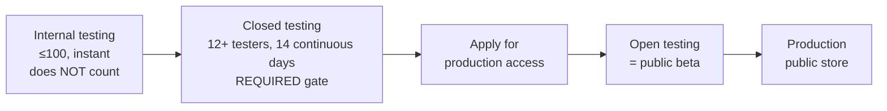

# Google Play — submission checklist

Goal: get **Caller's Compendium** to **open beta (Open testing)** on Google Play
and set up for a later production release.

Read [`README.md`](README.md) first for shared prerequisites. Paste-ready listing
text and the exact Data-safety / content-rating answers are in
[`listing-copy.md`](listing-copy.md).

> **Read this before you plan anything.** On a **new *personal* Play developer
> account** (created after 13 Nov 2023), Google will **not** let you release to
> Open testing or Production until you have run a **Closed test with at least 12
> testers who stay opted-in for 14 continuous days**. Internal testing does **not**
> count toward it. So the fast "open beta = one click" mental model from Apple
> does **not** apply here. **Start recruiting your 12 closed testers now** — it is
> the critical path for Android. (Organization accounts are exempt; see
> [Account type](#account-type-decision-read-first).)

> **Where we already are.** CI builds a **signed universal `.apk`** for
> sideloading from GitHub Releases. Google Play needs an **`.aab` (Android App
> Bundle)**, which is a small build change (Section 2). Everything else — the Play
> Console account, listing, and policy forms — is **net-new**, because we have
> never been on Play.

Legend: **[Gate]** = blocks progress. **[One-time]** = account/setup. **[New]** =
work we have not done before.

---

## Account type decision (read first) — [One-time, Gate]

- [x] **[Gate]** Decide **personal** vs ~~organization~~ account. This changes the
  rules:
  - **Personal** — $25 one-time fee, no D-U-N-S number needed, verified with a
    government ID + name/address/phone. **Subject to the 12-testers / 14-day
    closed-testing requirement.** Simplest for a solo open-source project.
    Your legal name / contact may be shown publicly (especially if you ever
    monetize; we don't, so exposure is minimal, but the developer *email* is
    public regardless).
  - **Organization** — needs a **D-U-N-S number** (free, but takes days to get),
    business docs, and a verified org phone/website. **Exempt** from the
    12-testers requirement. Overkill unless you want the project to publish as an
    entity rather than as "Isaac Banner."
  - **Recommendation:** for a solo AGPL project, a **personal** account is the
    pragmatic choice — just budget for the closed-testing gate.

## 0. Create & verify the Play Console account — [One-time, New]

- [x] **[New]** Register at <https://play.google.com/console/signup> and pay the
  **one-time $25** registration fee.
- [x] **[Gate]** Complete **identity verification**: government ID, legal name,
  address, and a verified **phone + email** (OTP). **You cannot publish anything
  until verification passes** — it can take a few days, so start early.
- [x] Set the **public developer name** (does not have to be your legal name — e.g.
  "Caller's Compendium" or "Isaac Banner") and the **public developer email**
  (compendium@contra.dance is fine, and is shown on the listing).
- [x] Accept the **Developer Distribution Agreement** and **US export law**
  acknowledgement.

## 1. Create the app — [New]

- [x] **[New]** Play Console → **Create app**.
  - App name: **Caller's Compendium**
  - Default language: **English (United States)** (add locales later)
  - App or game: **App**
  - Free or paid: **Free** (⚠️ you cannot switch a Free app to Paid later — Free
    is correct for us and permanent)
  - Declarations: it's not a game; confirm it meets Developer Program Policies and
    US export laws.
- [x] **[Confirm]** The package name will be `org.callerscompendium.compendiumApp`
  (set at first upload; it is **permanent** and must match the manifest).

## 2. Produce a signed Android App Bundle (`.aab`) — [Gate, New]

Play requires an `.aab`, not the `.apk` we ship today. The signing keystore we
already use for the release APK works as the **Play upload key**.

- [x] **[Automated]** The release workflow now builds a signed `.aab` on every
  `v*` tag (mirroring the APK leg) and uploads it as the **`android-aab`**
  workflow artifact — download it from the release run and upload that file to
  Play. It's built + signed with the same upload keystore, but is intentionally
  kept out of `SHA256SUMS` / the channel manifest / the GitHub Release (it's a
  store-upload input, not a sideload download). To build one locally instead,
  run from the app package (`cd app`, matching CONTRIBUTING): `fvm flutter build
  appbundle --release` (requires `app/android/key.properties` with the real
  upload keystore, exactly as the APK build does — see
  [`../releasing.md`](../releasing.md#android-signed-apk)); the output is then at
  `app/build/app/outputs/bundle/release/app-release.aab` (i.e.
  `build/app/outputs/bundle/release/app-release.aab` relative to `app/`).
- [x] **[Gate]** Enrol in **Play App Signing** (the default): you upload an `.aab`
  signed with your **upload key**; Google manages the real **app signing key**.
  Register the existing upload keystore's certificate as the upload key.
- [x] **[Policy]** **Long-term channel policy.** We intentionally treat the Play build (standard Play App Signing, with a Google-held app-signing key) and the GitHub Releases APK (direct-signed with our keystore) as separate identities.
  Switching requires **backup → uninstall → install → restore** — it is not an in-place upgrade.
  The existing keystore currently signs both the Play upload and the direct APK; its custody and the constraint on independently rotating the Play upload key are in
  [`../releasing.md`](../releasing.md#android-signing-key-custody-backup-and-rotation).
- [x] **[Confirm]** `versionCode` is the deterministic code derived from the
  release tag (bounded SemVer core plus a channel bit, beta below stable for one
  core). It increases with each newer SemVer core; Play rejects duplicates.
- [x] **[Confirm]** `targetSdk` meets Play's current minimum target-API
  requirement for **new apps** (Play raises this yearly; check the current floor
  in Play Console when it flags the bundle). Bump `flutter.targetSdkVersion` if
  Play complains.
- [x] **[Confirm]** The bundle is **debuggable=false**, release-signed (the Gradle
  guard already refuses an unsigned release), and passes Play's pre-launch checks.

## 3. Store listing (Main store listing) — [Gate, New]

Fill Play Console → **Grow → Store presence → Main store listing**. Text is in
[`listing-copy.md`](listing-copy.md).

- [x] **[Gate]** **App name** (30 chars): "Caller's Compendium".
- [x] **[Gate]** **Short description** (80 chars): from draft.
- [x] **[Gate]** **Full description** (4000 chars): from draft.
- [x] **[Gate]** **App icon** — 512×512 PNG, 32-bit, no rounded corners/alpha
  weirdness.
- [x] **[Gate]** **Feature graphic** — 1024×500 PNG/JPG (Play-specific; required).
- [x] **[Gate]** **Phone screenshots** — 2–8, 16:9 or 9:16, min 320px, max 3840px.
- [x] **[Recommended]** **7-inch and 10-inch tablet screenshots** — we support
  tablets, so add them to qualify for tablet featuring and avoid a "not optimized
  for tablets" note.
- [ ] ~~**[Optional]** A **promo video** (YouTube URL).~~
- [x] **[Gate]** **Contact details**: email (required), website, phone (optional).
- [x] **[Gate]** **Privacy Policy URL** — required. Publish
  [`privacy-policy.md`](privacy-policy.md) and paste the URL.

## 4. Policy & content forms (App content) — [Gate, New]

Play Console → **Policy → App content**. Every item here is **mandatory** before
any track (including testing) can go live. Answers are drafted in
[`listing-copy.md`](listing-copy.md).

- [x] **[Gate]** **Privacy policy** — paste the URL.
- [x] **[Gate]** **Ads** — declare **No ads**.
- [x] **[Gate]** **App access** — "**All functionality is available without special
  access**" (no login). Say so, so review isn't blocked.
- [x] **[Gate]** **Content rating (IARC) questionnaire** — complete honestly;
  expected result **Everyone**. Answers in
  [`listing-copy.md`](listing-copy.md#age--content-rating).
- [x] **[Gate]** **Target audience and content** — target age groups. We're a
  utility for adult callers; select adult age bands (13+/18+ as you prefer) and
  **not** "designed for children," so the **Families policy / Play for Families**
  rules don't apply.
- [x] **[Gate]** **Data safety form** — for a pre-Sync build, declare **No data
  collected, no data shared**. Note the app makes user-initiated network
  requests (imports) and an opt-in update check, but the developer **collects**
  nothing. Full answer set in
  [`listing-copy.md`](listing-copy.md#data-safety-google-play). Re-answer it
  before any beta where opt-in Device Sync transfers content; do not carry the
  pre-Sync answer into that beta.
- [x] **[Gate]** **Government apps / financial / health / etc.** declarations —
  all **No** for us.
- [x] **[Gate]** **News app?** — **No**.
- [x] **[Gate]** **COVID-19 / contact-tracing?** — **No**.
- [x] **[Confirm]** **Advertising ID permission** — we do **not** request
  `AD_ID`; declare that the app does not use an advertising ID. (If a dependency
  pulls the `com.google.android.gms.permission.AD_ID` permission in, either
  remove it via manifest merge or declare its use — mismatches get flagged.)

## 5. The testing ladder — [the critical path]

New personal accounts must climb this ladder in order. Do **not** expect to skip
to Open testing.

### 5a. Internal testing (smoke test) — [New, fast]

- [x] Create an **Internal testing** release, upload the `.aab`, add your own test
  accounts, and confirm the app installs from Play and runs on a real device.
  This is instant and is the right place to shake out signing/target-SDK issues.

### 5b. Closed testing (the mandatory gate) — [Gate, New, long pole]

- [x] **[Gate]** Create a **Closed testing** track and release.
- [ ] **[Gate]** Recruit **≥12 testers** (real Google accounts, real devices) —
  e.g. from the beta guide, Discussions, and the caller community. Add them via an
  email list or a Google Group.
  - Current status: **6 testers** recruited, still seeking others to join the Android beta.
- [ ] **[Gate]** All 12+ must **opt in and keep the app installed for 14
  continuous days**. If the count drops below 12, replace testers promptly — the
  clock is unforgiving.
- [ ] Gather their feedback (Play gives you a feedback channel + pre-launch report).
- [ ] **[Gate]** After 14 days with 12+ testers, Play unlocks **"Apply for
  production access."** Fill in the short questionnaire about how you tested.

### 5c. Open testing (this is the "open beta") — [New]

- [ ] Once production access is granted, create an **Open testing** release.
- [ ] Choose **anyone can join** and get the **public opt-in URL** — this is the
  Google Play equivalent of a public TestFlight link.
- [ ] **[Gate]** Roll out the release (staged or 100%). It goes through **Play
  review** (usually hours to a few days for a new app).
- [ ] Publish the opt-in URL in the beta guide, project site, and Discussions, and
  update [`docs/beta/beta-guide.md`](../../beta/beta-guide.md) and the README's
  Android note (which currently says "sideload the APK / not on Play yet").

## 6. Production (public Play Store) — [later]

- [ ] Create a **Production** release from a promoted bundle.
- [ ] Set **countries/regions** (worldwide is fine).
- [ ] Consider a **staged rollout** (e.g. 20% → 100%).
- [ ] Submit; monitor the **Publishing overview** for review status.

## 7. Post-submission monitoring — [ongoing]

- [ ] Watch the **Pre-launch report** (Play test-runs your app on real devices and
  flags crashes, accessibility, and security issues) and **Android vitals**
  (crash/ANR rates) — Play can throttle visibility if vitals are bad.
- [ ] Read tester feedback and reviews; reply from the console.
- [ ] Keep `targetSdk`, the privacy policy URL, and Data safety answers current —
  Play emails deadlines for policy changes and target-API bumps.
- [ ] Re-affirm Data safety at each release. A pre-Sync release remains "no data
  collected"; re-answer the form before any beta where Device Sync can transfer
  content.

---

## Quick reference — Play facts for this app

| Thing | Value |
|-------|-------|
| Console | Google Play Console — <https://play.google.com/console> |
| Package name | `org.callerscompendium.compendiumApp` (permanent) |
| Account | Personal recommended; $25 one-time; ID-verified |
| Upload format | **`.aab`** — built by CI each `v*` tag as the `android-aab` artifact (or locally via `cd app && fvm flutter build appbundle --release`); not the sideload APK |
| Signing | Play App Signing; existing upload keystore = upload key |
| Open beta = | **Open testing** track — but only **after** the closed-testing gate |
| Closed-testing gate | **12+ testers, 14 continuous days** (new personal accounts) |
| Data safety | **No data collected / no data shared** |
| Content rating | IARC → **Everyone** |
| Feature graphic | 1024×500 (required by Play) |
| Ads / IAP | None / None |
